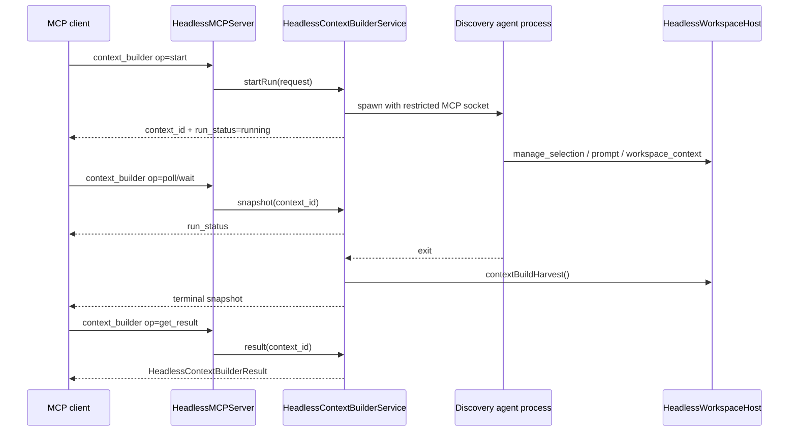

# fix: Add async results for headless context_builder

## Summary

Make `rpce-headless` `context_builder` usable with real discovery agents whose runs can exceed an MCP client's tool-call deadline. Keep the current one-shot `context_builder` request compatible for fast callers, and add a first-class async lifecycle so callers can start discovery, poll or wait, retrieve the final context pack, cancel active work, and clean up retained run state. The fix is MCP-client agnostic: Codex, Claude Code, Gemini, and any configured agent CLI that can use the generated MCP config should follow the same lifecycle.

---

## Problem Frame

The current MCP `context_builder` tool runs discovery synchronously inside one `tools/call`. That works for the deterministic harness, but real configured agents such as Codex, Claude Code, or Gemini can take longer than the MCP client call ceiling. In the observed failure, the client timed out after 120 seconds while the server-side run continued and eventually populated `workspace_context`; the only way to recover the result was to inspect the workspace as a side channel.

The bug is not the normal 120k-160k context budget. The bug is that long-running context-builder work has no session/result contract comparable to `agent_run`, even though it is also a process-backed orchestration flow.

---

## Requirements

**MCP behavior**

- R1. Existing one-shot `context_builder` calls without an async `op` keep returning the current `HeadlessContextBuilderResult` shape for fast runs.
- R2. Callers can start a `context_builder` run and receive a stable `context_id` before discovery completes.
- R3. Callers can poll or wait on a `context_id` without relying on `workspace_context` as an implicit result store.
- R4. Callers can retrieve the final result with the existing context-builder result fields after the run reaches a terminal state.
- R5. Callers can cancel an active context-builder run and the server terminates the spawned discovery agent process group.
- R6. Discovery-restricted sockets continue to block `context_builder`, `agent_run`, `agent_manage`, and `oracle_send`.

**Operational behavior**

- R7. Long-running real agents are supported across MCP-capable agent CLIs without shrinking token budgets or requiring fake-agent defaults.
- R8. Temporary files, sockets, pipes, and retained run records are cleaned up after terminal runs.
- R9. Concurrent context-builder starts either remain intentionally single-flight with a clear error or become explicitly supported; the implementation must not silently corrupt shared selection/prompt state.

**Validation**

- R10. Deterministic smoke tests prove the async lifecycle with a sleeping external process.
- R11. Existing fake-agent context-builder smokes remain as fixtures, not as the product behavior being optimized.
- R12. Documentation explains the synchronous compatibility path, the async path for real agents, and the recommended call sequence for Codex, Claude Code, Gemini, and other configured agent CLIs.

---

## Key Technical Decisions

- KTD1. Add async operations to `context_builder` rather than creating a sibling tool: keeping discovery under one tool preserves the advertised full-tool surface and makes the relationship to the existing synchronous path obvious.
- KTD2. Preserve current no-`op` behavior as the compatibility path: existing smokes and clients should not have to migrate before the async contract is useful.
- KTD3. Model the lifecycle after `agent_run` but return context-builder-specific results: `agent_run` already has `start`, `poll`, `wait`, and `cancel`; `context_builder` needs the same lifecycle plus an explicit result retrieval path because terminal results can be large.
- KTD4. Use deterministic fake and sleeping agents only as test fixtures: real behavior is a configured external discovery agent; tests use controlled subprocesses to prove timeout, cancellation, and cleanup behavior without depending on live Codex, Claude Code, or Gemini credentials.
- KTD5. Keep async run state in `HeadlessContextBuilderService`: it already owns the single-run guard, socket listener, agent launch, harvest, and oracle follow-up, so adding retained run records there avoids inventing a second orchestration layer.

---

## High-Level Technical Design

The compatibility path remains a direct `context_builder` call with no `op`. The async path separates the short MCP call that starts work from the longer discovery process and final result transfer.

---

## Scope Boundaries

### In Scope

- Add an async lifecycle to the MCP `context_builder` tool.
- Reuse the real configured discovery-agent launcher and restricted socket mechanism.
- Add deterministic process-backed tests for sleeping, completing, cancelling, result retrieval, and cleanup.
- Update headless README and example docs for the new call sequence.

### Deferred to Follow-Up Work

- A separate `context_builder_manage` tool, unless implementation proves one-tool cleanup semantics are too cramped.
- Persistent run storage across server restarts.
- Multi-workspace or multi-tab context-builder orchestration.
- A real-agent CI gate that requires authenticated Codex, Claude Code, Gemini, or another external CLI.

### Out of Scope

- Changing the app Context Builder UI or app Agent Mode runtime.
- Reducing default context-builder token budgets to fit short client timeouts.
- Treating `workspace_context` as the official result channel for async context-builder runs.

---

## Implementation Units

### U1. Extend the context_builder schema and request model

- **Goal:** Advertise async operations while preserving the current one-shot call contract.
- **Requirements:** R1, R2, R3, R4, R12
- **Dependencies:** None
- **Files:**
  - `Sources/RepoPromptHeadlessServer/HeadlessToolSchemas.swift`
  - `Sources/RepoPromptHeadlessServer/HeadlessContextBuilderService.swift`
  - `Tests/RepoPromptTests/MCP/HeadlessAgentToolSchemaTests.swift`
- **Approach:** Add an optional `op` field to `context_builder` with lifecycle values such as `start`, `poll`, `wait`, `get_result`, `cancel`, and `cleanup`. Keep `instructions` required only for operations that start work. Add optional `context_id` and `timeout` or reuse `timeout_seconds` semantics for wait. Keep absent `op` mapped to the current synchronous run behavior.
- **Patterns to follow:** `agent_run` and `agent_manage` schema conventions in `HeadlessToolSchemas.swift`; schema assertions in `HeadlessAgentToolSchemaTests.swift`.
- **Test scenarios:**
  - Schema exposes `context_builder` `op` enum values while keeping `instructions` available for one-shot/start calls.
  - Schema keeps `context_builder` out of `HeadlessToolSchemas.discoveryTools`.
  - Request parsing accepts no `op` as synchronous compatibility mode.
  - Request parsing rejects `start` without non-empty `instructions`.
  - Request parsing rejects `poll`, `wait`, `get_result`, `cancel`, or `cleanup` without a non-empty `context_id`.
- **Verification:** Tool schemas describe both the old one-shot mode and the new lifecycle mode without changing the full/discovery tool boundary.

### U2. Add retained context-builder run lifecycle state

- **Goal:** Let context-builder work continue after the initiating MCP call returns.
- **Requirements:** R2, R3, R5, R8, R9
- **Dependencies:** U1
- **Files:**
  - `Sources/RepoPromptHeadlessServer/HeadlessContextBuilderService.swift`
  - `Sources/RepoPromptHeadlessServer/HeadlessTypes.swift`
  - `Sources/RepoPromptHeadlessServer/HeadlessProcessGroupLauncher.swift`
- **Approach:** Replace the single `run()`-only model with a retained run record for async starts. A record should hold request metadata, temp directory, socket path/listener, spawned process ID, lifecycle state, timestamps, captured exit code, optional harvested result, optional error text, and cleanup status. Keep the current single-flight behavior unless the implementation creates isolated `HeadlessWorkspaceHost` state per run; if single-flight stays, return a clear busy error for a second `start`.
- **Patterns to follow:** `HeadlessAgentSessionManager.SessionRecord`, `waitForSession`, `completeSession`, cancellation, process-tree termination, and cleanup guard behavior.
- **Test scenarios:**
  - Starting a sleeping discovery agent returns a `context_id` quickly and `run_status=running`.
  - Polling a running context returns running state without harvesting partial prompt/selection as final.
  - Waiting with a short timeout returns running state with a timeout marker rather than killing the process.
  - Cancelling an active run transitions it to cancelled and terminates the spawned process group.
  - Cleanup skips active runs and removes terminal run resources.
  - A second `start` during an active single-flight run returns a clear busy error if concurrent context-builder runs remain unsupported.
- **Verification:** Async runs have explicit lifecycle state independent of the initiating MCP call, and active process resources are not orphaned.

### U3. Route context_builder operations through MCP dispatch

- **Goal:** Implement the public lifecycle operations and return stable structured payloads.
- **Requirements:** R1, R2, R3, R4, R5, R6
- **Dependencies:** U1, U2
- **Files:**
  - `Sources/RepoPromptHeadlessServer/HeadlessMCPServer.swift`
  - `Sources/RepoPromptHeadlessServer/HeadlessContextBuilderService.swift`
  - `Sources/RepoPromptHeadlessServer/HeadlessToolSchemas.swift`
- **Approach:** In the `context_builder` dispatch branch, route absent `op` to the existing synchronous call. Route `start`, `poll`, `wait`, `get_result`, `cancel`, and `cleanup` to service methods. Use a compact snapshot payload for lifecycle operations, and reserve the existing `HeadlessContextBuilderResult` payload for one-shot and `get_result`.
- **Patterns to follow:** `agent_run` dispatch and `HeadlessAgentRunSnapshot` shape, with context-builder names to avoid confusing lifecycle status with discovery result status.
- **Test scenarios:**
  - One-shot clarify request still returns `status=completed`, selection, prompt, and token fields for a fast fixture.
  - `start` returns a `context_id` and no large context payload.
  - `poll` for an unknown `context_id` returns an expired/not-found snapshot or clear tool error consistently with the chosen contract.
  - `get_result` before terminal completion returns a clear not-ready error.
  - `get_result` after completion returns the existing result fields including `status`, `prompt`, `selection`, `token_budget`, and `response_type`.
  - Restricted socket calls to `context_builder` still return discovery-restricted errors.
- **Verification:** MCP clients can complete the workflow without inspecting `workspace_context` directly.

### U4. Cover async behavior in headless smoke tests

- **Goal:** Prove the bug fix with deterministic subprocesses while keeping real-agent behavior as the target.
- **Requirements:** R7, R10, R11
- **Dependencies:** U1, U2, U3
- **Files:**
  - `Sources/RepoPromptHeadlessServer/Scripts/context_builder_mcp_fake_agent_test.py`
  - `Sources/RepoPromptHeadlessServer/Scripts/mcp_agent_lifecycle_smoke.py`
  - `Sources/RepoPromptHeadlessServer/Scripts/context_build_fake_agent_test.py`
- **Approach:** Extend the MCP context-builder harness with a sleeping discovery fixture that starts slowly, then selects `Package.swift` and sets a handoff prompt. Assert `start` returns before completion, `poll` shows running, `wait` can time out without terminating the run, later `wait` reaches terminal state, and `get_result` returns the final pack. Keep existing fast fake-agent tests as regression coverage for compatibility and oracle gating.
- **Patterns to follow:** Sleeping-agent and process-tree assertions in `mcp_agent_lifecycle_smoke.py`; existing context-builder MCP harness helpers for JSON-RPC and structuredContent fallback.
- **Test scenarios:**
  - Async start returns quickly while fixture sleeps.
  - Short wait reports timeout/running and the run later completes.
  - Final result contains selected `Package.swift` and the handoff prompt.
  - Cancelled run cannot later return a completed result.
  - Cleanup removes terminal run records and temp directories.
  - Existing fake-agent happy path, failed-agent path, and empty-selection path still pass.
- **Verification:** The smoke suite demonstrates the MCP timeout class directly: long-running work survives beyond an individual call and remains retrievable through the tool contract.

### U5. Document the real-agent workflow and operational guidance

- **Goal:** Make the intended calling pattern clear for operators and future agents across MCP clients.
- **Requirements:** R7, R8, R12
- **Dependencies:** U1, U2, U3, U4
- **Files:**
  - `Sources/RepoPromptHeadlessServer/README.md`
  - `Sources/RepoPromptHeadlessServer/Examples/rpce-headless.env`
  - `Sources/RepoPromptHeadlessServer/Examples/agents.json`
- **Approach:** Update the README to show both modes: one-shot for short deterministic calls, async start/poll/get_result for real configured agents. Name normal token budgets as 120k-160k and make clear that callers should not shrink context just to fit a client deadline. Document cleanup expectations, describe the generated MCP config contract for Codex, Claude Code, Gemini, and similar CLIs, and note that fake agents are test fixtures.
- **Patterns to follow:** Existing README sections for headless context builder and headless agent runner.
- **Test scenarios:**
  - Test expectation: none -- documentation-only unit. Validate by checking that examples are consistent with the final schema names and result fields.
- **Verification:** A user can run real-agent context builder through MCP without discovering the async sequence from source code.

---

## Acceptance Examples

- AE1. Given a real configured discovery agent that takes longer than the MCP client's call ceiling, when the caller uses `context_builder op=start`, then the start call returns a `context_id` before discovery finishes.
- AE2. Given that same long-running run, when the caller polls or waits with a short timeout, then the tool reports running/timed-out state without killing the discovery agent.
- AE3. Given the run later completes successfully, when the caller requests the result by `context_id`, then the tool returns the curated selection, prompt, token counts, and response metadata without requiring a separate `workspace_context` call.
- AE4. Given an active run, when the caller cancels it, then the spawned process group is terminated and later result retrieval cannot report a false completed pack.
- AE5. Given a fast existing one-shot request, when the caller omits `op`, then the tool returns the same result shape as before.

---

## Risks & Dependencies

- **Shared workspace state:** `HeadlessWorkspaceHost` currently stores one prompt and selection for the loaded workspace. Supporting concurrent context-builder runs without isolated host state risks selection/prompt collision. The plan allows keeping single-flight semantics for this fix.
- **Result size:** Completed context packs can be large. Polling should return compact snapshots; full payloads should be returned only by one-shot or explicit result retrieval.
- **Oracle follow-up duration:** `question`, `plan`, and `review` modes may remain slow after discovery finishes. Async lifecycle must encompass oracle follow-up too.
- **Process cleanup:** Context Builder currently owns listener/temp cleanup in `defer` inside a synchronous run. Async records must move cleanup to terminal lifecycle and explicit cleanup paths.

---

## Documentation / Operational Notes

The docs should position async `context_builder` as the normal MCP path for real agents and MCP clients, not as a Claude-only path. The generated MCP config and lifecycle contract should work for Codex, Claude Code, Gemini, and any configured CLI that can launch the `repoprompt` MCP bridge. The fake-agent harness remains valuable because it is deterministic and offline, but it should be described as test infrastructure rather than an operator path.

---

## Sources & Research

- `Sources/RepoPromptHeadlessServer/HeadlessContextBuilderService.swift` currently performs synchronous launch, wait, harvest, and result rendering inside one call.
- `Sources/RepoPromptHeadlessServer/HeadlessAgentSessionManager.swift` already implements a process-backed lifecycle with start, poll, wait, cancel, session logs, cleanup, and process-tree termination.
- `Sources/RepoPromptHeadlessServer/Scripts/mcp_agent_lifecycle_smoke.py` provides deterministic sleeping-process patterns for timeout and cancellation coverage.
- `Sources/RepoPromptHeadlessServer/Scripts/context_builder_mcp_fake_agent_test.py` covers the existing MCP context-builder happy/failure paths and should be extended, not treated as product behavior.
- `docs/plans/fable/006-headless-context-builder.md` and `docs/plans/fable/009-context-builder-oracle-gating.md` define the original headless context-builder contract and prior oracle-gating fix.
