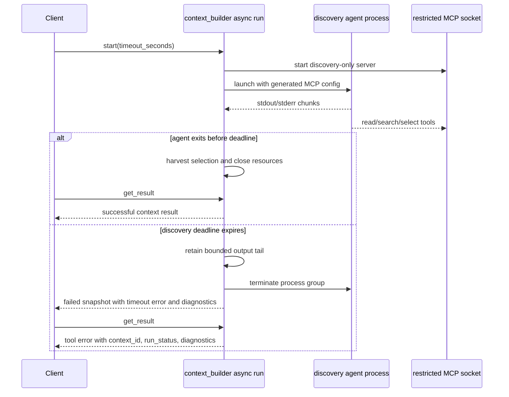
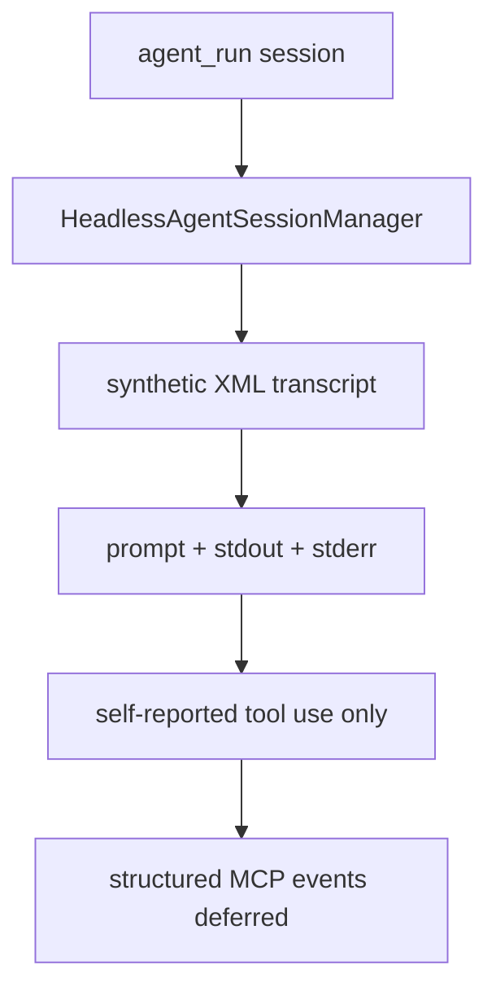

# fix: Improve headless Context Builder timeout observability

## Summary

Improve `rpce-headless` operator diagnostics when real-agent Context Builder discovery times out, without changing the existing timeout lifecycle. The plan adds bounded child-output evidence to failed async Context Builder runs, clarifies the `agent_manage get_log` stdout/stderr-only contract, and strengthens smoke/schema coverage around discovery deadlines and failed-result diagnostics.

---

## Problem Frame

The rebuilt `rpce-headless` MCP server exposes the expected full stdio tool surface, deterministic tools work, and direct `agent_run` with `claude` completes. The async `context_builder` lifecycle also behaves correctly: `start` creates a run, `timeout_seconds` fails overlong discovery, `activeRunID` is cleared, the process tree is killed, `get_result` rejects the failed run, and `cleanup` removes the terminal record.

The operator experience is still thin when a real discovery agent times out. `HeadlessContextBuilderService` currently streams child stdout/stderr to server stderr with an `agent|` prefix, but the async record does not retain that output and `drainPipes` discards remaining bytes. Meanwhile `agent_manage get_log` returns a synthetic XML transcript containing prompt/stdout/stderr only; it should not be treated as structured MCP tool-call evidence unless a separate event model is introduced.

---

## Requirements

**Context Builder timeout diagnostics**

- R1. Failed async Context Builder snapshots expose a bounded diagnostic payload that helps explain what the discovery process emitted before timeout.
- R2. `timeout_seconds` remains the discovery-agent deadline, distinct from `wait`'s polling timeout.
- R3. Timeout and cancel paths continue to terminate the launched process group and clear the single-flight active run.
- R4. `get_result` continues to reject failed, cancelled, expired, and not-ready runs, while surfacing enough diagnostic context for operators to correlate the failure.

**Agent log contract**

- R5. `agent_manage get_log` is documented and tested as a synthetic prompt/stdout/stderr transcript, not an authoritative structured MCP tool-call log.
- R6. A structured Claude event stream remains out of scope for this fix unless implementation research shows it can be added without changing the launcher/log model materially.

**Compatibility and scope**

- R7. Existing synchronous Context Builder behavior and successful async result payloads stay source-compatible for current MCP clients.
- R8. Diagnostics stay bounded and safe for JSON-RPC responses; stdout remains reserved for JSON-RPC and server diagnostics remain on stderr.

---

## Key Technical Decisions

- KTD1. Preserve lifecycle semantics and improve evidence only: The debug finding shows the async timeout lifecycle is correct, so the fix should not retune defaults, retry discovery, or reinterpret failed timeout runs as partial successes.
- KTD2. Reuse the bounded output-capture pattern from `agent_run`: `HeadlessAgentSessionManager` already stores child stdout/stderr with truncation flags and a byte limit; Context Builder should use the same style rather than inventing a tracing subsystem.
- KTD3. Put Context Builder diagnostics on lifecycle snapshots, not final success results: timeout evidence matters most on `poll`/`wait` after failure and on failed `get_result`; adding it only to successful `HeadlessContextBuilderResult` would miss the failing operator path.
- KTD4. Keep structured tool events as a follow-up option: Claude's `stream-json`/verbose mode can provide richer evidence, but adopting it requires launcher configuration, event parsing, schema design, and contract decisions beyond this small shippable improvement.

---

## High-Level Technical Design

---

## Scope Boundaries

### In Scope

- Retain bounded stdout/stderr evidence for async Context Builder runs.
- Include timeout/cancel/get-result diagnostics in existing lifecycle surfaces.
- Strengthen fake-agent MCP smokes and schema parsing tests around timeout behavior.
- Clarify README and smoke assertions for the current `agent_manage get_log` contract.

### Deferred to Follow-Up Work

- Add a structured Claude event path using `--output-format stream-json` and `--verbose`.
- Build a generalized trace/event store shared by Context Builder and `agent_run`.
- Add UI-level or app Agent Mode changes; this plan targets `rpce-headless`.
- Change default real-agent discovery timeout values or add automatic retries.

---

## Implementation Units

### U1. Add bounded Context Builder child-output diagnostics

- **Goal:** Retain enough discovery-agent stdout/stderr evidence on async Context Builder records to make timeout failures actionable.
- **Requirements:** R1, R2, R3, R8
- **Dependencies:** None
- **Files:**
  - `Sources/RepoPromptHeadlessServer/HeadlessContextBuilderService.swift`
  - `Sources/RepoPromptHeadlessServer/HeadlessTypes.swift`
  - `Tests/RepoPromptTests/MCP/HeadlessAgentToolSchemaTests.swift`
- **Approach:** Extend the async run record with bounded stdout/stderr buffers and truncation flags, following `HeadlessAgentSessionManager`'s byte-limit pattern. Replace async `prefixPipe`-only handling with capture plus stderr forwarding so existing operator stderr behavior stays intact. Add optional diagnostic fields to `HeadlessContextBuilderRunSnapshot`, keeping successful final `HeadlessContextBuilderResult` stable unless implementation reveals a low-risk need for parity.
- **Execution note:** Start with schema/parsing tests that describe the desired diagnostic shape before changing the Swift model.
- **Patterns to follow:** `HeadlessAgentSessionManager` output capture and `HeadlessContextBuilderRunSnapshot` snake_case `CodingKeys`.
- **Test scenarios:**
  - Happy path: a successful async fake-agent run still reaches `run_status: completed` and `get_result` returns the same success result shape clients already consume.
  - Error path: a fake agent that writes stdout/stderr then exceeds `timeout_seconds` yields `run_status: failed`, the existing timeout error, and bounded diagnostic output with correct truncation metadata.
  - Edge case: diagnostic capture respects the configured byte limit and records truncation without breaking UTF-8 in the stored strings.
  - Integration: server stderr still receives `agent|`-prefixed child output while the MCP snapshot receives the bounded diagnostic copy.
- **Verification:** Timeout snapshots contain useful child-output evidence, successful result payloads remain compatible, and schema tests lock the new optional fields.

### U2. Tighten async timeout and failed-result diagnostics

- **Goal:** Make timeout, cancel, and failed `get_result` responses explain the failed lifecycle state without changing lifecycle semantics.
- **Requirements:** R1, R2, R3, R4
- **Dependencies:** U1
- **Files:**
  - `Sources/RepoPromptHeadlessServer/HeadlessContextBuilderService.swift`
  - `Sources/RepoPromptHeadlessServer/Scripts/context_builder_mcp_fake_agent_test.py`
  - `Tests/RepoPromptTests/MCP/HeadlessAgentToolSchemaTests.swift`
- **Approach:** Keep `timeoutAsyncRun` as the source of timeout failure, but ensure the stored error and diagnostic payload survive until cleanup. Improve failed `get_result` errors so callers can see the `context_id`, terminal `run_status`, and timeout diagnostic context. Add parsing tests that distinguish `timeout_seconds` on discovery from `timeout` on `wait`.
- **Execution note:** Add characterization assertions for current wait-timeout behavior before changing failed-result diagnostics.
- **Patterns to follow:** Existing `context_builder_mcp_fake_agent_test.py` async lifecycle scenarios and existing `HeadlessToolFailure` text style.
- **Test scenarios:**
  - Happy path: `wait` with a short `timeout` returns `_meta.wait_result: timed_out` while the run remains `running` and later completes.
  - Error path: `start` with `timeout_seconds: 1` fails quickly even when a later `wait` timeout is longer, proving `timeout_seconds` is the discovery-agent deadline.
  - Error path: failed `get_result` for a timed-out context returns an MCP tool error that names the `context_id`, `run_status: failed`, and timeout diagnostic.
  - Error path: failed `get_result` for a cancelled context still rejects with `run_status: cancelled` and does not pretend a context pack exists.
  - Integration: timeout and cancel scenarios leave the agent process group dead or outside the original group before cleanup proceeds.
- **Verification:** Existing async lifecycle smoke assertions become stronger without changing the status transitions clients already saw.

### U3. Clarify and test the `agent_manage get_log` evidence contract

- **Goal:** Make it explicit that `agent_manage get_log` currently exposes stdout/stderr transcript evidence, not structured MCP tool-call telemetry.
- **Requirements:** R5, R6, R8
- **Dependencies:** None
- **Files:**
  - `Sources/RepoPromptHeadlessServer/HeadlessAgentSessionManager.swift`
  - `Sources/RepoPromptHeadlessServer/Scripts/mcp_agent_lifecycle_smoke.py`
  - `Sources/RepoPromptHeadlessServer/README.md`
- **Approach:** Preserve the existing synthetic XML transcript unless implementation finds a small naming/doc improvement. Add smoke assertions with distinct stdout and stderr sentinels to prove the contract, including pagination behavior. Document that agent claims of tool use in stdout are useful evidence but not a structured tool-call audit trail.
- **Patterns to follow:** `transcriptXML(for:)` and existing lifecycle-smoke log isolation checks.
- **Test scenarios:**
  - Happy path: `get_log` returns `session_id`, `name`, turn counts, and `transcript_xml` with prompt/stdout/stderr tags.
  - Edge case: `limit: 0` returns no transcript turn and an empty transcript body.
  - Error path: unknown `session_id` remains a tool error.
  - Contract path: the payload has no top-level structured tool-call list and no top-level stdout/stderr fields outside the XML transcript.
- **Verification:** Operators and tests no longer infer structured MCP tool use from `get_log` unless a future structured-event feature adds that contract.

### U4. Document operator timeout interpretation and structured-event follow-up

- **Goal:** Update operator-facing docs so real-agent timeout results are understandable and expectations around tool-use evidence are honest.
- **Requirements:** R1, R2, R5, R6, R8
- **Dependencies:** U1, U2, U3
- **Files:**
  - `Sources/RepoPromptHeadlessServer/README.md`
  - `Sources/RepoPromptHeadlessServer/Examples/rpce-headless.env`
- **Approach:** Add a concise section explaining the difference between `timeout_seconds` and `wait.timeout`, what fields to inspect after `run_status: failed`, and when to use cleanup. Clarify that `agent_manage get_log` is stdout/stderr transcript evidence. Mention the structured Claude `stream-json` path as a deferred option requiring launcher/config/schema work.
- **Patterns to follow:** Existing README sections for stdio/full toolset, discovery-restricted sockets, oracle-backed tools, and Linux service configuration.
- **Test scenarios:**
  - Test expectation: none for prose-only docs, but smoke tests from U2 and U3 should exercise the documented behavior.
- **Verification:** A reader can distinguish discovery timeouts from polling timeouts and can explain why `get_log` does not prove individual MCP tool calls.

---

## Risks & Dependencies

- **Response size risk:** Capturing child output in lifecycle snapshots can make failed responses noisy. Bound by bytes, include truncation flags, and prefer tails or compact excerpts if full bounded buffers still feel too large.
- **Compatibility risk:** Adding optional fields should be source-compatible, but changing existing field names or successful result shape would break clients. Keep new diagnostics additive.
- **Flake risk:** Process cleanup tests can be timing-sensitive. Reuse existing lifecycle smoke polling helpers and accept process exit or zombie states as cleanup evidence where appropriate.
- **Evidence risk:** A real Claude run may emit useful self-reporting without structured tool events. Keep documentation precise so users do not overtrust stdout claims as an audit trail.

---

## Acceptance Examples

- AE1. Given a Context Builder run with `timeout_seconds: 1` and a fake discovery agent that sleeps before MCP access, when the client waits with a longer `timeout`, then the run reaches `failed`, the timeout error names the discovery deadline, and the snapshot includes bounded child-output diagnostics.
- AE2. Given a Context Builder run where the client calls `wait` with `timeout: 1` but the discovery deadline is longer, when the wait expires, then the run remains `running` and later completes successfully.
- AE3. Given a timed-out Context Builder run, when the client calls `get_result`, then the tool error names the failed status and carries or points to the stored timeout diagnostics.
- AE4. Given an `agent_run` session whose fake agent writes stdout and stderr sentinels, when the client calls `agent_manage get_log`, then the XML transcript contains those streams and no structured tool-call event list is implied.

---

## Sources & Research

- `Sources/RepoPromptHeadlessServer/HeadlessContextBuilderService.swift` owns async Context Builder lifecycle, timeout failure, process termination, and current stdout/stderr forwarding.
- `Sources/RepoPromptHeadlessServer/HeadlessAgentSessionManager.swift` provides the bounded stdout/stderr capture pattern and the current synthetic XML `get_log` contract.
- `Sources/RepoPromptHeadlessServer/AgentLauncher.swift` renders the real/fake agent command, generated MCP config, and discovery-agent environment.
- `Sources/RepoPromptHeadlessServer/Scripts/context_builder_mcp_fake_agent_test.py` already covers async start, wait, success, cancel, timeout, failed `get_result`, and cleanup.
- `Sources/RepoPromptHeadlessServer/Scripts/mcp_agent_lifecycle_smoke.py` already covers agent process-tree cleanup, wait timeout, cleanup guards, and log isolation.
- `docs/plans/fable/006-headless-context-builder.md`, `docs/plans/fable/008-agent-process-lifecycle.md`, and `docs/plans/fable/011-agent-lifecycle-smokes.md` establish the original headless Context Builder, process-group, and lifecycle-smoke intent.
