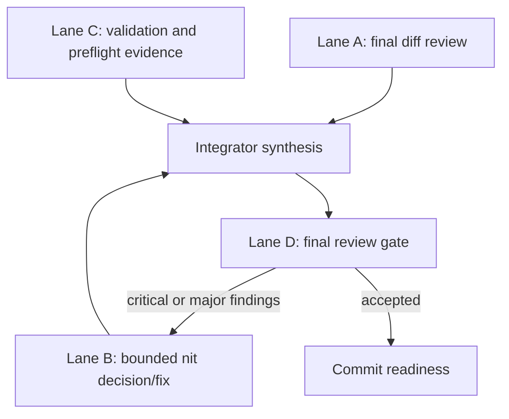

# fix: Close out headless timeout observability

## Summary

Finish and land the already-implemented `rpce-headless` timeout-observability change by reviewing the final diff against the original plan, resolving only worthwhile reviewer nits, rerunning bounded validation, and preparing the commit. This plan is a closeout checklist, not a redesign of the feature.

---

## Problem Frame

The feature plan in `docs/plans/2026-06-15-001-fix-headless-timeout-observability-plan.md` remains the source of truth. The implementation is already present in the working tree across headless service, schema, smoke, test, README, and env-example files. The remaining risk is closeout drift: over-expanding the last mile, letting stale Agent Mail reservations block same-branch work, or committing without a clean final evidence packet.

---

## Requirements

- R1. Final review traces the current diff back to the original feature plan without reopening settled design choices.
- R2. Any additional edits are limited to reviewer nits that materially improve acceptance or reduce obvious operational risk.
- R3. Same-branch Smithers lanes coordinate through Agent Mail; only the nit-fix lane may edit, and it must reserve files first.
- R4. Validation evidence covers formatting, Python smoke syntax, Linux Docker `rpce-headless` build, headless smoke behavior, and contribution preflight readiness.
- R5. Final review approves only when no critical or major findings remain; minor/nit findings may be accepted as follow-up if they do not imply a regression.
- R6. The integrator owns final staging and commit preparation after stale reservations are released and the intended file set is confirmed.

---

## Key Technical Decisions

- **Use the original plan as the source of truth:** The closeout plan checks implementation coverage against `docs/plans/2026-06-15-001-fix-headless-timeout-observability-plan.md`; it does not create a second feature design.
- **Keep Smithers lanes bounded:** Review and validation lanes are read-only. Editing is isolated to the nit-fix lane and only after Agent Mail reservations are granted.
- **Treat reviewer nits as acceptance decisions:** The diagnostics buffer size, `op=wait` timeout clamp, and Linux XCTest limitation should be accepted, documented, or fixed only if the change is tiny and local.
- **Commit readiness is separate from implementation:** The integrator confirms the final diff, releases stale reservations, runs preflight after staging, and prepares a commit only after review and validation agree.

---

## High-Level Technical Design

---

## Scope Boundaries

### In Scope

- Review the final working-tree diff against the original feature plan.
- Decide whether to fix, accept, or defer current non-blocking nits.
- Run bounded validation and capture evidence in one closeout summary.
- Prepare staging and commit readiness for the intended file set.
- Use short Smithers loops until final review reports no critical or major findings.

### Deferred to Follow-Up Work

- Structured Claude `stream-json` event capture.
- Broad redesign of Context Builder diagnostics or `agent_run` logging.
- Mac/Linux test graph cleanup for unrelated macOS-only XCTest dependencies.
- New Smithers workflow authoring beyond what is needed to execute this closeout.

---

## Implementation Units

### U1. Lane A final diff review against original plan

- **Goal:** Confirm the current working-tree diff implements the original timeout-observability plan without expanding or contradicting it.
- **Requirements:** R1, R5
- **Dependencies:** None
- **Files:**
  - `docs/plans/2026-06-15-001-fix-headless-timeout-observability-plan.md`
  - `Sources/RepoPromptHeadlessServer/Examples/rpce-headless.env`
  - `Sources/RepoPromptHeadlessServer/HeadlessContextBuilderService.swift`
  - `Sources/RepoPromptHeadlessServer/HeadlessMCPServer.swift`
  - `Sources/RepoPromptHeadlessServer/HeadlessToolSchemas.swift`
  - `Sources/RepoPromptHeadlessServer/HeadlessTypes.swift`
  - `Sources/RepoPromptHeadlessServer/README.md`
  - `Sources/RepoPromptHeadlessServer/Scripts/context_builder_mcp_fake_agent_test.py`
  - `Sources/RepoPromptHeadlessServer/Scripts/mcp_agent_lifecycle_smoke.py`
  - `Tests/RepoPromptTests/MCP/HeadlessAgentToolSchemaTests.swift`
- **Approach:** Run a read-only Smithers review lane that maps the diff to the original plan requirements and flags only missing coverage, scope creep, or critical/major regressions. The lane should not propose polish unrelated to acceptance.
- **Patterns to follow:** Prior Smithers review-gate stance: findings first, severity tagged, file-specific, and no edits.
- **Test scenarios:**
  - Test expectation: none; this is a read-only review lane.
- **Verification:** The lane returns either approval or a concise list of blocking findings tied to the original plan.

### U2. Lane B decide and fix only worthwhile nits

- **Goal:** Resolve the remaining reviewer nits without turning closeout into new feature work.
- **Requirements:** R2, R3, R5
- **Dependencies:** U1
- **Files:**
  - `Sources/RepoPromptHeadlessServer/HeadlessContextBuilderService.swift`
  - `Sources/RepoPromptHeadlessServer/README.md`
  - `Sources/RepoPromptHeadlessServer/Examples/rpce-headless.env`
  - `Sources/RepoPromptHeadlessServer/Scripts/context_builder_mcp_fake_agent_test.py`
  - `Tests/RepoPromptTests/MCP/HeadlessAgentToolSchemaTests.swift`
- **Approach:** Have one implementation lane inspect the accepted minor/nit list and make a yes/no decision for each. Default to accepting the diagnostics buffer size as intentional and configurable, documenting the Linux XCTest limitation only if current docs are misleading, and fixing the `op=wait` timeout clamp only if it is a small local hardening change with focused coverage.
- **Execution note:** This is the only editing lane. It must start an Agent Mail session, reserve exact files before edits, release reservations when done, and stop if another active holder conflicts.
- **Patterns to follow:** Existing bounded-diagnostics config in `HeadlessAgentSessionManager`, existing Context Builder parser tests, and the README's operator-focused tone.
- **Test scenarios:**
  - Happy path: if the lane makes no edits, it reports the explicit acceptance rationale for each nit.
  - Edge case: if a wait-timeout clamp is added, a schema or smoke assertion proves large wait values are handled according to the chosen contract.
  - Documentation path: if Linux XCTest limitations are documented, the text distinguishes product validation from unrelated platform test-graph limits.
- **Verification:** Any edit is small, covered by a focused check, and does not add new files outside the intended closeout surface.

### U3. Lane C validation and preflight evidence

- **Goal:** Produce a compact evidence packet proving the final diff is ready for commit preparation.
- **Requirements:** R4, R6
- **Dependencies:** U2
- **Files:**
  - `Sources/RepoPromptHeadlessServer/Scripts/context_builder_mcp_fake_agent_test.py`
  - `Sources/RepoPromptHeadlessServer/Scripts/mcp_agent_lifecycle_smoke.py`
  - `Tests/RepoPromptTests/MCP/HeadlessAgentToolSchemaTests.swift`
  - `Sources/RepoPromptHeadlessServer/README.md`
- **Approach:** Run a read-only validation lane using the repo's existing Linux Docker guidance and contribution-check expectations. Capture passed checks, failed checks, and platform limitations separately so a known Linux XCTest graph issue does not obscure product validation.
- **Patterns to follow:** `AGENTS.md` headless MCP validation guidance, shared `.build-linux` scratch path, and the repository-local contribution preflight contract.
- **Test scenarios:**
  - Happy path: formatting and Python syntax checks pass for the final diff.
  - Integration path: the Linux Docker `rpce-headless` build passes against the final tree.
  - Integration path: Context Builder and agent lifecycle smoke scripts pass against the built binary.
  - Environment limitation path: focused XCTest failure due unrelated macOS-only dependencies is reported as a platform gap, not a product regression.
- **Verification:** The lane returns a validation matrix with pass/fail/blocked status and enough detail for the integrator to cite in the commit handoff.

### U4. Lane D final review gate

- **Goal:** Re-review the final diff and evidence packet after any nit decisions or edits.
- **Requirements:** R1, R5
- **Dependencies:** U1, U2, U3
- **Files:**
  - `docs/plans/2026-06-15-001-fix-headless-timeout-observability-plan.md`
  - `docs/plans/2026-06-15-002-fix-headless-timeout-observability-closeout-plan.md`
  - `Sources/RepoPromptHeadlessServer/`
  - `Tests/RepoPromptTests/MCP/HeadlessAgentToolSchemaTests.swift`
- **Approach:** Run a read-only Smithers review lane after validation. The approval threshold is no critical or major findings; accepted minor/nit items must be recorded as non-blocking with rationale.
- **Patterns to follow:** Code-review stance with findings first, direct file references, and clear residual-risk notes.
- **Test scenarios:**
  - Test expectation: none; this is a read-only review gate.
- **Verification:** The lane returns approval or a short blocking-finding list. If blocking findings remain, feed only those findings back to U2 and repeat.

### U5. Integrator commit readiness

- **Goal:** Prepare the final working tree for a clean commit without losing coordination evidence or staging unrelated files.
- **Requirements:** R3, R4, R6
- **Dependencies:** U4
- **Files:**
  - `Sources/RepoPromptHeadlessServer/Examples/rpce-headless.env`
  - `Sources/RepoPromptHeadlessServer/HeadlessContextBuilderService.swift`
  - `Sources/RepoPromptHeadlessServer/HeadlessMCPServer.swift`
  - `Sources/RepoPromptHeadlessServer/HeadlessToolSchemas.swift`
  - `Sources/RepoPromptHeadlessServer/HeadlessTypes.swift`
  - `Sources/RepoPromptHeadlessServer/README.md`
  - `Sources/RepoPromptHeadlessServer/Scripts/context_builder_mcp_fake_agent_test.py`
  - `Sources/RepoPromptHeadlessServer/Scripts/mcp_agent_lifecycle_smoke.py`
  - `Tests/RepoPromptTests/MCP/HeadlessAgentToolSchemaTests.swift`
  - `docs/plans/2026-06-15-002-fix-headless-timeout-observability-closeout-plan.md`
- **Approach:** The integrator confirms the intended file set, checks for stale Agent Mail reservations, stages only accepted files, runs the repository contribution preflight in commit mode, and prepares the commit summary. The integrator should not stage unrelated Smithers runtime state or local investigation notes.
- **Patterns to follow:** `AGENTS.md` staging/preflight rules and repo-local `rpce-contribution-check` expectations.
- **Test scenarios:**
  - Test expectation: none; commit readiness is a coordination and preflight step.
- **Verification:** Active reservations are clear or owned by the integrator, staged files match the accepted diff, preflight passes or has documented platform gaps, and no commit is created until the user or main thread explicitly proceeds.

---

## Risks & Dependencies

- **Stale coordination risk:** Cancelled or interrupted Smithers agents can leave Agent Mail reservations. The integrator must query and release stale reservations before staging.
- **Validation overreach risk:** The Linux XCTest graph may fail for unrelated macOS-only dependencies. Treat this as a documented environment limitation when smoke/build evidence covers the product path.
- **Scope creep risk:** Reviewer nits can become new product work. U2 must accept or defer non-blocking nits unless the fix is tiny, local, and covered.
- **Workflow-loop risk:** A Smithers validation task can wedge after useful evidence is already collected. Prefer bounded review/validation lanes and cancel stale runs after preserving their useful outputs.

---

## Acceptance Examples

- AE1. Given the current diff and the original feature plan, when Lane A reviews the change, then it reports whether every original requirement is implemented or explicitly deferred.
- AE2. Given a non-blocking reviewer nit, when Lane B evaluates it, then the lane either makes a small reserved edit with focused validation or records an acceptance/defer rationale.
- AE3. Given the final diff, when Lane C validates it, then the evidence packet separates passing product checks from unrelated platform limitations.
- AE4. Given final review approval with no critical or major findings, when the integrator prepares commit readiness, then only intended files are staged and contribution preflight has been run after staging.

---

## Smithers Execution Shape

- **Lane A: final diff review.** Read-only. Compare final diff to the original plan and report blocking gaps.
- **Lane B: nits decision/fix.** Editing lane. Must reserve files through Agent Mail before edits and release reservations after.
- **Lane C: validation/preflight evidence.** Read-only until the integrator stage. Capture checks and known platform gaps.
- **Lane D: final review gate.** Read-only. Approve only when no critical or major findings remain.
- **Integrator.** Owns stale reservation cleanup, synthesis, staging, commit-mode preflight, and final commit readiness.

Short loop rule: if Lane D finds critical or major issues, feed only those findings to Lane B, rerun Lane C as needed, and repeat Lane D. Stop when accepted or when the loop reveals a new product/design question that belongs outside closeout.

---

## Sources & Research

- `docs/plans/2026-06-15-001-fix-headless-timeout-observability-plan.md` is the feature source of truth.
- `AGENTS.md` defines same-branch coordination, Agent Mail expectations, headless Linux Docker validation, and contribution preflight rules.
- Current working-tree diff contains the implemented headless timeout-observability change across the service, schemas, docs, smoke scripts, and schema tests.
