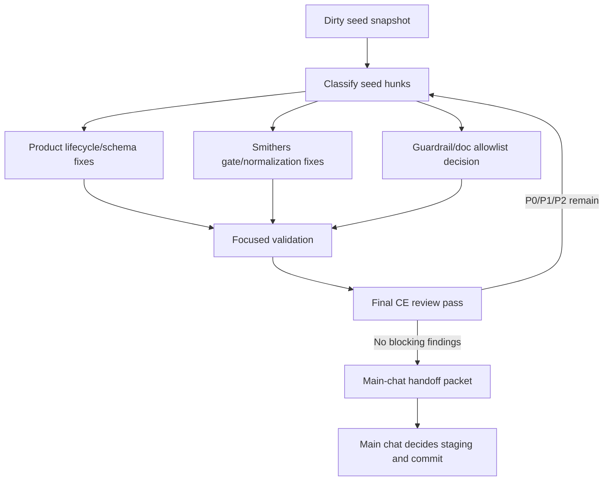
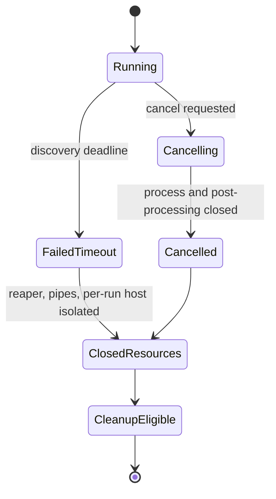

# fix: Resolve headless closeout review findings

## Summary

Resolve the CE review findings left after the headless timeout-observability closeout by separating useful dirty seed edits from unaccepted implementation, hardening both the `rpce-headless` lifecycle behavior and the Smithers grinder, and returning a clean evidence packet to the main chat before any staging or commit.

---

## Problem Frame

Three commits already landed the timeout diagnostics feature, tracked related plans, and added a Smithers closeout grinder. A follow-up review then found P1/P2 issues across two surfaces: product behavior in `context_builder` async lifecycle/schema handling, and workflow behavior in the Smithers review grinder. A partial ad-hoc fix pass started before planning and left dirty edits in the working tree.

Those dirty edits are not accepted implementation. They are candidate seed material that an implementing workflow may inspect, preserve, rewrite, or discard. The plan must make that posture explicit so Smithers can work in parallel without converting unvalidated local hunks into a commit by accident.

---

## Requirements

**Seed and handoff discipline**

- R1. Catalog the current dirty edits as seed material, with useful and discard-or-rewrite guidance before implementation starts.
- R2. Keep all dirty edits unstaged until the main chat accepts the final diff and evidence packet.
- R3. Require a clean handoff packet that lists accepted files, rejected seed hunks, validation evidence, residual risks, and commit readiness.

**Headless product hardening**

- R4. Prevent timed-out or cancelled Context Builder discovery runs from mutating shared context after a new run starts.
- R5. Ensure cancellation during post-discovery oracle follow-up cannot later overwrite a cancelled terminal state.
- R6. Make failed `get_result` responses expose structured terminal state and diagnostics without changing successful result compatibility.
- R7. Keep `context_builder` tool schema useful to clients while accurately modeling synchronous, start, and lifecycle argument requirements.
- R8. Preserve compatibility for existing synchronous calls and make the unknown-`op` behavior an intentional, tested contract.
- R9. Remove or neutralize blocking pipe-drain behavior that can hang completion when descendant processes keep stdout/stderr file descriptors open.
- R10. Extend fake-agent smokes to prove timeout/cancel process cleanup and no stale-run contamination.

**Smithers workflow hardening**

- R11. Make the grinder fail closed when validation evidence is missing, null, blocked, or sparse.
- R12. Treat P0/P1/P2 review findings as blocking even when `actionableFindings` is omitted or malformed.
- R13. Preserve CE review stable IDs and evidence well enough for follow-up fix prompts and landing packets.
- R14. Remove machine-local skill paths from Smithers workflow and prompt assets.
- R15. Validate workflow changes without running a live mutating grinder unless a disposable worktree or explicit approval is provided.

**Guardrails and validation**

- R16. Keep source-layout doc guardrails explicit; avoid blanket allowing future timestamped plan churn.
- R17. Validate the accepted final diff across Smithers, Swift/headless, smoke, guardrail, and contribution-readiness checks.
- R18. Do not create a commit in this side workflow; commit preparation belongs to the main chat after review.

---

## Review Finding Traceability

| ID | Severity | Finding | Requirements | Units |
| --- | --- | --- | --- | --- |
| RF1 | P1 | Smithers validation can pass with missing, null, blocked, or sparse build/smoke evidence. | R11, R17 | U5, U8 |
| RF2 | P1 | P0/P1/P2 findings can be ignored when `actionableFindings` is omitted or malformed. | R12, R13 | U5 |
| RF3 | P1 | Timed-out discovery may mutate shared context after a replacement run starts. | R4, R10 | U2 |
| RF4 | P1 | Cancel during oracle follow-up may not stop post-processing or may allow later completion overwrite. | R5 | U2 |
| RF5 | P2 | Smithers workflow and prompts contain machine-local skill paths. | R14 | U6 |
| RF6 | P2 | Source-layout guardrail broadly allowed future dated plan churn. | R16 | U7 |
| RF7 | P2 | Fake-agent smokes do not prove timeout/cancel process cleanup. | R10 | U2 |
| RF8 | P2 | Failed `get_result` diagnostics are prose-only or not structured enough for clients. | R6 | U3 |
| RF9 | P2 | Smithers finding normalization drops CE stable IDs or useful evidence. | R13 | U5 |
| RF10 | P2 | `context_builder` schema accepts invalid sparse calls and needs conditional requirements. | R7 | U4 |
| RF11 | P2 | Unknown `op` behavior may be an accidental compatibility break. | R8 | U4 |
| RF12 | P2 | Blocking pipe drain can hang completion when descendants keep stdout/stderr open. | R9 | U2 |

---

## Dirty Seed Assessment

### Useful Seed Material

- `.smithers/workflows/headless-closeout-grinder.tsx`: replacing the hard-coded CE code-review path with `compound-engineering:ce-code-review` is the right portability direction.
- `.smithers/prompts/headless-closeout-apply-fixes.mdx`: replacing the hard-coded Agent Mail skill path with a portable `agent-mail` reference is the right direction.
- `.smithers/prompts/headless-closeout-ce-review.mdx` and `.smithers/prompts/headless-closeout-establish-scope.mdx`: wording changes from local paths to skill references are useful, but should be checked for generated-skill consistency.
- `.smithers/workflows/headless-closeout-grinder.tsx`: the stricter validation gate is useful because it requires explicit build pass, smoke pass, unblocked validation, and evidence.
- `.smithers/workflows/headless-closeout-grinder.tsx`: defaulting blocking severities to actionable when `actionableFindings` is missing is useful, but explicit false handling still needs a product decision.
- `.smithers/workflows/headless-closeout-grinder.tsx`: normalizing CE `#` values is useful, but should preserve enough stable identity and evidence for later fix prompts.
- `Scripts/source_layout_guardrails.sh`: moving from a broad dated-plan regex to explicit allowed docs is the right guardrail direction.
- `Sources/RepoPromptHeadlessServer/HeadlessContextBuilderService.swift`: holding the active run while resources remain open, structured failed `get_result`, cancel-after-agent-exit handling, and terminal-state checks after awaited work are useful directions.
- `Sources/RepoPromptHeadlessServer/HeadlessToolSchemas.swift`: replacing the all-optional `context_builder` schema with conditional requirements is the right contract direction.

### Discard or Rewrite Candidates

- `Sources/RepoPromptHeadlessServer/HeadlessToolSchemas.swift`: the current `oneOf` seed likely breaks existing schema helpers that expect top-level `properties` and `required`, and the property merge appears to keep old `op` definitions instead of overrides.
- `Sources/RepoPromptHeadlessServer/HeadlessToolSchemas.swift`: unknown-`op` compatibility is not resolved and should not be accepted accidentally through schema-only changes.
- `Sources/RepoPromptHeadlessServer/HeadlessContextBuilderService.swift`: stopping the listener on timeout is not enough to prove accepted discovery socket work is closed or unable to mutate shared context.
- `Sources/RepoPromptHeadlessServer/HeadlessContextBuilderService.swift`: marking a run terminal before reaper/resource closure may still interact badly with immediate cleanup.
- `Sources/RepoPromptHeadlessServer/HeadlessContextBuilderService.swift`: cancel during oracle follow-up currently looks like it prevents overwrite but may not promptly abort the oracle stream.
- `Sources/RepoPromptHeadlessServer/HeadlessContextBuilderService.swift`: blocking `availableData` pipe draining still appears present and should be removed or made nonblocking.
- `.smithers/workflows/headless-closeout-grinder.tsx`: explicit `actionable: false` on P0/P1/P2 still suppresses blocking unless the implementation chooses otherwise.
- `.smithers/workflows/headless-closeout-grinder.tsx`: evidence normalization only preserves strings, but CE review evidence may be array-shaped.

---

## Key Technical Decisions

- KTD1. Treat dirty edits as candidate patches, not baseline: The first implementation unit inspects and classifies each dirty hunk before any worker edits further. Accepted hunks may be preserved; incomplete hunks should be rewritten in place; unrelated hunks should be reverted only after main-chat approval.
- KTD2. Keep product and workflow findings in one resolution plan: The review blockers span `rpce-headless` behavior and the Smithers workflow that will close it out. Splitting them now would let the workflow ship while still unable to police its own review loop.
- KTD3. Require fail-closed workflow gates: Missing validation or malformed CE review output is a blocker. A grinder whose evidence parser fails open is worse than a manual checklist because it creates false completion confidence.
- KTD4. Keep schema changes additive and client-readable: Conditional requirements should not remove useful top-level discoverability unless the MCP schema ecosystem requires it. Existing tests should be updated to assert both contract precision and client compatibility.
- KTD5. Isolate discovery state per async run: Each async Context Builder discovery socket should use run-scoped selection/prompt state, preferably through a per-run `HeadlessWorkspaceHost`, so stale accepted socket work can only mutate an obsolete run record. The main/shared host and future runs must not observe stale discovery mutations.
- KTD6. Defer structured Claude event telemetry: This plan fixes failed result diagnostics and current log contracts. It does not add Claude `stream-json` event capture or structured MCP tool-call auditing.
- KTD7. Main chat owns commit readiness: Smithers and side agents may prepare evidence, but staging and commit happen only after the main chat accepts the final diff.

---

## High-Level Technical Design

---

## Scope Boundaries

### In Scope

- Resolving the catalogued P1/P2 CE findings from the closeout review.
- Inspecting the current dirty edits and deciding hunk-by-hunk whether they are useful, incomplete, or discardable.
- Hardening `context_builder` timeout, cancel, failed-result, schema, and smoke coverage.
- Hardening the Smithers closeout grinder's review normalization, validation gate, portable skill references, and non-mutating validation story.
- Keeping tracked plan-doc guardrails explicit.
- Returning a handoff packet to the main chat before staging or commit.

### Deferred to Follow-Up Work

- Structured Claude event capture through `stream-json`.
- A shared trace/event store for `context_builder` and `agent_run`.
- Broad redesign of Context Builder discovery sockets or oracle streaming infrastructure beyond what cancellation safety requires.
- Live execution of the mutating Smithers grinder in the main worktree as validation.
- New product behavior outside the reviewed headless timeout-observability closeout.

---

## Implementation Units

### U1. Freeze and classify the dirty seed state

- **Goal:** Turn the current dirty worktree into an explicit input to implementation instead of an accidental baseline.
- **Requirements:** R1, R2, R3, R18
- **Dependencies:** None
- **Files:**
  - `.smithers/prompts/headless-closeout-apply-fixes.mdx`
  - `.smithers/prompts/headless-closeout-ce-review.mdx`
  - `.smithers/prompts/headless-closeout-establish-scope.mdx`
  - `.smithers/workflows/headless-closeout-grinder.tsx`
  - `Scripts/source_layout_guardrails.sh`
  - `Sources/RepoPromptHeadlessServer/HeadlessContextBuilderService.swift`
  - `Sources/RepoPromptHeadlessServer/HeadlessToolSchemas.swift`
- **Approach:** Capture the dirty diff and compare each hunk against this plan's seed assessment. Preserve hunks only when they directly satisfy a requirement and survive local review. Mark incomplete hunks for rewrite rather than layering new patches on top of dubious state.
- **Patterns to follow:** `AGENTS.md` dirty-worktree guidance and the closeout posture in `docs/plans/2026-06-15-002-fix-headless-timeout-observability-closeout-plan.md`.
- **Test scenarios:**
  - Test expectation: none; this unit is read-only classification.
- **Verification:** The handoff notes identify accepted, rewritten, and rejected seed hunks before any file is staged.

### U2. Harden Context Builder terminal lifecycle isolation

- **Goal:** Ensure timed-out and cancelled async discovery runs cannot mutate shared context after a replacement run starts.
- **Requirements:** R4, R5, R9, R10
- **Dependencies:** U1
- **Files:**
  - `Sources/RepoPromptHeadlessServer/HeadlessContextBuilderService.swift`
  - `Sources/RepoPromptHeadlessServer/UnixSocketListener.swift`
  - `Sources/RepoPromptHeadlessServer/Scripts/context_builder_mcp_fake_agent_test.py`
- **Approach:** Treat terminal state and resource closure as separate lifecycle facts. Give each async discovery run isolated selection/prompt state, preferably by creating a per-run `HeadlessWorkspaceHost` for the discovery socket and harvesting from that run host. Keep the single-flight slot occupied until process reaping, nonblocking pipe closure, and listener shutdown are complete. Stale accepted socket work may finish against its obsolete run host, but it must not mutate the shared host or a later run. Cancellation during oracle follow-up must leave cancellation as the winning terminal state and should stop or abandon oracle work promptly.
- **Execution note:** Add characterization smoke coverage before rewriting lifecycle ordering so the implementation proves the stale-run race and cancellation behavior.
- **Patterns to follow:** Existing `AsyncRunRecord` lifecycle fields, `closeResources(for:)`, `finishCancelled`, and fake-agent MCP lifecycle scenarios.
- **Test scenarios:**
  - Error path: a timeout run reaches `failed`, retains diagnostics, and rejects a second `start` until resources are closed or proven inert.
  - Integration path: after timeout closure, a second `start` succeeds without inheriting prompt or selection mutations from the stale discovery agent's per-run host.
  - Integration path: a stale accepted discovery connection that writes selection or prompt after timeout affects only its obsolete run host and never appears in the next run's harvest.
  - Error path: cancelling a sleeping fake agent yields `cancelled`, kills the recorded fake-agent process tree, and cleanup succeeds.
  - Error path: cancelling after discovery selection but during slow oracle follow-up leaves the run cancelled and prevents a later completed result.
  - Edge case: a fake agent exits while a descendant keeps stdout or stderr descriptors open; completion does not hang.
- **Verification:** The fake-agent smoke proves timeout isolation, cancel isolation, process cleanup, and no blocking drain.

### U3. Return structured failed `get_result` diagnostics

- **Goal:** Make failed async `get_result` useful to MCP clients while preserving successful result compatibility.
- **Requirements:** R6, R10
- **Dependencies:** U2
- **Files:**
  - `Sources/RepoPromptHeadlessServer/HeadlessContextBuilderService.swift`
  - `Sources/RepoPromptHeadlessServer/HeadlessTypes.swift`
  - `Sources/RepoPromptHeadlessServer/Scripts/context_builder_mcp_fake_agent_test.py`
  - `Tests/RepoPromptTests/MCP/HeadlessAgentToolSchemaTests.swift`
- **Approach:** Return a tool error result for terminal failed/cancelled contexts that includes text for humans and structured snapshot content for clients. Keep successful `get_result` responses as the existing `HeadlessContextBuilderResult`. Avoid introducing a second error-envelope type unless the existing snapshot cannot express the needed fields cleanly.
- **Patterns to follow:** Existing snapshot diagnostics encoding and existing `jsonTextResult` response style.
- **Test scenarios:**
  - Error path: timed-out `get_result` returns `isError: true`, includes the timeout error in text, and includes structured snapshot fields with diagnostics.
  - Error path: cancelled `get_result` returns `isError: true` with `run_status: cancelled`.
  - Happy path: completed `get_result` still returns the existing context pack shape with `isError` unset or false.
  - Compatibility path: clients can still read `context_id`, `run_status`, and diagnostics from lifecycle `wait` snapshots.
- **Verification:** Swift schema tests and Python smoke assertions prove both failed and successful response shapes.

### U4. Repair the `context_builder` input schema contract

- **Goal:** Accurately advertise synchronous, `start`, and lifecycle argument requirements without breaking clients that inspect top-level properties.
- **Requirements:** R7, R8
- **Dependencies:** U1
- **Files:**
  - `Sources/RepoPromptHeadlessServer/HeadlessToolSchemas.swift`
  - `Sources/RepoPromptHeadlessServer/HeadlessContextBuilderService.swift`
  - `Tests/RepoPromptTests/MCP/HeadlessAgentToolSchemaTests.swift`
  - `Tests/RepoPromptTests/MCP/ToolCatalogSnapshotTests.swift`
- **Approach:** Replace the all-optional schema with a conditional contract, but keep top-level `properties` discoverable if existing tests or clients rely on them. Fix property override merging so the `start` and lifecycle `op` constraints are real. Decide and test unknown-`op` behavior: preserve synchronous compatibility when no `op` is supplied, and either keep service-level unsupported-op errors for unknown values or explicitly document schema-level rejection.
- **Patterns to follow:** Existing `agent_run` and `agent_manage` schema tests, plus the context-builder parser tests in `HeadlessAgentToolSchemaTests`.
- **Test scenarios:**
  - Happy path: no `op` plus `instructions` remains valid synchronous compatibility mode.
  - Happy path: `op: start` requires `instructions`.
  - Happy path: lifecycle ops require `context_id`.
  - Error path: unknown `op` has an intentional tested result.
  - Compatibility path: tool schema still advertises `instructions`, `context_id`, `timeout`, `timeout_seconds`, and lifecycle `op` values to schema readers.
  - Snapshot path: any schema digest changes in tool catalog tests are reviewed and updated only if intentional.
- **Verification:** Schema tests prove both argument requirements and compatibility expectations.

### U5. Harden Smithers review and validation gating

- **Goal:** Ensure the closeout grinder cannot declare success when CE review or validation output is sparse, malformed, or missing blocking findings.
- **Requirements:** R11, R12, R13, R15
- **Dependencies:** U1
- **Files:**
  - `.smithers/workflows/headless-closeout-grinder.tsx`
  - `.smithers/package.json`
  - `.smithers/tests/headless-closeout-grinder.test.ts`
  - `.smithers/lib/headlessCloseoutGate.ts`
- **Approach:** Isolate pure normalization/gating helpers enough to test them without running a mutating Smithers workflow. Extraction into `.smithers/lib` and `.smithers/tests` is optional unless the implementer also wires an explicit Bun test entry in `.smithers/package.json`; otherwise keep helpers local and validate through typecheck plus a small non-mutating harness. Treat malformed CE review output as a P1 blocker. Treat P0/P1/P2 findings as blocking unless the workflow has a clearly trusted non-actionable signal. Preserve CE stable `#` identity and evidence arrays so follow-up prompts can cite the same finding across review loops.
- **Execution note:** Prefer test-first for the pure helper behavior because the current seed edits are plausible but not yet validated.
- **Patterns to follow:** Existing zod output schemas and the grinder's `normalizeReview` and `validationPassed` functions.
- **Test scenarios:**
  - Error path: missing validation, empty validation, null build result, null smoke result, `validationBlocked: true`, and empty evidence all fail completion.
  - Happy path: completion passes only with unblocked validation, explicit build pass, explicit smoke pass, and non-empty evidence.
  - Error path: P0/P1/P2 findings in `findings` block even when `actionableFindings` is absent.
  - Error path: malformed or failed CE review output becomes a P1 workflow blocker.
  - Edge case: CE `#`, explicit `id`, numeric IDs, string IDs, and fallback file-line-title IDs dedupe predictably.
  - Edge case: evidence arrays are preserved or rendered into useful evidence text rather than dropped.
  - Happy path: P3 and nit findings remain non-blocking unless separately marked actionable by policy.
- **Verification:** Smithers unit tests exercise the pure gate/normalization contract without launching a live mutating workflow.

### U6. Make Smithers skill references portable

- **Goal:** Remove machine-local skill paths from the grinder workflow, prompts, and generated workflow skill.
- **Requirements:** R14, R15
- **Dependencies:** U1
- **Files:**
  - `.smithers/workflows/headless-closeout-grinder.tsx`
  - `.smithers/prompts/headless-closeout-apply-fixes.mdx`
  - `.smithers/prompts/headless-closeout-ce-review.mdx`
  - `.smithers/prompts/headless-closeout-establish-scope.mdx`
  - `.smithers/skills/headless-closeout-grinder.md`
- **Approach:** Use portable skill names or references in workflow props and prompt text. Regenerate or update repo-local Smithers skill documentation only if the workflow shape or prompt contract changes. Keep Agent Mail instructions as a coordination requirement for editing lanes, not as an absolute local filesystem path.
- **Patterns to follow:** `AGENTS.md` Smithers section and existing repo-local Smithers skill docs.
- **Test scenarios:**
  - Error path: path scan finds no machine-local home prefixes or plugin-cache paths in Smithers workflow, prompt, or generated skill assets.
  - Happy path: workflow inspection and doctor commands still resolve the workflow after portable reference changes.
  - Non-mutating path: graph rendering succeeds without launching the apply-fixes lane.
- **Verification:** Smithers typecheck, workflow list, workflow inspection, workflow doctor, and graph generation pass for the updated workflow.

### U7. Keep tracked-plan guardrails explicit

- **Goal:** Preserve the decision to commit specific plan docs without allowing future dated plan churn by regex.
- **Requirements:** R16
- **Dependencies:** U1
- **Files:**
  - `Scripts/source_layout_guardrails.sh`
- **Approach:** Keep durable plan documents in an explicit allowlist. This plan is intended as a tracked resolution plan, so add only `docs/plans/2026-06-16-001-fix-headless-closeout-review-findings-plan.md` if guardrails require it. Do not restore the broad dated-plan pattern.
- **Patterns to follow:** Existing `allowed_tracked_docs` entries in `Scripts/source_layout_guardrails.sh`.
- **Allowlist entries to validate:**
  - `docs/plans/2026-06-15-001-fix-context-builder-async-results-plan.md`
  - `docs/plans/2026-06-15-001-fix-headless-timeout-observability-plan.md`
  - `docs/plans/2026-06-15-002-fix-headless-timeout-observability-closeout-plan.md`
  - `docs/plans/2026-06-16-001-fix-headless-closeout-review-findings-plan.md`
- **Test scenarios:**
  - Happy path: currently accepted plan docs pass source-layout guardrails.
  - Error path: an arbitrary new dated plan remains rejected until explicitly allowlisted.
- **Verification:** Guardrails pass for the intended tracked docs and still fail for unapproved docs.

### U8. Validate and hand off before staging

- **Goal:** Prove the accepted final diff and return control to the main chat before staging or commit.
- **Requirements:** R2, R3, R15, R17, R18
- **Dependencies:** U2, U3, U4, U5, U6, U7
- **Files:**
  - `.agents/skills/rpce-contribution-check/scripts/preflight.sh`
  - `.smithers/package.json`
  - `.smithers/lib/headlessCloseoutGate.ts`
  - `.smithers/prompts/headless-closeout-apply-fixes.mdx`
  - `.smithers/prompts/headless-closeout-ce-review.mdx`
  - `.smithers/prompts/headless-closeout-establish-scope.mdx`
  - `.smithers/skills/headless-closeout-grinder.md`
  - `.smithers/workflows/headless-closeout-grinder.tsx`
  - `.smithers/tests/headless-closeout-grinder.test.ts`
  - `Scripts/source_layout_guardrails.sh`
  - `Sources/RepoPromptHeadlessServer/Scripts/context_builder_mcp_fake_agent_test.py`
  - `Sources/RepoPromptHeadlessServer/Scripts/mcp_smoke.py`
  - `Tests/RepoPromptTests/MCP/HeadlessAgentToolSchemaTests.swift`
  - `Tests/RepoPromptTests/MCP/ToolCatalogSnapshotTests.swift`
- **Approach:** Validate only after accepted seed decisions are applied. Separate Smithers workflow validation, Swift/headless build and schema validation, fake-agent smoke validation, and guardrail/doc validation. The pre-staging handoff packet must say which checks passed, which were blocked by host constraints, which files are intended for staging, which seed hunks were discarded, and that commit-mode contribution preflight is pending main-chat staging approval.
- **Patterns to follow:** `AGENTS.md` headless Linux Docker guidance, Smithers validation guidance, and contribution preflight requirements.
- **Test scenarios:**
  - Happy path: Smithers typecheck and workflow static validation pass without a live mutating grinder run.
  - Happy path: `rpce-headless` build and headless smokes pass on the available supported path.
  - Happy path: guardrails accept only the intended tracked plan docs.
  - Environment limitation path: unavailable native Swift or macOS-only XCTest dependencies are reported as host-tool gaps only when Docker build and headless smokes still prove the product path.
  - Handoff path: no files are staged and no commit is made before the main chat accepts the packet.
  - Post-approval path: after the main chat approves staging, contribution preflight runs against the exact staged file set.
- **Verification:** Main chat receives a final pre-staging evidence packet with accepted files, rejected seed hunks, validation results, residual risks, and a clear "ready/not ready for staging" recommendation. Commit-mode preflight is explicitly marked pending until staging is approved.

---

## Risks & Dependencies

- **Seed confusion risk:** Implementers may mistake dirty seed edits for accepted code. U1 and U8 mitigate this by requiring explicit hunk classification and main-chat acceptance before staging.
- **Concurrency risk:** Smithers editing lanes can collide on shared files. Editing lanes should use Agent Mail reservations; read-only review and validation lanes should not reserve files.
- **Schema compatibility risk:** A correct JSON Schema can still be less usable for clients that expect top-level properties. U4 requires compatibility checks, not only formal conditional requirements.
- **Async lifecycle risk:** Closing the listener may not close accepted discovery work. U2 requires proof that stale discovery effects cannot mutate the next run.
- **Validation risk:** Running the live grinder in the main worktree can mutate files during validation. U5 and U6 favor pure helper tests and static workflow validation instead.
- **Host-tool risk:** Linux/native Swift gaps can obscure product evidence. U8 separates host-tool limitations from Docker/headless product validation.

---

## Validation Strategy

Validation should happen after implementation accepts or rewrites seed hunks, not before. The evidence packet should include:

- Smithers static validation for typecheck, workflow listing, workflow inspection, workflow doctor, and graph rendering.
- Smithers pure-helper tests for review normalization and validation gating.
- Swift schema tests for `context_builder` input schema, parser compatibility, and failed-result diagnostics.
- Python fake-agent smoke coverage for timeout diagnostics, cancel cleanup, process death, no stale-run contamination, and nonblocking pipe behavior.
- `rpce-headless` build evidence on the supported local or Docker path.
- Headless smoke evidence for the rebuilt binary.
- Source-layout guardrail evidence for explicit plan-doc allowlisting.
- Commit-mode contribution preflight listed as pending until the main chat approves staging.

Do not use a live mutating Smithers grinder run as the primary validation unless it runs in a disposable worktree or the main chat explicitly approves that mutation.

---

## Main-Chat Handoff Contract

The final handoff back to the main chat must include:

- The three committed base changes being closed out.
- The dirty seed hunks accepted, rewritten, or discarded.
- The final intended file set.
- The final CE review status and whether any P0/P1/P2 findings remain.
- Validation results grouped by Smithers, Swift/headless, smokes, guardrails, and contribution readiness.
- Contribution-readiness state, with commit-mode preflight marked pending until the main chat approves staging.
- Known host-tool limitations, separated from product failures.
- Agent Mail reservation status for any editing lanes.
- A clear statement that nothing is staged and no commit has been made unless the main chat explicitly requested it after reviewing the packet.

---

## Sources & Research

- `docs/plans/2026-06-15-001-fix-headless-timeout-observability-plan.md` defines the original timeout-observability feature scope.
- `docs/plans/2026-06-15-002-fix-headless-timeout-observability-closeout-plan.md` defines the closeout and Smithers lane posture.
- `AGENTS.md` defines dirty-tree handling, headless Linux validation, Smithers workflow validation, and contribution preflight expectations.
- `.smithers/workflows/headless-closeout-grinder.tsx` owns the review loop, validation gate, and landing packet behavior being hardened.
- `Sources/RepoPromptHeadlessServer/HeadlessContextBuilderService.swift` owns async Context Builder lifecycle, timeout, cancel, failed results, pipe draining, and oracle follow-up.
- `Sources/RepoPromptHeadlessServer/HeadlessToolSchemas.swift` owns the advertised `context_builder` schema.
- `Sources/RepoPromptHeadlessServer/Scripts/context_builder_mcp_fake_agent_test.py` is the best smoke harness for process cleanup, timeout, cancel, and stale-run scenarios.
- `Tests/RepoPromptTests/MCP/HeadlessAgentToolSchemaTests.swift` is the focused Swift test surface for tool schemas and diagnostics encoding.
