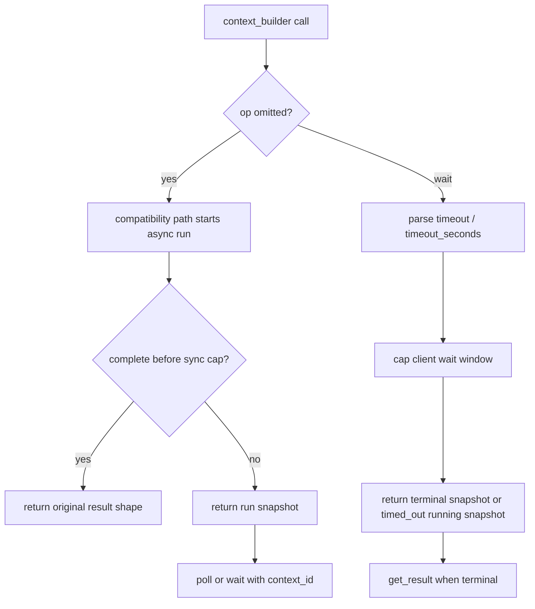

# fix: Clarify headless Context Builder contract

## Summary

Clarify the `rpce-headless` Context Builder MCP contract after the progress-friendly wait changes. The work keeps the new behavior, makes the omitted-`op` compatibility response explicitly union-shaped, pins wait-cap semantics in focused tests, and reconciles the audit artifact that still describes the older onboarding order.

---

## Problem Frame

Review found three pass-3 closeout issues. First, `context_builder` calls that omit `op` can now return a lifecycle snapshot when the run exceeds the synchronous wait cap, while `Sources/RepoPromptHeadlessServer/README.md` still says the path preserves the original one-shot shape. Second, `op:"wait"` now defaults and caps waits to progress-friendly windows, which is intentional but observable for clients that previously requested long waits. Third, `agent_ergonomics_audit/audit/recommendations.jsonl` still describes direct tree/search/code-structure exploration before `context_builder`, which contradicts the implemented Context Builder-first onboarding contract.

This plan treats the current behavior as the intended direction. It does not roll back progress heartbeats, async recovery, `context_id:"active"`, or wait caps.

---

## Requirements

- R1. The omitted-`op` Context Builder contract must state that short completed calls return the original result shape and long calls return a lifecycle snapshot with recovery fields.
- R2. The wait contract must state that `timeout` wins over `timeout_seconds`, that waits are capped by default, and that operators can raise the cap when a client truly wants longer waits.
- R3. Capabilities, tool schema text, README, AGENTS guidance, and robot docs must remain aligned on the same Context Builder lifecycle semantics.
- R4. Focused tests and smokes must pin the union response shape and wait-cap behavior so future ergonomic passes do not silently drift.
- R5. Audit artifacts must describe the implemented onboarding order: status check, Context Builder synthesis, then direct tree/search/code-structure tools for verification and citations.

---

## Key Technical Decisions

- **Keep contract version stable for this patch:** Keep `contract_version` at `1` unless implementation deliberately preserves old omitted-`op` shape instead. The safer plan is to document the v1 compatibility path as a union and test both outcomes because the behavior is already uncommitted and still within the active pass-3 contract.
- **Keep progress-friendly waits:** Preserve the 15s default and 30s default cap as the intended MCP UX. Document the environment override instead of honoring arbitrarily long waits by default.
- **Treat docs and tests as the fix surface:** The implementation already carries the desired progress behavior. The primary work is contract wording, parser/smoke assertions, and audit reconciliation rather than new runtime architecture.
- **Use real schema/status assertions:** Follow existing headless test patterns that inspect `HeadlessToolSchemas`, capabilities/status payloads, and black-box MCP smokes rather than brittle grep-only source checks.

---

## High-Level Technical Design

The contract should present this as one lifecycle with two response shapes, not as two unrelated modes. The original result shape remains valid only when omitted-`op` completion happens inside the synchronous cap.

---

## Scope Boundaries

- In scope: documentation and contract text, parser/unit assertions, black-box MCP smoke assertions, and audit artifact wording.
- In scope: deciding whether to keep `contract_version` stable or bump it as a deliberate compatibility signal.
- Out of scope: reverting Context Builder progress notifications, removing wait caps, changing agent process lifecycle, changing global MCP config, or installing a rebuilt binary.
- Deferred to follow-up work: deeper formal pass-3 rescore from the agent-ergonomics skill.

---

## Implementation Units

### U1. Make the compatibility response shape explicit

- **Goal:** Remove the false promise that omitted-`op` always preserves the one-shot result shape.
- **Requirements:** R1, R3
- **Dependencies:** None
- **Files:**
  - `Sources/RepoPromptHeadlessServer/README.md`
  - `Sources/RepoPromptHeadlessServer/HeadlessCapabilities.swift`
  - `Sources/RepoPromptHeadlessServer/HeadlessToolSchemas.swift`
  - `AGENTS.md`
  - `Tests/RepoPromptTests/MCP/HeadlessAgentToolSchemaTests.swift`
- **Approach:** Describe omitted-`op` as compatibility mode that may return either the original result shape or a lifecycle snapshot. Make `headless_capabilities`, robot docs, and tool descriptions use the same language. Keep `op:"start"` as the preferred path for real agents.
- **Patterns to follow:** Existing `context_builder` lifecycle examples in `HeadlessCapabilities.swift`; schema-description assertions in `HeadlessAgentToolSchemaTests.swift`.
- **Test scenarios:**
  - Assert the Context Builder tool description mentions that compatibility mode may return a running snapshot.
  - Assert capabilities timeout/lifecycle guidance mentions original result shape only for completion inside the sync cap.
  - Assert robot docs teach `get_result` after terminal lifecycle snapshots.
- **Verification:** A reader comparing README, capabilities JSON, and tool schema sees the same union-shaped compatibility contract.

### U2. Pin wait-cap semantics and overrides

- **Goal:** Make progress-friendly wait semantics intentional and test-covered instead of an accidental narrowing of old long waits.
- **Requirements:** R2, R3, R4
- **Dependencies:** U1
- **Files:**
  - `Sources/RepoPromptHeadlessServer/README.md`
  - `Sources/RepoPromptHeadlessServer/HeadlessCapabilities.swift`
  - `Sources/RepoPromptHeadlessServer/HeadlessToolSchemas.swift`
  - `Tests/RepoPromptTests/MCP/HeadlessAgentToolSchemaTests.swift`
  - `Sources/RepoPromptHeadlessServer/Scripts/context_builder_mcp_fake_agent_test.py`
- **Approach:** Document the default wait window and cap, the environment overrides, and the precedence rule that `timeout` wins over `timeout_seconds`. Add parser coverage for default wait behavior and explicit `timeout` values above the cap. Extend the fake-agent MCP test so a long explicit wait with a low cap returns a timed-out running snapshot quickly while the discovery run remains recoverable.
- **Patterns to follow:** Existing parser tests for `timeout` vs. `timeout_seconds`; existing fake-agent sections that use controlled sleep and environment overrides.
- **Test scenarios:**
  - Parser: omitted lifecycle wait timeout uses the default lifecycle wait value.
  - Parser: `timeout` greater than the configured max is capped.
  - Parser: `timeout:0` still behaves like poll and is not raised by the cap.
  - MCP smoke: a running Context Builder call with a long wait request and low wait max returns `_meta.wait_result:"timed_out"` while `run_status` remains `running`.
  - MCP smoke: the same run can still be completed or cleaned up after the capped wait returns.
- **Verification:** Tests prove that capped waits are recoverable progress snapshots, not discovery failures.

### U3. Reconcile audit artifacts with Context Builder-first onboarding

- **Goal:** Remove the stale R-009 wording that tells future auditors to put direct exploration before Context Builder.
- **Requirements:** R5
- **Dependencies:** U1
- **Files:**
  - `agent_ergonomics_audit/audit/recommendations.jsonl`
  - `agent_ergonomics_audit/audit/applied_changes.jsonl`
  - `agent_ergonomics_audit/audit/uplift_diff.md`
  - `agent_ergonomics_audit/pass3_handoff.md`
  - `agent_ergonomics_audit/audit/regression_tests/R-006__context_builder_schema_guidance.test.sh`
  - `agent_ergonomics_audit/audit/regression_tests/R-007__headless_status.test.sh`
- **Approach:** Make R-009 and related prose say the onboarding order is `headless_status`, then `context_builder` for synthesis, then direct tree/search/code-structure calls for anchors and citations. Keep R-013 as the progress-specific item and do not blur it with R-012 timeout recovery.
- **Patterns to follow:** JSONL one-record-per-line audit ledger; existing regression tests that validate public contract text and CLI/MCP smoke payloads.
- **Test scenarios:**
  - JSONL parse succeeds for recommendations and applied changes after wording updates.
  - Regression tests assert Context Builder-first wording, not manual-read-first wording.
  - Audit handoff and uplift text describe R-012 as recoverability and R-013 as progress/wait feedback.
- **Verification:** The next audit pass sees one coherent story across recommendations, applied changes, handoff, and regression tests.

### U4. Refresh contract smokes and validation notes

- **Goal:** Ensure the review fixes are guarded by the same Linux headless validation lane as the rest of pass 3.
- **Requirements:** R3, R4
- **Dependencies:** U1, U2, U3
- **Files:**
  - `Sources/RepoPromptHeadlessServer/Scripts/cli_contract_smoke.py`
  - `Sources/RepoPromptHeadlessServer/Scripts/mcp_smoke.py`
  - `Sources/RepoPromptHeadlessServer/Scripts/context_builder_mcp_fake_agent_test.py`
  - `agent_ergonomics_audit/audit/applied_changes.jsonl`
  - `agent_ergonomics_audit/pass3_handoff.md`
- **Approach:** Add narrow smoke assertions for the phrases that matter to the public contract: compatibility mode may return a running snapshot, waits are capped to a progress-friendly maximum, and `timeout_seconds` is a wait alias. Keep validation notes honest that Linux XCTest remains blocked by macOS-only package dependencies.
- **Patterns to follow:** Existing Docker-backed headless smoke evidence in `agent_ergonomics_audit/audit/applied_changes.jsonl`; existing CLI/MCP smoke assertion style that checks structured payloads before text fallback.
- **Test scenarios:**
  - CLI contract smoke verifies capabilities and robot docs expose the union-shaped compatibility contract.
  - MCP smoke verifies `headless_capabilities` or tool descriptions expose wait-cap semantics.
  - Context Builder fake-agent smoke verifies progress-token and capped-wait behavior still pass after wording/test changes.
- **Verification:** Docker product build plus headless smokes pass, and validation notes distinguish that evidence from Linux XCTest limitations.

---

## Acceptance Examples

- AE1. Given an agent omits `op` and the run finishes before the synchronous cap, when it reads the tool result, then the result is the original Context Builder result shape.
- AE2. Given an agent omits `op` and the run is still active after the synchronous cap, when it reads the tool result, then it receives a lifecycle snapshot with `context_id`, `run_status`, and next-action guidance.
- AE3. Given a client sends `op:"wait"` with both `timeout` and `timeout_seconds`, when the parser resolves the request, then `timeout` controls the wait window.
- AE4. Given a client asks for a long wait above the configured max, when the run is still active at the cap, then the response is a timed-out running snapshot and the run remains recoverable.
- AE5. Given a future auditor reads R-009, when they compare it to headless status/capabilities, then both sources describe Context Builder before broad manual reads.

---

## System-Wide Impact

This work affects the agent-facing MCP contract for `rpce-headless`, not app runtime behavior. The most sensitive downstream consumers are strict MCP clients that parse `context_builder` omitted-`op` results or wait responses. The plan reduces risk by documenting the union response, testing the compatibility branch, and keeping the current `contract_version` decision explicit.

---

## Risks & Dependencies

- **Strict legacy clients:** Clients that assumed omitted-`op` always returns the original result shape may need to handle lifecycle snapshots. Mitigation: document the union shape and prefer `op:"start"` in all agent guidance.
- **Over-documenting internals:** The docs should describe observable contract fields without turning into implementation notes about private helper methods.
- **Audit drift:** JSONL and markdown audit artifacts can drift from each other. Mitigation: update recommendations, applied changes, uplift, and handoff together and parse JSONL after changes.
- **Linux test constraints:** Focused XCTest remains limited on Linux by macOS-only dependencies. Mitigation: rely on Docker `rpce-headless` product build plus headless Python smokes for Linux proof, while keeping Swift unit test changes compile-ready for macOS.

---

## Documentation / Operational Notes

Do not install or restart the shared user-local `rpce-headless` binary as part of this plan. Installation and active Codex MCP process restarts are operational actions for the implementation or validation turn, not planning.

---

## Sources & Research

- `AGENTS.md` for headless MCP validation rules, Docker Swift guidance, and the current Context Builder-first agent guidance.
- `Sources/RepoPromptHeadlessServer/HeadlessContextBuilderService.swift` for omitted-`op`, wait parsing, wait caps, and snapshot behavior.
- `Sources/RepoPromptHeadlessServer/HeadlessCapabilities.swift` and `Sources/RepoPromptHeadlessServer/HeadlessToolSchemas.swift` for public MCP contract text.
- `Sources/RepoPromptHeadlessServer/README.md` for the stale compatibility-shape statement found in review.
- `Tests/RepoPromptTests/MCP/HeadlessAgentToolSchemaTests.swift` and `Sources/RepoPromptHeadlessServer/Scripts/context_builder_mcp_fake_agent_test.py` for focused coverage patterns.
- `docs/plans/fable/010-real-schema-tests.md` and `docs/plans/2026-06-16-001-fix-headless-closeout-review-findings-plan.md` for prior local guidance on schema assertions and Context Builder lifecycle recovery.
- `agent_ergonomics_audit/pass3_handoff.md` and `agent_ergonomics_audit/audit/HANDOFF.md` for pass-3 audit intent and validation evidence conventions.
