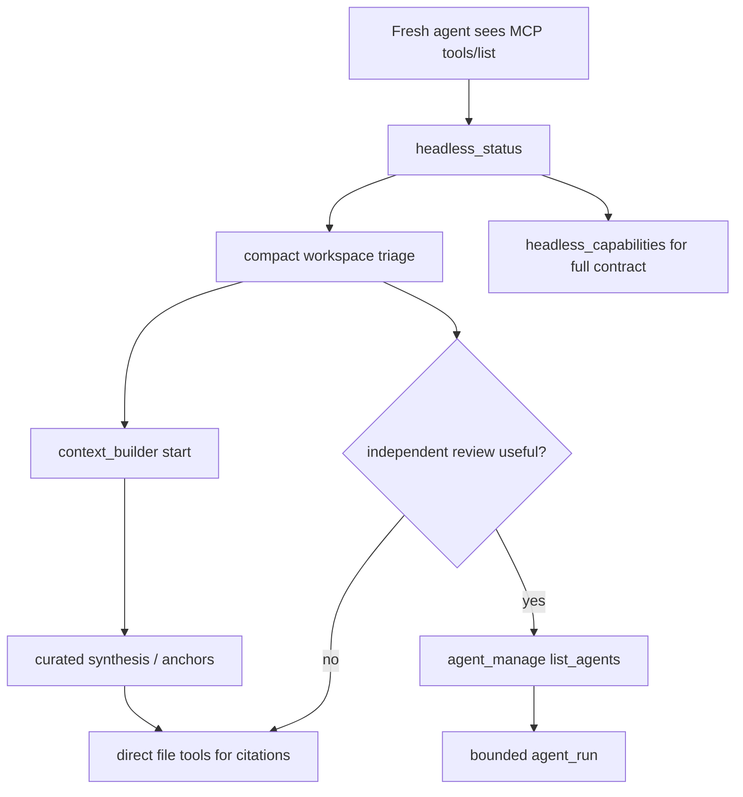

# fix: Align headless status-first onboarding

## Summary

Align the remaining `rpce-headless` discovery and audit surfaces around the intended onboarding order: `headless_status` first, `context_builder` second, then direct tools for verification and citations. The fix should update the highest-salience contract strings, tool ordering assertions, smoke expectations, and the tracked audit playbook that still teaches the older agent-first flow.

---

## Problem Frame

The pass-3 ergonomics diff mostly teaches agents to start with `headless_status`, but two review findings show lingering drift. `HeadlessCapabilities.recommendedWorkflow`, MCP `tools/list` order, and their tests still make `headless_capabilities` the first visible action. `agent_ergonomics_audit/audit/playbook.md` still recommends root verification, `agent_manage`, and `agent_run` before `context_builder`, which contradicts the newer Context Builder-first architecture onboarding story.

This plan does not revisit the already-reviewed Context Builder wait contract. It only closes the status-first onboarding drift surfaced by the review.

---

## Requirements

**Status-first contract**

- R1. `headless_status` must be the first recommended MCP action in high-salience agent-facing contract surfaces.
- R2. MCP tool discovery must make `headless_status` at least as salient as, and preferably earlier than, `headless_capabilities`.
- R3. `headless_capabilities` must remain discoverable as the fuller contract after compact workspace triage.

**Onboarding workflow**

- R4. Architecture onboarding guidance must consistently describe the order as `headless_status`, then `context_builder`, then direct tree/search/structure/read tools for evidence.
- R5. Server-managed subagents must remain discoverable as an optional independent review path, not the default first architecture-onboarding step.

**Regression resistance**

- R6. Swift tests, CLI contract smoke, MCP smoke, and audit regression checks must assert the status-first order.
- R7. Tracked audit artifacts must agree with the current behavior so future audit agents do not inherit stale guidance.

---

## Key Technical Decisions

- **Prefer status before capabilities in `tools/list`:** Tool order is a strong behavioral nudge for generic MCP agents. Putting `headless_status` first makes the compact triage packet the default first call while preserving `headless_capabilities` as the fuller follow-up contract.
- **Keep capabilities as the detailed second surface:** `headless_capabilities` still carries exit codes, examples, native workflow metadata, and fuller contract text. The fix should not demote it out of the early discovery cluster.
- **Treat subagents as optional review, not first-pass onboarding:** `agent_manage` and `agent_run` should remain near the top of the tool list, but status and Context Builder should frame when to use them.
- **Update tests by behavior, not wording trivia:** Assertions should pin first-call order and key contract phrases without becoming brittle about every sentence in documentation.

---

## High-Level Technical Design

The important shape is that compact status and Context Builder lead the default path. Capabilities and subagents remain early, but they no longer precede status as the main onboarding cue.

---

## Scope Boundaries

- In scope: tool list ordering, capabilities/status recommended workflow strings, robot docs/README/AGENTS consistency checks if needed, Swift schema tests, Python smokes, and tracked audit artifacts.
- In scope: updating the audit playbook from audit-only stale guidance to the current pass-3 intended behavior.
- Out of scope: changing Context Builder wait semantics, progress-token handling, omitted-`op` compatibility behavior, root metadata shape, native workflow metadata, or custom workflow resolver support.
- Out of scope: installing a rebuilt host binary, changing global MCP config, killing processes, staging, committing, or pushing.
- Deferred to follow-up work: a fresh skill-guided ergonomics rescore after the functional fixes are applied and validated.

---

## Implementation Units

### U1. Make status the first high-salience discovery action

- **Goal:** Ensure fresh MCP agents see `headless_status` before `headless_capabilities` in tool discovery and recommended workflow text.
- **Requirements:** R1, R2, R3
- **Dependencies:** None
- **Files:**
  - `Sources/RepoPromptHeadlessServer/HeadlessToolSchemas.swift`
  - `Sources/RepoPromptHeadlessServer/HeadlessCapabilities.swift`
  - `Tests/RepoPromptTests/MCP/HeadlessAgentToolSchemaTests.swift`
  - `Sources/RepoPromptHeadlessServer/Scripts/mcp_smoke.py`
- **Approach:** Reorder `HeadlessToolSchemas.tools` so `headless_status` is first and `headless_capabilities` remains second. Change `HeadlessCapabilities.recommendedWorkflow[0]` to call `headless_status` or `robot-docs status --json` first, then direct agents to `headless_capabilities` for the fuller contract. Update the tests and smoke to assert the status-first prefix.
- **Patterns to follow:** Existing `testFullToolDiscoveryPromotesManagedOnboardingBeforeFileReads` prefix assertions and `mcp_smoke.py` black-box `tools/list` checks.
- **Test scenarios:**
  - Happy path: `HeadlessToolSchemas.tools.map(\.name)` begins with `headless_status`, `headless_capabilities`, `context_builder`, `agent_manage`, `agent_run`.
  - Happy path: capabilities `recommended_workflow` starts with compact status and later mentions the fuller capabilities contract.
  - Integration: MCP `tools/list` returns the same status-first prefix as the Swift schema test.
  - Regression: discovery-restricted socket tools still include both `headless_status` and `headless_capabilities`.
- **Verification:** Tool discovery and capabilities payloads both teach status-first onboarding without removing the fuller capabilities contract.

### U2. Reconcile docs and audit guidance around Context Builder-first onboarding

- **Goal:** Remove stale guidance that makes subagents the default first architecture-onboarding path.
- **Requirements:** R4, R5, R7
- **Dependencies:** U1
- **Files:**
  - `agent_ergonomics_audit/audit/playbook.md`
  - `agent_ergonomics_audit/audit/uplift_diff.md`
  - `agent_ergonomics_audit/pass3_handoff.md`
  - `Sources/RepoPromptHeadlessServer/README.md`
  - `AGENTS.md`
- **Approach:** Update `playbook.md` so the highest-leverage architecture workflow is `headless_status` root triage, `context_builder` synthesis, direct verification/citation tools, and optional server-managed subagents for independent review. Cross-check README, AGENTS, uplift, and pass-3 handoff for the same order rather than adding new competing prose.
- **Patterns to follow:** Existing pass-3 handoff wording for R-009 and README's architecture onboarding flow.
- **Test scenarios:**
  - Documentation review: no tracked audit file under `agent_ergonomics_audit/audit/` recommends `agent_manage` or `agent_run` before `context_builder` as the default onboarding path.
  - Documentation review: README and AGENTS both still describe subagents as server-managed and optional for independent review.
  - Audit ledger: JSONL audit files still parse as one JSON object per line after any related wording updates.
- **Verification:** A future audit agent reading the tracked playbook and pass-3 artifacts sees the same onboarding order as the MCP status and capabilities payloads.

### U3. Add focused contract checks for the status-first story

- **Goal:** Make the two review findings hard to reintroduce.
- **Requirements:** R1, R4, R6, R7
- **Dependencies:** U1, U2
- **Files:**
  - `Sources/RepoPromptHeadlessServer/Scripts/cli_contract_smoke.py`
  - `Sources/RepoPromptHeadlessServer/Scripts/mcp_smoke.py`
  - `agent_ergonomics_audit/audit/regression_tests/R-007__headless_status.test.sh`
  - `agent_ergonomics_audit/audit/regression_tests/R-006__context_builder_schema_guidance.test.sh`
  - `Tests/RepoPromptTests/MCP/HeadlessAgentToolSchemaTests.swift`
- **Approach:** Keep the main assertions close to structured outputs. Use the shell regression tests only for high-value public-contract text that is not already covered by Swift or Python smokes. Prefer asserting ordering in arrays and suggested calls over broad grep checks.
- **Patterns to follow:** `cli_contract_smoke.py` structured JSON assertions and the existing shell regression tests' small, single-purpose checks.
- **Test scenarios:**
  - CLI smoke: `robot-docs status --json` includes `headless_status` as the first suggested call and `context_builder` as the next architecture step.
  - CLI smoke: `capabilities --json` recommended workflow starts with status and still references capabilities as the full contract.
  - MCP smoke: `tools/list` exposes status first and Context Builder before direct file reads.
  - Audit regression: tracked playbook contains the status-to-Context-Builder sequence and does not contain the stale subagent-first recommended sequence.
- **Verification:** Focused smoke and regression checks fail on the exact drift found in review.

### U4. Validate through the Linux headless lane

- **Goal:** Prove the contract closeout using the validation path expected for this branch.
- **Requirements:** R6
- **Dependencies:** U1, U2, U3
- **Files:**
  - `agent_ergonomics_audit/pass3_handoff.md`
  - `agent_ergonomics_audit/audit/applied_changes.jsonl`
- **Approach:** Record validation evidence after implementation using the Docker Swift `rpce-headless` build with `.build-linux`, the CLI contract smoke, MCP smoke, relevant audit regression shell checks, and `git diff --check` excluding `docs/ideation/`. Run focused Swift tests if the environment supports them; otherwise state the host limitation separately from Docker build/smoke evidence.
- **Patterns to follow:** Current `agent_ergonomics_audit/pass3_handoff.md` validation bullets and `applied_changes.jsonl` evidence summaries.
- **Test scenarios:**
  - Build validation: Linux Docker product build succeeds with the shared `.build-linux` scratch path.
  - Smoke validation: CLI and MCP smokes pass against the rebuilt Docker binary.
  - Regression validation: R-006 and R-007 audit regression tests pass.
  - Diff validation: whitespace and conflict-marker checks pass outside `docs/ideation/`.
- **Verification:** The handoff and applied-change artifacts name the same validation evidence an implementer actually ran.

---

## Acceptance Examples

- AE1. Given a fresh MCP agent lists tools, when it inspects the first discovery tools, then `headless_status` appears before `headless_capabilities`.
- AE2. Given an agent reads `headless_capabilities`, when it follows `recommended_workflow`, then it starts with compact status triage and uses capabilities as the fuller contract.
- AE3. Given an agent reads the audit playbook, when it follows architecture onboarding, then it uses `context_builder` before broad manual reads or optional subagent review.
- AE4. Given a future change reorders tools back to capabilities-first, when Swift tests or MCP smoke run, then at least one focused status-first assertion fails.
- AE5. Given future audit artifacts are read in isolation, when they describe subagents, then they frame them as server-managed optional review rather than default first discovery.

---

## System-Wide Impact

This is an agent-contract change, not a runtime capability change. It affects how MCP clients and future audit agents choose their first calls. The highest risk is breaking a brittle test or client that assumed capabilities-first ordering, but the desired contract is now status-first and the fuller capabilities surface remains adjacent.

---

## Risks & Dependencies

- **Order-sensitive clients:** A client that hard-coded capabilities as the first tool may notice the order change. Mitigation: no tool is removed, and both discovery surfaces remain in the early prefix.
- **String-fragile smokes:** Adding too many prose assertions can make future wording cleanup noisy. Mitigation: assert structured order and only the short phrases that encode the contract.
- **Audit artifact drift:** Markdown, JSONL, and regression tests can disagree. Mitigation: update playbook, uplift, handoff, and regression checks in the same implementation pass.
- **Validation cost:** Full native Swift validation may be unavailable on this Linux host. Mitigation: use the branch's Docker Swift lane and record any focused-test gap honestly.

---

## Documentation / Operational Notes

Do not install or restart the user-local `rpce-headless` binary as part of this fix unless the user separately asks for operational testing in other repos. The validation target is the rebuilt Docker binary and local smoke harnesses.

---

## Sources & Research

- `AGENTS.md` defines the current intended headless order and the Linux Docker validation lane.
- `docs/plans/2026-06-17-001-fix-headless-context-builder-contract-plan.md` is the adjacent Context Builder contract closeout plan; this plan is narrower and does not replace it.
- `Sources/RepoPromptHeadlessServer/HeadlessCapabilities.swift` currently has `recommendedWorkflow` starting with capabilities, while `status.suggestedFirstToolCalls` starts with status.
- `Sources/RepoPromptHeadlessServer/HeadlessToolSchemas.swift` currently orders `headless_capabilities` before `headless_status`.
- `Tests/RepoPromptTests/MCP/HeadlessAgentToolSchemaTests.swift` and `Sources/RepoPromptHeadlessServer/Scripts/mcp_smoke.py` currently freeze the capabilities-first prefix.
- `agent_ergonomics_audit/audit/playbook.md` still contains the stale subagent-first recommended sequence.
