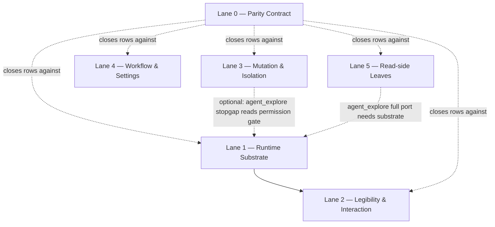

# App↔Headless Parity — Coordinated Lane Plan Index

## Summary

This is the index for a coordinated set of plans that close the app↔headless parity gap documented in `docs/investigations/feature-parity/app-vs-headless-parity-design.md`. The design doc maps the gap into a three-layer dependency spine (runtime substrate → legibility/interaction → capability leaves). This index decomposes that spine into six planning lanes, each with its own plan file. A cross-cutting Lane 0 establishes a living parity contract so the silent drift that necessitated this effort does not recur.

---

## Problem Frame

`rpce-headless` is a read-only context server today. The macOS app exposes a full agentic harness (persistent native runtime, steer/respond, approvals, structured transcripts, worktree isolation, workflow engine, settings) that headless lacks. The design doc is the authoritative findings record; these plans are the executable decomposition. Without a coordinated lane structure, the work is either attempted as one impossibly large plan or fragmented into efforts that miss the dependency spine (e.g. trying to port approvals before the runtime substrate that emits waiting-states exists).

---

## Lane Structure

The design doc's three-layer dependency spine maps to six lanes. Lanes 1→2 are sequential (Lane 2 presupposes Lane 1's substrate contract). Lanes 0, 3, 4, 5 are independent of the substrate and parallel to 1–2.

| Lane | Plan File | Depth | Depends On | Layer |
|------|-----------|-------|------------|-------|
| **0 — Parity Contract** | `2026-06-18-002-feat-headless-parity-contract-plan.md` | Lightweight | None | Cross-cutting |
| **1 — Runtime Substrate** | `2026-06-18-003-feat-headless-runtime-substrate-plan.md` | Deep | None | Layer 1 (keystone) |
| **2 — Legibility & Interaction** | `2026-06-18-004-feat-headless-legibility-interaction-plan.md` | Deep | Lane 1 (contract) | Layer 2 |
| **3 — Mutation & Isolation** | `2026-06-18-005-feat-headless-mutation-isolation-plan.md` | Deep | None | Layer 3 (leaves) |
| **4 — Workflow & Settings** | `2026-06-18-006-feat-headless-workflow-settings-plan.md` | Deep | None | Layer 3 (leaves) |
| **5 — Read-side Parity Leaves** | `2026-06-18-007-feat-headless-readside-leaves-plan.md` | Standard | None (mostly; see `agent_explore` note) | Layer 3 (leaves) |

### Dependency graph

---

## Execution Posture

- **Lane 1 is the keystone and the bulk/risk.** It ships Claude-first; Codex/ACP adapters are a follow-on wave. Lane 2 is planned against Lane 1's contract now so the roadmap stays coherent and Lanes 3–5 proceed independently.
- **Lanes 3, 4, 5 can start immediately** in parallel with Lane 1. They are independent capability leaves (CRUD-completeness, workflow resolver, read-side parity).
- **Lane 0 should land first or alongside** — it is the contract every other lane closes rows against, and its drift-prevention hook prevents the gap from reopening.
- **Cross-cutting invariants** (all lanes): the macOS app source is the authoritative reference implementation to port from (per `AGENTS.md`); validate on Linux via Docker `swift:6.2.4-noble` with `.build-linux` scratch path; never `@MainActor`/`UserDefaults`/Keychain/AppKit on headless — use headless-native file/env stores; backwards compatibility is not a concern (early dev, no users, no tech debt per `AGENTS.md`).

---

## Scope Boundaries

### In scope (across the lane set)
- Porting the app's agentic harness, mutation surface, workflow engine, settings, and read-side leaves to `rpce-headless` on Linux.
- A maintained parity contract (Lane 0) with a drift-prevention hook.

### Deferred to Follow-Up Work
- **Codex/ACP native runtime adapters** — Lane 1 ships Claude-first; Codex (JSON-RPC app-server transport) and ACP (Cursor/OpenCode) adapters are a follow-on wave with their own design pass per provider.
- **Cross-restart session reattach** (`--resume` after parent MCP server restart) — Lane 1 delivers in-process live-controller persistence across turns; cross-restart reattach is gated on provider `--resume` semantics and deferred.
- **Dynamic model discovery** (ACP/Codex live model polling) — Lane 1 ships static option sets; dynamic discovery deferred (requires provider transports not present in headless).
- **Full `agent_explore` port** — Lane 5 ships a read-only stopgap; the full parent-child-ownership + worktree-inheritance + needs-input-wait port is deferred to after Lanes 1–2 land.
- **`bind_context` / `manage_workspaces` multi-workspace binding** — headless is single-workspace by design (design doc §1); `wontfix`-by-design in the parity map.
- **The SwiftUI app surfaces themselves** — no UI port; the app is reference material only (per `AGENTS.md`).

---

## Sources & References

- **Origin document:** [docs/investigations/feature-parity/app-vs-headless-parity-design.md](docs/investigations/feature-parity/app-vs-headless-parity-design.md) (the findings/design doc — source-cited gap matrix and dependency spine)
- Repo guidance: `AGENTS.md` (headless/Fable boundary, Docker Swift lane, source placement, no-tech-debt)
- Context glossary: `CONTEXT.md` (Plan / Bead / Bead Graph vocabulary)
