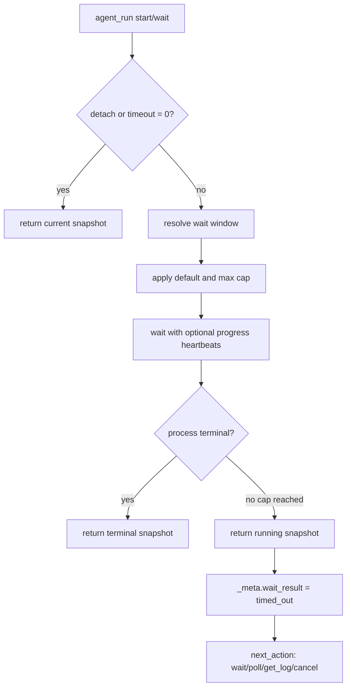
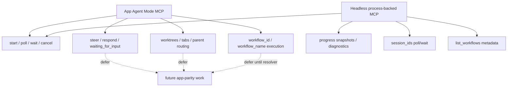

# fix: Align headless agent_run lifecycle parity

## Summary

Make `rpce-headless` server-managed `agent_run` usable under real MCP client deadlines. The plan mirrors the app and headless Context Builder lifecycle where it matters: short progress-friendly waits, structured recovery snapshots, bounded diagnostics, optional multi-session waiting, and workflow discovery metadata without claiming unsupported workflow execution.

---

## Problem Frame

Fresh dogfood sessions now discover `headless_status`, `context_builder`, `agent_manage`, and `agent_run`, but process-backed `agent_run.wait` can still block until the MCP client kills the tool call. The app-native Agent Mode MCP path already protects long waits with heartbeats and returns actionable snapshots, while headless Context Builder now returns `started_at`, `elapsed_seconds`, `next_action`, and `_meta.wait_result` recovery data. `agent_run` remains thinner: it waits for terminal process exit, defaults to a 120-second blocking call, lacks progress notifications, and returns sparse snapshots that do not tell the caller what to do next.

This plan treats headless `agent_run` as process-backed lifecycle control, not app/window Agent Mode. It should become progress-friendly and workflow-aware enough for agents to supervise subagents, while leaving app-only interactions such as steering, responding, worktrees, tabs, and real workflow execution out of scope.

---

## Requirements

**Wait and progress contract**

- R1. `agent_run.start` and `agent_run.wait` must not require a single silent wait that can hit common MCP client call caps.
- R2. `agent_run.start` with `detach:false` and `agent_run.wait` must return a running snapshot with `_meta.wait_result:"timed_out"` when the client wait window expires while the child process remains active.
- R3. Wait requests must support progress-friendly defaults, a configurable maximum wait cap, `timeout:0` as poll, and a clear `timeout_seconds` alias only for `op:"wait"` client wait windows.
- R4. When an MCP client supplies a progress token, non-detached `agent_run.start` and `agent_run.wait` must emit heartbeat progress notifications during active waits.

**Snapshot and supervision contract**

- R5. `agent_run` snapshots must include structured recovery fields comparable to headless Context Builder: `started_at`, `elapsed_seconds`, `process_id`, `exit_code`, `next_action`, and bounded output diagnostics.
- R6. Existing snapshot fields must remain compatible: `session_id`, `status`, `status_text`, `assistant_text`, `transcript_item_count`, `updated_at`, `session`, `agent`, and `_meta.wait_result`.
- R7. `agent_manage get_log` must remain the detailed transcript/output retrieval path; snapshots should summarize enough state to guide the next call without replacing logs.

**Parallel supervision and workflow discovery**

- R8. `agent_run` should support `session_ids` for `poll` and `wait` so agents can supervise multiple server-managed subagents without serial long waits.
- R9. Headless workflow discovery must expose native RepoPrompt workflow metadata through `agent_manage list_workflows` while continuing to reject `workflow_id` and `workflow_name` execution in `agent_run`.
- R10. Public contract surfaces must keep app-only Agent Mode features out of the headless supported operation set until a deterministic resolver/settings surface exists.

**Regression resistance**

- R11. Swift tests and Python MCP smokes must cover wait caps, progress snapshots, diagnostics, multi-session supervision, workflow listing, and unsupported workflow execution.
- R12. README, AGENTS guidance, capabilities/status payloads, robot docs, and audit artifacts must describe the same `agent_run` lifecycle and boundaries.

---

## Key Technical Decisions

- **Mirror lifecycle semantics, not app UI semantics:** Borrow app `agent_run` and headless Context Builder wait behavior, but keep headless process-backed. Do not add `steer`, `respond`, `waiting_for_input`, worktree binding, parent session routing, or app tab state.
- **Use Context Builder's headless wait shape as the local pattern:** Add default/capped wait windows, progress-token heartbeats, `_meta.wait_result`, `next_action`, and elapsed-time fields using the `context_builder` implementation as the closest headless precedent. Use agent-specific environment names such as `RPCE_AGENT_RUN_WAIT_DEFAULT_SECONDS` and `RPCE_AGENT_RUN_WAIT_MAX_SECONDS`.
- **Keep logs authoritative for child output:** Snapshots can include bounded diagnostics and output flags, but `agent_manage get_log` remains the primary evidence path for prompt/stdout/stderr.
- **Add workflow listing before workflow execution:** `agent_manage list_workflows` should expose built-in native workflow metadata and custom-workflow extension status first. Custom markdown workflow discovery should wait for an explicit headless-readable workflow directory or settings surface, and `agent_run workflow_name` stays rejected until headless can resolve and wrap templates deterministically.
- **Prefer structured tests over prose-only checks:** Pin JSON fields, enum shapes, and smoke behavior first; use documentation assertions only for high-salience contract text that agents actually see.

---

## High-Level Technical Design

### Wait Lifecycle

The wait cap protects the MCP call, not the child process. Process lifetime remains controlled by `agent_run cancel`, `agent_manage stop_session`, or future explicit process lifetime settings.

### Capability Boundary

The plan should make headless better at supervising spawned CLI agents without converting it into a second app Agent Mode runtime.

---

## Scope Boundaries

- In scope: `agent_run` wait policy, progress reporting, snapshot fields, diagnostics, optional `session_ids` supervision, workflow metadata listing, public contract text, smokes, and focused tests.
- In scope: documenting app-parity boundaries so agents understand what remains unsupported.
- Out of scope: app-window `agent_explore`, `steer`, `respond`, pending-interaction payloads, worktree creation/binding, parent session routing, handoff extraction, session resume/create, custom workflow mutation, and `agent_run workflow_name` execution.
- Out of scope: changing global MCP config, installing a rebuilt host binary, killing active user processes, staging, committing, or pushing.
- Deferred to follow-up work: a deterministic headless workflow resolver/settings mutation surface that can safely enable `workflow_id` or `workflow_name` execution.

---

## Implementation Units

### U1. Add a progress-friendly `agent_run` wait policy

- **Goal:** Prevent `agent_run.start` and `agent_run.wait` from hitting client call caps while preserving the child process.
- **Requirements:** R1, R2, R3, R4
- **Dependencies:** None
- **Files:**
  - `Sources/RepoPromptHeadlessServer/HeadlessMCPServer.swift`
  - `Sources/RepoPromptHeadlessServer/HeadlessAgentSessionManager.swift`
  - `Sources/RepoPromptHeadlessServer/HeadlessAgentTypes.swift`
  - `Sources/RepoPromptHeadlessServer/HeadlessToolSchemas.swift`
  - `Tests/RepoPromptTests/MCP/HeadlessAgentToolSchemaTests.swift`
  - `Sources/RepoPromptHeadlessServer/Scripts/mcp_agent_smoke.py`
- **Approach:** Pass the existing `HeadlessProgressReporter` into the agent session manager, resolve `timeout` with a default and configurable max cap, and treat `timeout_seconds` as a wait-window alias for `agent_run.wait` only. Apply the same capped wait behavior to non-detached `start`, but keep `start` accepting `timeout` rather than adding a second alias. Emit progress heartbeats while waiting when the client provides a progress token. Return `_meta.wait_result:"timed_out"` plus a running snapshot when the cap expires.
- **Patterns to follow:** `HeadlessContextBuilderService.wait`, `HeadlessContextBuilderService.toolRequestFromMCP`, `MCPContextBuilderToolProvider.withHeartbeat`, and app `AgentRunMCPToolService.timedOutWaitValue`.
- **Test scenarios:**
  - Happy path: `agent_run start` with `detach:false` and a fast fake agent returns a completed snapshot.
  - Edge case: `agent_run wait` with `timeout:0` returns the current snapshot without waiting.
  - Edge case: `agent_run wait` with `timeout_seconds` and no `timeout` uses the alias as the client wait window.
  - Error path: `agent_run start` with `timeout_seconds` is rejected or ignored according to the documented start-only timeout contract; the plan prefers rejecting unsupported aliases so callers learn the right field.
  - Edge case: negative or huge timeout values clamp consistently with the documented wait policy.
  - Edge case: a wait above the configured max returns before the requested duration with `_meta.wait_result:"timed_out"` while the session remains `running`.
  - Integration: an MCP call with a progress token receives at least one `notifications/progress` heartbeat during a long fake-agent wait.
  - Failure path: cancelling after a capped wait terminates the process and returns a terminal or cancelling snapshot instead of losing the session.
- **Verification:** Agents can safely use repeated short waits or polls without a tool-call timeout killing their control path.

### U2. Enrich `agent_run` snapshots and diagnostics

- **Goal:** Give callers enough structured state to recover without reading prose or guessing the next tool call.
- **Requirements:** R5, R6, R7
- **Dependencies:** U1
- **Files:**
  - `Sources/RepoPromptHeadlessServer/HeadlessAgentTypes.swift`
  - `Sources/RepoPromptHeadlessServer/HeadlessAgentSessionManager.swift`
  - `Tests/RepoPromptTests/MCP/HeadlessAgentToolSchemaTests.swift`
  - `Sources/RepoPromptHeadlessServer/Scripts/mcp_agent_smoke.py`
- **Approach:** Add optional `started_at`, `elapsed_seconds`, `process_id`, `exit_code`, `failure_reason`, `next_action`, and `diagnostics` to `HeadlessAgentRunSnapshot`. Diagnostics should expose bounded stdout/stderr, truncation flags, output limit, output-empty state, and process metadata. Keep `assistant_text` for backward compatibility, but make `next_action` the structured recovery cue.
- **Patterns to follow:** `HeadlessContextBuilderRunSnapshot`, `HeadlessContextBuilderDiagnostics`, `statusText(for:)`, `transcriptXML(for:)`, and current output-capture limit behavior.
- **Test scenarios:**
  - Happy path: a running snapshot includes `started_at`, `elapsed_seconds`, `process_id`, and a `next_action` that points to `wait`, `poll`, `get_log`, or `cancel`.
  - Happy path: a completed snapshot includes `exit_code` and a `next_action` that points to `get_log` and `cleanup_sessions`.
  - Edge case: an output-empty run reports diagnostics with `output_empty:true` rather than omitting diagnostics.
  - Edge case: stdout/stderr truncation flags are encoded when fake-agent output exceeds the configured limit.
  - Compatibility: existing fields still encode with the same names and remain present in smoke payloads.
- **Verification:** A client can render a compact session card and choose the next operation from structured fields alone.

### U3. Add multi-session poll/wait for server-managed subagents

- **Goal:** Let agents supervise parallel headless subagents without serial blocking waits.
- **Requirements:** R1, R2, R8, R11
- **Dependencies:** U1, U2
- **Files:**
  - `Sources/RepoPromptHeadlessServer/HeadlessAgentTypes.swift`
  - `Sources/RepoPromptHeadlessServer/HeadlessAgentSessionManager.swift`
  - `Sources/RepoPromptHeadlessServer/HeadlessToolSchemas.swift`
  - `Tests/RepoPromptTests/MCP/HeadlessAgentToolSchemaTests.swift`
  - `Sources/RepoPromptHeadlessServer/Scripts/mcp_agent_smoke.py`
- **Approach:** Add `session_ids` support for `agent_run poll` and `agent_run wait`. Single-session calls should preserve the existing response shape. Multi-session wait should reject mixed `session_id` plus `session_ids`, reject empty arrays, handle duplicates deterministically, return all current snapshots on timeout, identify the first terminal winner when one finishes, and include a `wait` object with mode, result, winner, and pending session ids.
- **Patterns to follow:** App `AgentRunMCPToolService.executeWaitAny`, `AgentRunMCPToolService.decoratedMultiWaitValue`, and `AgentRunMCPToolServiceWaitAnyTests`, without carrying over steering/interactions.
- **Test scenarios:**
  - Happy path: polling multiple running sessions returns snapshots for each requested id.
  - Happy path: waiting on two sessions returns the first completed session as the winner and leaves the other session pending.
  - Edge case: multi-wait timeout returns `_meta.wait_result:"timed_out"` plus all current snapshots and pending session ids.
  - Edge case: cleanup or cancellation during a wait wakes the caller with an expired, cancelling, or cancelled snapshot rather than hanging.
  - Error path: unknown session ids return expired snapshots or structured not-found evidence consistently with single-session poll.
  - Compatibility: single-session `session_id` responses remain unchanged apart from the enriched optional fields.
- **Verification:** A top-level agent can launch several detached read-only subagents, wait for whichever finishes first, and continue supervising the rest.

### U4. Expose workflow listing without enabling workflow execution

- **Goal:** Make native RepoPrompt workflow discovery first-class in headless while keeping execution boundaries honest.
- **Requirements:** R9, R10, R12
- **Dependencies:** None
- **Files:**
  - `Sources/RepoPromptHeadlessServer/HeadlessAgentTypes.swift`
  - `Sources/RepoPromptHeadlessServer/HeadlessAgentSessionManager.swift`
  - `Sources/RepoPromptHeadlessServer/HeadlessToolSchemas.swift`
  - `Sources/RepoPromptHeadlessServer/HeadlessCapabilities.swift`
  - `Sources/RepoPromptHeadlessServer/README.md`
  - `Tests/RepoPromptTests/MCP/HeadlessAgentToolSchemaTests.swift`
  - `Sources/RepoPromptHeadlessServer/Scripts/mcp_agent_smoke.py`
- **Approach:** Add `agent_manage op:"list_workflows"` to return a headless-native catalog from the existing capability model, not the app `AgentWorkflowStore` catalog. Use a stable shape such as `workflows:[{id,name,source:"headless_native",intent,shape,execution_support:"metadata_only"}]` plus `custom_workflows` copied from `HeadlessCapabilities.NativeWorkflowGuide.CustomWorkflowExtensibility`. Include an explicit metadata-only execution support field so the response itself discourages unsupported `workflow_name` calls. Keep `agent_run` rejecting `workflow_id` and `workflow_name` with guidance to use metadata for planning only.
- **Patterns to follow:** App `AgentManageMCPToolService.executeListWorkflows`, `HeadlessCapabilities.NativeWorkflowGuide`, current `rejectUnsupportedStartArguments`, and existing `native_workflows.custom_workflows.current_headless_support:"metadata_only"`.
- **Test scenarios:**
  - Happy path: `agent_manage list_workflows` returns native workflow entries for `investigate`, `optimize`, and `deep_plan` with source and descriptive metadata.
  - Happy path: the payload includes custom-workflow support and headless execution support as metadata-only.
  - Error path: `agent_run start` with `workflow_name` or `workflow_id` still fails with a message that points to unsupported execution.
  - Contract path: tool schema enum includes `list_workflows`, while `agent_run` still omits workflow execution fields.
  - Smoke path: `mcp_agent_smoke.py` verifies workflow listing and unsupported execution in the same fake-agent harness.
- **Verification:** Agents can discover native workflow shapes through `agent_manage` before delegation, without being invited to call unsupported workflow execution.

### U5. Align public contract, docs, and audit artifacts

- **Goal:** Make future agents and audit passes see one coherent `agent_run` story.
- **Requirements:** R3, R7, R10, R12
- **Dependencies:** U1, U2, U3, U4
- **Files:**
  - `AGENTS.md`
  - `Sources/RepoPromptHeadlessServer/README.md`
  - `Sources/RepoPromptHeadlessServer/HeadlessCapabilities.swift`
  - `Sources/RepoPromptHeadlessServer/HeadlessToolSchemas.swift`
  - `agent_ergonomics_audit/pass3_handoff.md`
  - `agent_ergonomics_audit/audit/HANDOFF.md`
  - `agent_ergonomics_audit/audit/recommendations.jsonl`
  - `agent_ergonomics_audit/audit/applied_changes.jsonl`
  - `agent_ergonomics_audit/audit/uplift_diff.md`
- **Approach:** Update high-salience guidance so `agent_run` examples use detached start plus short waits, mention progress snapshots and `next_action`, and frame `agent_manage get_log` as the evidence path. Add workflow-listing guidance while preserving the unsupported execution caveat. Keep audit JSONL parseable and distinguish this work from prior Context Builder/status-first fixes.
- **Patterns to follow:** Existing pass-3 audit ledger style, current Context Builder wait documentation, and status-first onboarding wording.
- **Test scenarios:**
  - Documentation review: README, AGENTS, robot docs, and capabilities all describe short waits and recoverable `agent_run` snapshots.
  - Documentation review: no public guidance recommends `agent_run wait` with a long silent timeout.
  - Audit ledger: JSONL artifacts remain valid one-object-per-line records.
  - Contract test: schema/capabilities assertions cover the new agent-run guidance without overfitting on entire paragraphs.
- **Verification:** A fresh agent reading only the public contract knows to start detached, wait briefly, inspect structured snapshots, read logs, and cleanup.

### U6. Validate through the Linux headless lane

- **Goal:** Prove the new agent-run contract with the branch's expected headless validation path.
- **Requirements:** R11, R12
- **Dependencies:** U1, U2, U3, U4, U5
- **Files:**
  - `Sources/RepoPromptHeadlessServer/Scripts/mcp_agent_smoke.py`
  - `Sources/RepoPromptHeadlessServer/Scripts/mcp_smoke.py`
  - `Sources/RepoPromptHeadlessServer/Scripts/cli_contract_smoke.py`
  - `agent_ergonomics_audit/pass3_handoff.md`
  - `agent_ergonomics_audit/audit/applied_changes.jsonl`
- **Approach:** Use the Docker Swift `swift:6.2.4-noble` lane with `.build-linux` for the product build and Python smokes. Add focused Swift tests where they are valuable, but keep Linux proof centered on Docker product build plus MCP/agent smokes because full XCTest may still encounter macOS-only package dependencies on this host.
- **Patterns to follow:** AGENTS Linux guidance, previous pass-3 validation bullets, and current `mcp_agent_smoke.py` fake-agent harness.
- **Test scenarios:**
  - Build validation: Docker `rpce-headless` product build succeeds with `--scratch-path .build-linux`.
  - Smoke validation: `mcp_agent_smoke.py` covers detached start, short wait timeout, later completion, diagnostics, workflow listing, unsupported workflow execution, and cleanup.
  - Smoke validation: `mcp_smoke.py` and `cli_contract_smoke.py` cover updated capabilities/status contract text.
  - Diff validation: whitespace/conflict-marker checks pass outside user-owned ideation material.
  - Preflight readiness: contribution preflight can be run after staging if the user later asks to commit.
- **Verification:** Validation evidence distinguishes Docker-backed Linux proof from any native host-tool gaps.

---

## Acceptance Examples

- AE1. Covers R1, R2, R3. Given a fake agent sleeps longer than the configured wait cap, when an MCP client calls `agent_run wait` with a large timeout, then the call returns a running snapshot with `_meta.wait_result:"timed_out"` before the client deadline.
- AE2. Covers R5, R6, R7. Given the same session later completes, when the client calls `agent_run wait` again, then it receives a completed snapshot with `exit_code`, `next_action`, and retained log access.
- AE3. Covers R4. Given a client supplies a progress token during a long `agent_run wait`, when the wait remains active, then the server emits progress notifications before returning the wait snapshot.
- AE4. Covers R3. Given a caller passes `timeout:0`, when the server handles `agent_run wait`, then the response is equivalent to poll and does not sleep.
- AE5. Covers R8. Given two detached subagent sessions are running, when one completes during `agent_run wait` with `session_ids`, then the response identifies the winner and lists the still-pending session.
- AE6. Covers R9, R10. Given a caller asks `agent_manage list_workflows`, when the server responds, then native RepoPrompt workflow metadata is visible and custom workflow support is marked metadata-only.
- AE7. Covers R9, R10. Given a caller passes `workflow_name` to `agent_run start`, when the server validates arguments, then it rejects the call and explains that workflow execution is unsupported until a resolver exists.
- AE8. Covers R8. Given a multi-session wait includes `session_id` and `session_ids`, when the server validates arguments, then it rejects the ambiguous request instead of choosing one path silently.

---

## System-Wide Impact

This changes the exported MCP contract for `rpce-headless` stdio and authenticated full-tool socket callers. It should make real Codex/Claude/Gemini supervision more reliable because the top-level agent can recover from waits instead of losing the tool call. The change also strengthens the native workflow story by moving workflow discovery into `agent_manage`, but it intentionally keeps app workflow execution out of headless v1.

---

## Risks & Dependencies

- **Compatibility with existing consumers:** New snapshot fields should be additive. Preserve existing field names and single-session response shapes so consumers that already parse `session_id` and `status` continue working.
- **Timeout semantic confusion:** `timeout_seconds` means process lifetime for Context Builder start calls but should mean client wait window for `agent_run wait` if accepted there. Mitigation: document the alias narrowly and prefer `timeout` in examples.
- **False workflow affordance:** Listing workflows could invite agents to pass `workflow_name` to `agent_run`. Mitigation: keep schema fields absent, rejection explicit, and capabilities marked metadata-only.
- **Smoke runtime cost:** Long-wait smokes can slow validation if fake agents sleep too long. Mitigation: use low environment caps and short sleeps that prove the behavior without stretching the suite.
- **Linux test limits:** Native full XCTest may remain blocked by app-only dependencies on Linux. Mitigation: rely on Docker product build plus black-box headless smokes for Linux proof and run focused Swift tests where feasible.

---

## Documentation / Operational Notes

Do not install or restart the user-local `rpce-headless` binary as part of executing this plan unless the user separately asks for operational dogfooding in other repositories. The implementation validation target is the rebuilt Docker binary and local smoke harnesses. If the user does ask to dogfood from Codex, use `make headless-linux-install-local` after validation and restart only matching `rpce-headless serve` processes for this worktree.

---

## Sources & Research

- `AGENTS.md` for the headless MCP contract, Docker Swift validation lane, and no-commit/no-push constraints.
- `docs/plans/2026-06-17-001-fix-headless-context-builder-contract-plan.md` for the Context Builder wait-cap and recovery contract that `agent_run` should mirror.
- `docs/plans/2026-06-17-002-fix-headless-status-first-onboarding-plan.md` for status-first and Context Builder-first onboarding scope already handled.
- `Sources/RepoPrompt/Infrastructure/MCP/Agent/AgentRunMCPToolService.swift` for app wait, heartbeat, timeout, and multi-session patterns.
- `Sources/RepoPrompt/Infrastructure/MCP/Agent/AgentRunMCPSnapshot.swift` for app snapshot compatibility fields and actionable-state boundaries.
- `Sources/RepoPrompt/Infrastructure/MCP/Agent/AgentManageMCPToolService.swift` for app `list_workflows` response shape.
- `Sources/RepoPromptHeadlessServer/HeadlessContextBuilderService.swift` and `Sources/RepoPromptHeadlessServer/HeadlessTypes.swift` for the headless progress-friendly lifecycle and diagnostics model.
- `Sources/RepoPromptHeadlessServer/HeadlessAgentSessionManager.swift` and `Sources/RepoPromptHeadlessServer/HeadlessAgentTypes.swift` for current process-backed `agent_run` behavior.
- `Tests/RepoPromptTests/MCP/HeadlessAgentToolSchemaTests.swift` and `Sources/RepoPromptHeadlessServer/Scripts/mcp_agent_smoke.py` for focused headless coverage patterns.
- `agent_ergonomics_audit/pass3_handoff.md` and `agent_ergonomics_audit/audit/HANDOFF.md` for audit-state continuity and validation evidence conventions.
