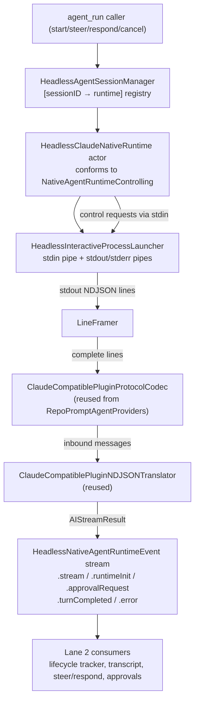

# feat: Headless Runtime Substrate (Persistent Native Sessions, Stream-JSON, Model Catalog, Permission Profiles)

## Summary

Port the app's persistent, event-streaming native runtime so `rpce-headless` replaces its fire-and-forget `AgentLauncher` spawn with a live, multi-turn provider process that emits typed events. This is the keystone substrate — every 🔴 gap row (steer/respond, approvals, structured transcripts, lifecycle stages, session restore) hangs off it. Ships Claude-first; Codex/ACP adapters are a follow-on wave.

---

## Problem Frame

Headless spawns one-shot `claude -p "{PROMPT}"` processes fire-and-forget with `--permission-mode bypassPermissions` hard-coded into the argv (design doc §2, §5). There is no live session to inject into, no event stream to parse, no model catalog, and no permission profiles. From this single absence the rest follows: `steer`/`respond` cannot exist (no live session); approvals cannot exist (no `waitingFor*` state); structured transcripts cannot exist (no stream-json parsing); lifecycle stages cannot exist (no `providerEvent`/`toolActivity` signals); session restore cannot exist (ephemeral temp dirs). The port's critical path has a three-layer structure (design doc §6), and this lane is Layer 1 — the bulk and highest-risk portion that everything in Layer 2 rides on.

---

## Requirements

- R1. Persistent native sessions — a headless-native runtime actor conforming to the `NativeAgentRuntimeControlling` contract shape (`startOrResume`/`interrupt`/`shutdown`) that keeps a provider process alive across turns within one server run, with reattach by provider session ID.
- R2. Stream-JSON event parsing — the runtime parses `--output-format stream-json --input-format stream-json` output into a typed neutral `HeadlessNativeAgentRuntimeEvent` stream (`.stream`/`.runtimeInit`/`.approvalRequest`/`.turnCompleted`/`.error`), not aliased onto a provider DTO.
- R3. Headless model catalog — `options(for:availability:)`, `isValid`, `normalizeSelection`, `defaultModelRaw` for Claude (base:effort) and Codex (service tier + reasoning effort), with availability derived from Linux-relevant signals (PATH probes, env), not from app-only singletons.
- R4. Provider permission profiles replacing `bypassPermissions` hardcoding — the three-case `AgentProviderPermissionProfile` enum ported, profile→mode resolution rebound to a headless file/env store, default `mcpSafeDefaults` (→ `requireApproval`) for server-managed runs.
- R5. Decouple from macOS-only singletons (`MCPConfigExportService`, `ServerNetworkManager`, `UserDefaults`, `Keychain`, `MCPIntegrationHelper`) — headless-native analogs (JSON MCP config writer, env-only resolver, file-based secure store, headless auto-approval policy).

---

## Scope Boundaries

- Codex/ACP native adapters (U8) are a **follow-on wave** — Lane 1 ships Claude-only. Codex uses a JSON-RPC app-server transport, not stream-json-over-stdio; treating "port the runtime" as one shape across providers underestimates provider divergence.
- Cross-restart `--resume` reattach (U7) is **later** — Lane 1 delivers in-process live-controller persistence across turns only. Cross-restart reattach is gated on provider `--resume` semantics after a parent MCP-server restart (unverified).
- Dynamic model discovery (ACP/Codex live model polling) is **deferred** — U5 ships static option sets; dynamic polling requires provider transports not present in headless.
- Structured `ToolCall`/`ToolResult` transcript store and visibility/persistence policies are **Lane 2** — Lane 1 emits the raw `.stream` signals carrying tool payloads; Lane 2 builds the legible transcript on top.
- `AgentRunLifecycleTracker` stage vocabulary is **Lane 2** — Lane 1 feeds `providerEvent`/`toolActivity`-equivalent data via `.stream` events; Lane 2 implements the tracker.
- `ask_user` / `share_thoughts` / `set_status` / `wait_for_next_user_instruction` are **Lane 2** — they depend on `waitingFor*` states that Lane 1's state machine must *enable* but the MCP tools themselves are Lane 2.
- `app_settings` is **Lane 4** — Lane 1 only needs the permission/model/env config the runtime consumes.

### Deferred to Follow-Up Work
- Codex/ACP native adapters: separate follow-on wave after Claude is proven (U8).
- Cross-restart session reattach: gated on provider `--resume` semantics (U7).
- Dynamic model discovery: requires ACP/Codex provider transports (U5 follow-on).
- Headless auto-approval policy for headless-owned MCP tools: needs defining against the headless tool set.

---

## Context & Research

### Relevant Code and Patterns

- **App reference — runtime contract:** `Sources/RepoPrompt/Features/AgentMode/Runtime/Native/NativeAgentRuntimeContracts.swift` (`NativeAgentRuntimeControlling` actor protocol — provider-neutral at the protocol level; currently typealias-coupled to Claude DTOs).
- **App reference — Claude controller:** `Sources/RepoPrompt/Infrastructure/AI/Providers/ClaudeCode/SDK/ClaudeNativeProcessSessionController.swift` (persistent process + stream-json parsing + control channel + turn-boundary logic + approval mapping). Couples to app singletons (`MCPConfigExportService.shared`, `ServerNetworkManager.shared`, `ClaudeCodeLaunchEnvironmentResolver`, `UserDefaults`, `MCPIntegrationHelper`) — needs decoupling, not verbatim copy.
- **App reference — codec/translator:** `Packages/RepoPromptAgentProviders/Sources/RepoPromptClaudeCompatibleProvider` (`ClaudeCompatiblePluginProtocolCodec`, `ClaudeCompatiblePluginNDJSONTranslator` — the load-bearing parsing logic; source is AppKit-free but package is `platforms: [.macOS(.v14)]` only and not a headless dep).
- **App reference — model catalog:** `Sources/RepoPrompt/Features/AgentMode/Models/ModelSelection/AgentModelCatalog.swift`, `AgentACPModelRegistry.swift`, `AgentCodexModelRegistry.swift`; `ClaudeModelSpecifier.swift` (base:effort encoding); `AgentRuntimeProviderService.swift` (`AgentProviderKind`).
- **App reference — permission profiles:** `Sources/RepoPrompt/Features/AgentMode/Runtime/ProviderBindings/AgentProviderPermissionProfile.swift` (three-case enum, pure Swift); `AgentPermissionSecureStore.swift` (Keychain-backed, fail-closed, `NotificationCenter`-coupled).
- **Shared-core primitives (already portable):** `Sources/RepoPrompt/Infrastructure/Process/ProcessStreamFraming.swift` (`LineFramer` — pure Foundation); `ProcessLauncher.swift` (posix_spawn); `ProcessTermination.swift` (waitpid/kill).
- **Headless current state:** `Sources/RepoPromptHeadlessServer/AgentLauncher.swift` (fire-and-forget spawn, prompt inlined on argv, `bypassPermissions` hardcoded); `Sources/RepoPromptHeadlessServer/HeadlessAgentSessionManager.swift` (ephemeral sessions, `start/poll/wait/cancel` only, rejects `steer`/`respond`/`session_id`/`worktree*`/`workflow*`); `Sources/RepoPromptHeadlessServer/HeadlessProcessGroupLauncher` (Darwin/Glibc guards, posix_spawn — but stdin opens from a file path, not a writable pipe).
- **Repo guidance:** `AGENTS.md` (Docker `swift:6.2.4-noble`, `.build-linux` scratch path, no `@MainActor`/`UserDefaults`/Keychain/AppKit on headless, no tech debt).

### Institutional Learnings
- The design doc's "silent drift" diagnosis (§1 caveat) and dependency-spine analysis (§6) establish that the substrate is the load-bearing gap — not four independent missing features.
- The app's `NativeAgentRuntimeControlling` protocol is already `Actor`-based and provider-neutral at the protocol level; the Claude-specific typealias coupling is the thing to break.

### External References
- None required — the macOS app is the authoritative reference implementation (per `AGENTS.md`), and the design doc is exhaustive.

---

## Key Technical Decisions

- **Neutral `HeadlessNativeAgentRuntimeEvent` enum from day one:** the app aliases `NativeAgentRuntimeEvent` onto Claude's DTO (`typealias NativeAgentRuntimeEvent = ClaudeNativeProcessSessionController.Event`). Headless defines a proper neutral enum so Claude/Codex/ACP adapters each map into it, rather than re-aliasing onto one provider's DTO. This is the right boundary for multi-provider support without premature generalization.
- **Reuse `RepoPromptClaudeCompatibleProvider` codec/translator by relaxing its platform constraint:** the package source is AppKit-free and the codec is the load-bearing parsing logic with substantial malformed-line recovery (concatenated JSON, embedded tails, control-char repair, plaintext assistant-delta recovery). Reimplementing risks drift from the real protocol. Preferred path: relax `Packages/RepoPromptAgentProviders/Package.swift` platforms to include Linux and add as a `RepoPromptHeadlessServer` dependency. Fallback only if transitive deps block Linux build.
- **Claude-first, Codex/ACP follow-on:** provider divergence (Codex JSON-RPC app-server transport vs Claude stream-json-over-stdio) makes a single-shape port underestimate the work. The `NativeAgentRuntimeControlling` protocol is the correct abstraction boundary; do not generalize the Claude controller prematurely.
- **Headless-native JSON MCP config writer:** reuse the pattern from `AgentLauncher.render` (headless already builds a JSON MCP config); do not port `MCPConfigExportService.shared` (app-only, tied to `ServerNetworkManager`).
- **File-based permission store (0600 JSON under `~/.config/rpce-headless/permissions/`):** replace Keychain with a file-based store. The `Codable` document shapes (`SecureClaudePermissionDocument` etc.) are portable (pure `Codable`, no AppKit). Preserve fail-closed semantics. Drop `NotificationCenter` notifications (no UI observers headless).
- **`mcpSafeDefaults` (→ `requireApproval`) default for server-managed runs:** not `bypassPermissions`. The current hardcoding is a convenience default that eliminates the approval surface entirely; the port restores it unless a caller explicitly opts into `fullAccess`.

---

## Open Questions

### Resolved During Planning
- **Neutral event enum from day one vs. alias-then-generalize:** neutral from day one — the typealias coupling is the thing to break, and doing it later means a breaking refactor of every consumer.
- **Default permission mode for server-managed runs:** `mcpSafeDefaults` (→ `requireApproval`), not `bypassPermissions` — restores the approval surface that Lane 2 needs.

### Deferred to Implementation
- **Provider `--resume` semantics after parent MCP-server restart:** whether a headless server can `--resume` a Claude session whose original MCP config/socket endpoint is gone after a server restart is unverified. U7 cross-restart reattach deferred until proven.
- **Exact neutral event enum field set:** whether `HeadlessAIStreamResult` carries the full `AIStreamResult` field set (token counts, context-used, providerSessionID, stopReason) or a slimmer subset — the app's full set is the safe superset.
- **Headless auto-approval policy for headless-owned MCP tools:** the app auto-approves via `MCPIntegrationHelper.repoPromptPermissionAutoApprovalMatch`. The headless equivalent (which tools the headless MCP server exposes that should bypass approval) needs defining against the headless tool set (`headless_status`, `context_builder`, `read_file`, etc.).
- **Raw-event JSONL log path on Linux:** the app's `writeRawEventLogRecord` uses a temp dir + UserDefaults override. Headless analog path (env-var driven) TBD; only needed for debug/diffing, not runtime correctness.

---

## High-Level Technical Design

> *This illustrates the intended approach and is directional guidance for review, not implementation specification. The implementing agent should treat it as context, not code to reproduce.*



**Runtime lifecycle (state sketch):**

```
startOrResume(existingSessionID?):
  if no live process:
    spawn via Launcher (stream-json I/O, --resume if existingSessionID)
    send initialize control request, await ACK
    capture provider session ID from response
    apply initial permission mode (set_permission_mode control request)
  return SessionRef(sessionID: providerSessionID)

sendUserMessage(text) → turnID:
  enqueue turnID into FIFO deque
  write user message line to stdin
  return turnID

[internal] on result/message_stop:
  if authoritative mode (session_state_changed observed):
    record status, arm idle-fallback timer
    wait for idle session_state_changed OR fallback → .turnCompleted
  else (legacy mode):
    dequeue turnID → .turnCompleted immediately

interruptTurn(reason) → InterruptOutcome:
  send interrupt control request, await ACK (with timeout)
  → .acknowledged | .noTurnInFlight | .timedOut | .failed

respondToPermissionRequest(id, decision):
  encode decision as control-response success/deny line to stdin

shutdown():
  fail pending control requests, clear pending approvals + turn queue
  teardown I/O channels, terminate + reap process, finish events stream
```

---

## Implementation Units

### U1. Headless-native value types & neutral event enum

**Goal:** Define the foundation value types and a provider-neutral event enum that all adapters map into.

**Requirements:** R2, R3

**Dependencies:** None

**Files:**
- Create: `Sources/RepoPromptHeadlessServer/Runtime/HeadlessNativeAgentRuntimeEvent.swift`
- Create: `Sources/RepoPromptHeadlessServer/Runtime/HeadlessRuntimeTypes.swift`
- Test: `Tests/RepoPromptHeadlessServerTests/Runtime/HeadlessNativeAgentRuntimeEventTests.swift`

**Approach:**
- Define `HeadlessNativeAgentRuntimeEvent` as a neutral enum: `.stream(HeadlessAIStreamResult)`, `.runtimeInit(HeadlessRuntimeInitStatus)`, `.approvalRequest(HeadlessApprovalRequest)`, `.approvalCancelled(requestID:)`, `.turnCompleted(turnID:status:)`, `.error(String)`. NOT aliased onto a provider DTO.
- Define `HeadlessAIStreamResult` (subset or full superset of `AIStreamResult` fields — see deferred question), `HeadlessTurnStatus`, `HeadlessInterruptOutcome`, `HeadlessSessionRef`.
- Define `HeadlessAgentProviderKind` + `HeadlessAvailabilityContext` (env-derived flags).
- Define headless `ClaudeModelSpecifier`/`CodexModelSpecifier` equivalents (base:effort / service-tier+effort encoding).
- A focused headless reimplementation is lower-risk than cross-target moves of app value types.

**Patterns to follow:**
- `Sources/RepoPrompt/Features/AgentMode/Runtime/Native/NativeAgentRuntimeContracts.swift` (the contract shape, reproduced as headless-native types).
- `Sources/RepoPrompt/Infrastructure/AI/Providers/AIProviderFactory.swift` (`AIStreamResult` field shape — the safe superset).

**Test scenarios:**
- Happy path: neutral-event-roundtrip — input a Claude `.stream` and a `.turnCompleted`; encode→decode via the neutral enum; typed cases survive with payload equality.
- Edge case: unknown-provider-payload — input a stream chunk with an unrecognized `type`; map to `.stream` with `type=<raw>`; no crash, type preserved as opaque string.
- Error path: missing-session-id — `HeadlessSessionRef` with nil sessionID before `initialize` completes; consumers treat nil as "not yet bound".

**Verification:**
- The neutral event enum and value types compile, round-trip, and handle unknown payloads without crashing.

---

### U2. Interactive process launcher + stream-JSON I/O loop

**Goal:** Create a process launcher that keeps a writable stdin pipe alive and a stdout consumer that decodes stream-json lines.

**Requirements:** R2

**Dependencies:** U1

**Files:**
- Create: `Sources/RepoPromptHeadlessServer/Runtime/HeadlessInteractiveProcessLauncher.swift`
- Create: `Sources/RepoPromptHeadlessServer/Runtime/HeadlessLineFramer.swift`
- Modify: `Packages/RepoPromptAgentProviders/Package.swift` (relax platform constraint to include Linux)
- Modify: `Package.swift` (add `RepoPromptClaudeCompatibleProvider` as `RepoPromptHeadlessServer` dependency)
- Test: `Tests/RepoPromptHeadlessServerTests/Runtime/HeadlessInteractiveProcessLauncherTests.swift`

**Approach:**
- Extend or sibling `HeadlessProcessGroupLauncher` to create a **writable stdin pipe** + readable stdout/stderr pipes via `posix_spawn`, reusing the existing Darwin/Glibc guard pattern.
- Port the app's `LineFramer` (pure Foundation) as `HeadlessLineFramer`.
- A stdout consumer `Task` that decodes lines via the reused `ClaudeCompatiblePluginProtocolCodec` and routes inbound messages.
- Preferred reuse path: relax `Packages/RepoPromptAgentProviders/Package.swift` platforms to include Linux and add `RepoPromptClaudeCompatibleProvider` as a `RepoPromptHeadlessServer` dependency, then reuse `ClaudeCompatiblePluginProtocolCodec` + `ClaudeCompatiblePluginNDJSONTranslator`.
- Fallback: reimplement a minimal NDJSON line codec (higher drift risk — only if reuse blocked by transitive deps).
- Add explicit SIGPIPE-ignore for the stdin write path.

**Patterns to follow:**
- `Sources/RepoPromptHeadlessServer/HeadlessProcessGroupLauncher` (Darwin/Glibc guards, posix_spawn — extend with stdin pipe).
- `Sources/RepoPrompt/Infrastructure/Process/ProcessStreamFraming.swift` (`LineFramer` — port, pure Foundation).
- `Sources/RepoPrompt/Infrastructure/Process/FileHandleChunkChannel.swift` (`FileHandle.readabilityHandler` + `AsyncStream` — portable pattern).

**Test scenarios:**
- Happy path: stream-json-framing — fake agent writes two NDJSON lines on stdout; I/O loop produces two decoded `InboundMessage.streamPayload`s in order.
- Edge case: concatenated-json-lines — single stdout chunk with two adjacent JSON objects, no newline; `LineFramer` + concatenated recovery decodes both (mirrors `recoverConcatenatedInboundMessagesIfNeeded`).
- Edge case: partial-line-across-chunks — JSON line split across two `readabilityHandler` chunks; reassembled into one decoded line.
- Error path: stdin-write-after-exit — process exits immediately; `sendLine` after EOF yields a write-failed error and scheduled teardown, no hang.
- Integration: stdin-stdout-echo — fake agent echoes a control-response to a control request written on stdin; `sendControlRequest` continuation resumes with the echoed payload.

**Verification:**
- A fake stream-json agent's output is framed, decoded, and routed correctly; stdin control requests round-trip; the launcher works inside `swift:6.2.4-noble` Docker.

---

### U3. NativeAgentRuntimeControlling actor (Claude adapter) — KEYSTONE

**Goal:** Port the control flow of `ClaudeNativeProcessSessionController` as a headless-native actor conforming to the `NativeAgentRuntimeControlling`-shaped protocol.

**Requirements:** R1, R2, R5

**Dependencies:** U1, U2

**Files:**
- Create: `Sources/RepoPromptHeadlessServer/Runtime/HeadlessClaudeNativeRuntime.swift`
- Create: `Sources/RepoPromptHeadlessServer/Runtime/HeadlessMCPConfigWriter.swift`
- Create: `Sources/RepoPromptHeadlessServer/Runtime/HeadlessLaunchEnvironmentResolver.swift`
- Test: `Tests/RepoPromptHeadlessServerTests/Runtime/HeadlessClaudeNativeRuntimeTests.swift`

**Approach:**
- This is the keystone unit. Port the control flow of `ClaudeNativeProcessSessionController`: `startOrResume`/`initialize` handshake, `sendUserMessage`→turn tracking (FIFO deque), `interruptTurn` (control request + ACK), `applyModelAndEffort` (`apply_flag_settings`), `respondToPermissionRequest`, `shutdown`, authoritative-vs-legacy turn-boundary logic (`result`/`message_stop` + `session_state_changed` idle + fallback timer with generation-token stale-guard), `can_use_tool` → `.approvalRequest` (with a headless auto-approval policy that does NOT depend on `MCPIntegrationHelper`).
- **Decouple from app singletons:** replace `MCPConfigExportService.shared` with `HeadlessMCPConfigWriter` (JSON config, pattern from `AgentLauncher.render`); replace `ServerNetworkManager.shared` expected-PID registration with a no-op or local registry; replace `ClaudeCodeLaunchEnvironmentResolver` with `HeadlessLaunchEnvironmentResolver` (env-only, no UserDefaults); replace `UserDefaults` debug/log flags with env vars.
- **Preserve concurrency invariants:** register `CheckedContinuation` before writing stdin (avoid lost-ACK race); use generation tokens to ignore stale fallback tasks; `resetEventsStreamForNewRun` finishes old stream and creates fresh one.
- Reuse `LineFramer`/`FileHandleChunkChannel`/`ProcessLauncher`/`ProcessTermination` (port or reimplement — pure Foundation/POSIX).

**Execution note:** Start with a failing integration test for the start→sendMessage→turnComplete contract against a fake stream-json agent, then port the control flow.

**Patterns to follow:**
- `Sources/RepoPrompt/Infrastructure/AI/Providers/ClaudeCode/SDK/ClaudeNativeProcessSessionController.swift` (the control flow to port — decoupled from app singletons).
- The "register continuation before write" ordering, generation-token stale-guard, and `resetEventsStreamForNewRun` semantics must be preserved exactly.

**Test scenarios:**
- Happy path: start-sendMessage-turnComplete — fake agent emits `system/init`, assistant delta, `result` with `message_stop`; `startOrResume`→`sendUserMessage`→drain `events` yields `.runtimeInit` → `.stream(content)` → `.turnCompleted(.completed)` with the returned turnID.
- Happy path: authoritative-idle-boundary — agent emits `session_state_changed` then `result/message_stop` then `session_state_changed idle`; turn does NOT complete on `message_stop` (turnInFlight stays true); completes on `idle`.
- Edge case: idle-fallback-timer — `result/message_stop` then no `idle` within fallback timeout; fallback fires and `.turnCompleted` emits with recorded status.
- Happy path: interrupt-ack — turn in flight; `interruptTurn(reason:"interrupt")` → `.acknowledged`; next `result` mapped to `.cancelled`.
- Edge case: interrupt-no-turn — no turn in flight; `interruptTurn` → `.noTurnInFlight`.
- Error path: interrupt-timeout — agent never ACKs; `interruptTurn` with 1.5s timeout → `.timedOut`.
- Happy path: approval-request-then-respond — `can_use_tool` for a non-auto-approved tool → `.approvalRequest` emitted, pending request parked; `respondToPermissionRequest(id, .accept)` → control-response success written, run continues.
- Edge case: approval-auto-approve-headless-tool — `can_use_tool` for a headless-owned MCP tool → auto-approved, no `.approvalRequest` emitted.
- Happy path: applyModelAndEffort-live — running session; `applyModelAndEffort(model:"opus", effort:.max)` → `apply_flag_settings` control request written and ACK received.
- Error path: process-exit-mid-turn — unexpected stdout EOF during a turn → drain remaining lines, fail pending control requests, emit `.error` + `.turnCompleted(.failed)` for stale turn, finish stream.
- Error path: initialize-failure — agent's `initialize` response errors → initialization-failed error, process torn down, no leaked process.
- Integration: resume-by-id — `existingSessionID="abc"`; `startOrResume` → argv contains `--resume abc` and returned `SessionRef.sessionID` matches the `initialize` response's `session_id`.

**Verification:**
- The runtime actor boots a live process, exchanges messages across turns on the same process, handles interrupts/approvals/model-mutations, and tears down cleanly with no leaked processes.

---

### U4. Headless session manager (persistent live-controller registry)

**Goal:** Replace/extend `HeadlessAgentSessionManager` so `agent_run start` boots a `HeadlessClaudeNativeRuntime` and stores it in a live-controller registry across ops.

**Requirements:** R1

**Dependencies:** U3

**Files:**
- Modify: `Sources/RepoPromptHeadlessServer/HeadlessAgentSessionManager.swift`
- Modify: `Sources/RepoPromptHeadlessServer/HeadlessAgentTypes.swift`
- Test: `Tests/RepoPromptHeadlessServerTests/Runtime/HeadlessAgentSessionManagerRuntimeTests.swift`

**Approach:**
- Add a `[HeadlessSessionID: HeadlessClaudeNativeRuntime]` registry that holds the persistent process actor across `agent_run` ops.
- Wire `start` to boot a runtime; add `sendUserMessage`/`steer`/`respond`/`interrupt` ops wired to the live controller (remove them from `rejectUnsupportedStartArguments` — though the full `steer`/`respond` MCP behavior is Lane 2, the session manager must route them).
- Map the controller's `events` stream into the manager's snapshots (status text, assistant text, waiting-state) and a structured event log.
- Add the `waitingFor*` states to `HeadlessAgentRunStatus` (the state machine itself is Lane 2, but the enum must exist for the runtime to populate).
- Reuse the existing `HeadlessAgentRunSnapshot`/summary shapes (extend them); reuse the existing socket-listener plumbing.

**Patterns to follow:**
- The existing `HeadlessAgentSessionManager` snapshot/session-record shapes (extend, don't replace).
- The app's `AgentRunMCPToolService` op→state mapping (design doc §2) for the shape of `steer`/`respond` routing.

**Test scenarios:**
- Happy path: start-then-steer — started session; `agent_run steer` mid-flight → new user message dispatched to the live controller, wait interrupted.
- Happy path: respond-to-waitingForApproval — session in `waitingForApproval`; `agent_run respond` with accept → `respondToPermissionRequest` invoked, run resumes.
- Edge case: poll-unknown-session — stale `session_id` → `expiredSnapshot`.
- Edge case: concurrent-wait-and-steer — `wait` in progress when `steer` arrives → wait wakes (steering wake note analog), returns new interesting state.
- Error path: cancel-then-cleanup — running session; `cancel` then `cleanup_sessions` → process tree killed, temp dir removed, session evicted.

**Verification:**
- `agent_run` start/steer/respond/cancel route to a persistent live controller; snapshots reflect the runtime's event stream; cleanup leaves no orphaned processes.

---

### U5. Headless model catalog

**Goal:** Provide model ID resolution, validation, and option enumeration for Claude and Codex with env-derived availability.

**Requirements:** R3

**Dependencies:** U1, U3

**Files:**
- Create: `Sources/RepoPromptHeadlessServer/Runtime/HeadlessAgentModelCatalog.swift`
- Modify: `Sources/RepoPromptHeadlessServer/AgentLauncher.swift` (consult catalog for model resolution)
- Test: `Tests/RepoPromptHeadlessServerTests/Runtime/HeadlessAgentModelCatalogTests.swift`

**Approach:**
- `HeadlessAgentModelCatalog` with `options(for:availability:)`, `isValid`, `normalizeSelection`, `defaultModelRaw` for Claude (base:effort) + Codex (service tier + reasoning effort).
- `HeadlessAvailabilityContext.fromEnvironment`: PATH probes for `claude`/`codex`, `RPCE_AGENT_CONFIG` presence, env-configured compatible backends — NOT from `ClaudeCodeCompatibleBackendStore` or `UserDefaults`.
- Drop all UI menu-grouping code (`claudeMenu`, `codexMenu`, `openCodeMenu` — pure presentation chrome).
- Initial static option sets; dynamic discovery deferred (requires ACP/Codex provider transports).
- Reuse the *logic* of `ClaudeModelSpecifier`/`CodexModelSpecifier` + `ClaudeCodeEffortLevel`/`CodexReasoningEffort` (reimplement in headless using U1 value types).

**Patterns to follow:**
- `Sources/RepoPrompt/Features/AgentMode/Models/ModelSelection/AgentModelCatalog.swift` (the contract surface: `options`/`isValid`/`normalizeSelection`/`defaultModelRaw` — the reusable core, minus UI chrome and app-only stores).

**Test scenarios:**
- Happy path: normalize-claude-effort — `agentRaw="claude"`, `modelRaw="opus"`; `normalizeSelection` → agent `.claudeCode`, modelRaw resolved to default-effort encoded form.
- Edge case: unavailable-agent-fallback — `agentRaw="cursor"` with cursor unavailable → fallback to first selectable agent.
- Edge case: invalid-model-fallback — unknown `modelRaw` for codex → `isValid` false, fallback to `defaultModelRaw`.
- Integration: env-availability — `PATH` without `codex` → `AvailabilityContext.codexAvailable == false`, codex not selectable.

**Verification:**
- The catalog resolves/validates models for Claude and Codex; availability is derived from the Linux environment, not app singletons.

---

### U6. Permission profiles + headless secure store

**Goal:** Replace `bypassPermissions` hardcoding with a profile model and file-based secure store, defaulting server-managed runs to `mcpSafeDefaults`.

**Requirements:** R4, R5

**Dependencies:** U1, U3

**Files:**
- Create: `Sources/RepoPromptHeadlessServer/Runtime/HeadlessAgentProviderPermissionProfile.swift`
- Create: `Sources/RepoPromptHeadlessServer/Runtime/HeadlessPermissionSecureStore.swift`
- Modify: `Sources/RepoPromptHeadlessServer/AgentLauncher.swift` (remove `bypassPermissions` hardcoding; use resolved mode)
- Test: `Tests/RepoPromptHeadlessServerTests/Runtime/HeadlessPermissionProfileTests.swift`

**Approach:**
- Port `HeadlessAgentProviderPermissionProfile` (three-case enum: `userConfigured`/`mcpSafeDefaults`/`providerOverride(level)` — pure Swift, ports cleanly).
- `HeadlessPermissionSecureStore`: file-based (0600 JSON under `~/.config/rpce-headless/permissions/`), fail-closed, with the portable `SecureClaudePermissionDocument`/`SecureCodexPermissionDocument` shapes (reimplement — pure `Codable`, drop `NotificationCenter`).
- Profile → mode resolution: port the mapping *functions* (`claudePermissionMode`, `codexPermissionLevel`) and rebind "userConfigured" reads to the file store, not UserDefaults singletons.
- Wire the resolved Claude mode into U3's `set_permission_mode` init request + the `--allow-dangerously-skip-permissions` flag (only when effective mode is `bypassPermissions`).
- Default server-managed runs to `mcpSafeDefaults` (→ `requireApproval`), not `bypassPermissions`, unless a caller explicitly opts into `fullAccess`.

**Patterns to follow:**
- `Sources/RepoPrompt/Features/AgentMode/Runtime/ProviderBindings/AgentProviderPermissionProfile.swift` (the three-case enum + mapping functions — port and rebind).
- `Sources/RepoPrompt/Features/AgentMode/Runtime/ProviderBindings/AgentPermissionSecureStore.swift` (fail-closed semantics + `Codable` document shapes — reimplement on file-based store, drop Keychain/NotificationCenter).

**Test scenarios:**
- Happy path: mcpSafeDefaults-claude — profile `.mcpSafeDefaults`; resolve `claudePermissionMode` → `"default"` (requireApproval); launch argv does NOT include `--allow-dangerously-skip-permissions`.
- Happy path: providerOverride-bypass — `.providerOverride(.claude(.fullAccess))` → mode `"bypassPermissions"`; argv includes `--allow-dangerously-skip-permissions`.
- Edge case: secure-store-fail-closed — unreadable permissions file → `failClosedDocument` (requireApproval) + recorded diagnostic, no crash.
- Integration: set-permission-mode-at-init — profile resolving to `requireApproval`; `startOrResume` → `set_permission_mode` control request with `"default"` sent during init.

**Verification:**
- `bypassPermissions` is no longer hardcoded; the default is `mcpSafeDefaults`; the secure store is fail-closed; the resolved mode is wired into the runtime init.

---

### U7. Durable session persistence (cross-restart reattach) — LATER

**Goal:** Persist session metadata to a stable index so a restarted server can offer `--resume` reattach.

**Requirements:** R1

**Dependencies:** U4

**Files:**
- Create: `Sources/RepoPromptHeadlessServer/Runtime/HeadlessSessionPersistence.swift`
- Test: `Tests/RepoPromptHeadlessServerTests/Runtime/HeadlessSessionPersistenceTests.swift`

**Approach:**
- **This unit is LATER** — gated on provider `--resume` semantics after a parent-MCP-server restart (unverified). May need to be downscoped to "in-process persistence across turns" first (already delivered by U4's live-controller registry), cross-restart later.
- Persist `{headlessSessionID → providerSessionID, modelID, workspaceRoot, startedAt, status}` to a stable JSON index under a headless data dir (not temp).
- On server start, offer reattach via `--resume <providerSessionID>` where the provider supports it.
- Quarantine/hydrate analog of the app's `AgentSessionDataService`/index, but slimmer.

**Patterns to follow:**
- `Sources/RepoPrompt/Features/AgentMode/Runtime/AgentSessionDataService.swift` + `AgentSessionMetadataIndex.swift` (the shape — metadata index + reconciliation + quarantine — slimmer headless version).

**Test scenarios:**
- Happy path: restart-restores-session — running session, kill server, restart → session present in index with `status: idle` (active states normalized).
- Edge case: corrupt-file-quarantined — corrupt session file on disk → startup reconciliation quarantines it, not in entries.
- Edge case: stale-record-removed — index record for deleted file → reconciled away.

**Verification:**
- If/when shipped: a restarted server can enumerate persisted sessions and offer reattach; corrupt files are quarantined, not silently dropped.

---

### U8. Codex / ACP native adapters — FOLLOW-ON WAVE

**Goal:** Add Codex and ACP native runtime adapters, each mapping into the neutral event enum.

**Requirements:** R1, R2

**Dependencies:** U1, U3, U5, U6

**Files:**
- Create: `Sources/RepoPromptHeadlessServer/Runtime/HeadlessCodexNativeRuntime.swift`
- Create: `Sources/RepoPromptHeadlessServer/Runtime/HeadlessACPNativeRuntime.swift` (Cursor/OpenCode)
- Test: `Tests/RepoPromptHeadlessServerTests/Runtime/HeadlessCodexNativeRuntimeTests.swift`

**Approach:**
- **This unit is a FOLLOW-ON WAVE** after Claude is proven. Codex uses a different transport (JSON-RPC app-server via `CodexAppServerClient`, `thread/start`/`thread/resume`/`turn/start`/`turn/interrupt`, not stream-json over stdio). ACP adapters (Cursor/OpenCode) have their own launch resolvers and event normalizers.
- Each adapter maps into the U1 neutral event enum. The `NativeAgentRuntimeControlling` protocol is the correct abstraction boundary — do not generalize the Claude controller into a false "one shape fits all" abstraction prematurely.
- Codex's `Options` providers are `@MainActor`/UserDefaults — must be rebound (U5/U6).
- Highest provider-divergence area — each adapter gets its own design pass.

**Patterns to follow:**
- `Sources/RepoPrompt/Infrastructure/AI/Providers/Codex/AppServer/CodexNativeSessionController.swift` (Codex reference — different transport).
- ACP adapters under `Sources/RepoPrompt/Infrastructure/AI/Providers/Cursor` and `…/OpenCode`.

**Test scenarios:**
- Deferred to the follow-on wave's own design pass per provider.

**Verification:**
- Each adapter boots its provider, maps events into the neutral enum, and supports start/interrupt/respond within its transport's capabilities.

---

## System-Wide Impact

- **Interaction graph:** the substrate's `HeadlessNativeAgentRuntimeEvent` stream is the single feed Lane 2 consumers read (lifecycle tracker, transcript tool-tracking, steer/respond state transitions, approval gate). Lane 1 must emit the signals; Lane 2 renders them.
- **Error propagation:** process exit mid-turn (drain remaining lines, fail pending control requests, emit `.error` + `.turnCompleted(.failed)`); `initialize` failure (tear down process, no leak); control-request timeout (continuation resumes with timeout outcome); stdin write after EOF (write-failed error, scheduled teardown).
- **State lifecycle risks:** `CheckedContinuation` races (register before write to avoid lost-ACK); stale fallback tasks (generation-token guard); stream poisoning on cancellation (`resetEventsStreamForNewRun`); orphaned process groups (always reap via `waitpid` in `shutdown`).
- **API surface parity:** `agent_run` gains `steer`/`respond` routing (full MCP behavior is Lane 2); `HeadlessAgentRunStatus` gains `waitingFor*` states (state machine is Lane 2, but the enum must exist); `AgentLauncher` loses `bypassPermissions` hardcoding.
- **Integration coverage:** end-to-end interactive turn (fake stream-json agent → I/O loop → events → session manager snapshot); multi-turn persistence (same live process across two turns); Linux Docker smoke (no orphaned processes).
- **Unchanged invariants:** the read-side tools (`get_file_tree`, `file_search`, `get_code_structure`, `read_file`, `manage_selection`, `workspace_context`, `prompt`, `oracle_send`, `context_builder`) continue to work through `HeadlessWorkspaceHost` + `RepoPromptContextCore` unchanged. The substrate replaces the agent-run execution path, not the context engine.

---

## Risk Analysis & Mitigation

| Risk | Likelihood | Impact | Mitigation |
|------|-----------|--------|------------|
| **R1 — Provider process lifecycle on Linux:** `posix_spawn` + `FileHandle.readabilityHandler` + stdin pipe behavior on Glibc can differ from Darwin (pipe buffer sizes, delivery timing, SIGPIPE, orphaned process groups). A long-lived interactive process is a new pattern for the headless target. | High | High | Reuse the existing `HeadlessProcessGroupLauncher` Darwin/Glibc guard pattern; add a stdin-pipe variant; add explicit SIGPIPE-ignore for stdin writes; always reap via `waitpid` in `shutdown`; add orphan-process cleanup guard (`pgrep -a -f "rpce-headless serve --root $PWD"`) to smoke teardown. Validate exclusively inside `swift:6.2.4-noble` Docker first. |
| **R2 — Stream-JSON event coverage & protocol drift:** the stream-json vocabulary is large and the app carries substantial malformed-line recovery (concatenated JSON, embedded tails, control-char repair, plaintext delta recovery). A reimplementation will miss edge cases. | Med | High | Prefer reusing `RepoPromptClaudeCompatibleProvider` (relax platform + add dep) over reimplementing — reuse brings the malformed-recovery paths for free. Keep a raw-event JSONL log for diffing against the app. Build U2/U3 tests against a fake stream-json agent that replays recorded real transcripts. |
| **R3 — Authoritative turn-boundary correctness:** the legacy-vs-authoritative turn-completion logic (`observedSessionStateChangedEvents`, `pendingAuthoritativeTurnStatuses`, idle-fallback timer) is subtle. Getting it wrong either completes turns too early (steering message lands mid-turn) or hangs (never completes). Directly breaks Lane 2 steering/approvals. | Med | High | Port the logic verbatim with the generation-token stale-task guard; test both modes explicitly (authoritative-idle-boundary, idle-fallback-timer); make the fallback timeout configurable via env. |
| **R4 — Provider divergence (Codex/ACP):** Codex uses JSON-RPC app-server transport, not stream-json-over-stdio. ACP has its own launch resolvers. Treating "port the runtime" as a single shape underestimates this. | High | Med | Lane 1 ships Claude-first. U8 (Codex/ACP) is a follow-on wave with its own design pass per provider. Do not generalize the Claude controller prematurely; the `NativeAgentRuntimeControlling` protocol is the correct abstraction boundary. |
| **R5 — Concurrency / actor reentrancy & continuation races:** the controller is an `actor` with `CheckedContinuation`s, timeout tasks, readability-handler-spawned `Task`s, and an `AsyncStream` continuation. A port that loses these invariants will deadlock or drop ACKs. | Med | High | Preserve the "register continuation before write" ordering, the generation-token stale-guard, and `resetEventsStreamForNewRun` semantics exactly. Test stdin-stdout-echo and interrupt-timeout specifically exercise the continuation/timeout paths. |
| **R6 — Decoupling from app singletons without behavior drift:** replacing `MCPConfigExportService`/`ServerNetworkManager`/`ClaudeCodeLaunchEnvironmentResolver`/UserDefaults-preference-singletons with headless analogs can silently change env sanitization, MCP config shape, or permission defaults. | Med | Med | Port `ProcessEnvironmentBuilder`/`ProcessEnvironmentSanitizer` semantics (or reimplement narrowly); keep the `CLAUDE_CODE_ENTRYPOINT` / `ENABLE_CLAUDEAI_MCP_SERVERS` / `ENABLE_TOOL_SEARCH` env injections; diff the generated MCP config JSON against the app's `MCPConfigExportService` output. |
| **R7 — Package platform relaxation side effects:** widening `RepoPromptAgentProviders` to Linux may pull in transitive deps or conditional code that doesn't build on Linux, or may affect the macOS app build. | Med | Med | Gate any macOS-only code in the provider package behind `#if os(macOS)`; verify the macOS app still builds (`make dev-swift-build PRODUCT=RepoPrompt`) after the platform change; keep headless Linux validation in `.build-linux` via `swift:6.2.4-noble`. |

---

## Phased Delivery

### Phase 1 — Claude interactive runtime over a live process
- U1 (value types & neutral event enum) + U2 (interactive launcher + I/O loop) + U3 (native runtime actor — keystone).
- Delivers: a persistent Claude process that exchanges messages across turns and emits typed events. This is the substrate; nothing in Layer 2 works without it.

### Phase 2 — MCP surface + catalog + permissions
- U4 (session manager persistent registry) + U5 (model catalog) + U6 (permission profiles + secure store).
- Delivers: `agent_run` start/steer/respond/cancel route to a persistent live controller; models resolve/validate; `bypassPermissions` is replaced by configurable profiles defaulting to `mcpSafeDefaults`.

### Phase 3 — Cross-restart reattach (gated)
- U7 (durable session persistence).
- Delivers: session metadata survives server restart. Gated on provider `--resume` semantics after parent-MCP-server restart (unverified) — may downscope to in-process persistence only.

### Phase 4 — Codex/ACP follow-on wave
- U8 (Codex/ACP native adapters).
- Delivers: multi-provider support. Each adapter gets its own design pass; the neutral event enum from U1 is the mapping target.

---

## Alternative Approaches Considered

- **Reuse codec vs. reimplement:** reuse wins. The codec carries substantial malformed-line recovery accumulated in production; reimplementing risks drift from the real protocol. Reuse requires relaxing a package platform constraint, which is a contained, reversible change.
- **Full-substrate-at-once vs. Claude-first milestone:** Claude-first wins. Provider divergence (Codex JSON-RPC vs Claude stream-json) makes a single-shape port underestimate the work and risk. The `NativeAgentRuntimeControlling` protocol is the correct abstraction boundary; Claude-first proves it, then Codex/ACP map into it.
- **Relocate app value types to a shared module vs. headless reimplementation:** headless reimplementation for Lane 1 wins (lower risk than cross-target moves of app-target types that may touch bridging-header-sensitive code per `AGENTS.md` source-placement rules). Revisit if drift between app and headless value types emerges — at that point, extract a SwiftUI-free core into `RepoPromptShared`.

---

## Documentation / Operational Notes

- Update `Sources/RepoPromptHeadlessServer/README.md` — the headless v1 limitations ("fire-and-forget", "bypassPermissions convenience default", "does not return a structured MCP tool-call list") shift as units land. The README should track which limitations are resolved.
- Parity map rows owned by Lane 1 (see Lane 0 parity contract) flip from `deferred` to `ported` as units land. The `owning_lane` column makes non-closure visible to review.
- The `HeadlessCapabilities` self-doc (`headless_capabilities`) should be updated to reflect the new runtime capabilities as Phase 2 lands (the `agentRun` guide section).
- No migration concerns — early development, no users, no tech debt (per `AGENTS.md`).

---

## Sources & References

- **Origin document:** [docs/investigations/feature-parity/app-vs-headless-parity-design.md](docs/investigations/feature-parity/app-vs-headless-parity-design.md) (§2 Interactive Harness, §3 Context Builder Legibility, §5 Provider Runtime, §6 Consolidated Gap Matrix — the dependency spine and 🔴 gap rows)
- **Lane index:** [2026-06-18-001-feat-app-headless-parity-lane-index-plan.md](2026-06-18-001-feat-app-headless-parity-lane-index-plan.md)
- **App reference (runtime contract):** `Sources/RepoPrompt/Features/AgentMode/Runtime/Native/NativeAgentRuntimeContracts.swift` (`NativeAgentRuntimeControlling`)
- **App reference (Claude controller):** `Sources/RepoPrompt/Infrastructure/AI/Providers/ClaudeCode/SDK/ClaudeNativeProcessSessionController.swift`
- **App reference (codec/translator):** `Packages/RepoPromptAgentProviders/Sources/RepoPromptClaudeCompatibleProvider`
- **App reference (model catalog):** `Sources/RepoPrompt/Features/AgentMode/Models/ModelSelection/AgentModelCatalog.swift`
- **App reference (permission profiles):** `Sources/RepoPrompt/Features/AgentMode/Runtime/ProviderBindings/AgentProviderPermissionProfile.swift`, `AgentPermissionSecureStore.swift`
- **Headless current state:** `Sources/RepoPromptHeadlessServer/AgentLauncher.swift`, `HeadlessAgentSessionManager.swift`, `HeadlessProcessGroupLauncher.swift`, `HeadlessCapabilities.swift`
- **Repo guidance:** `AGENTS.md` (Docker Swift lane, source placement, no-tech-debt)
