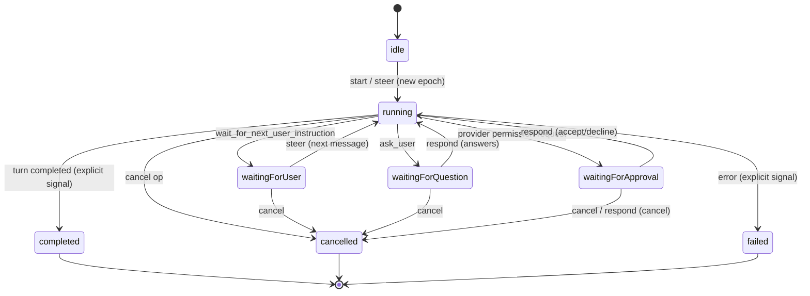
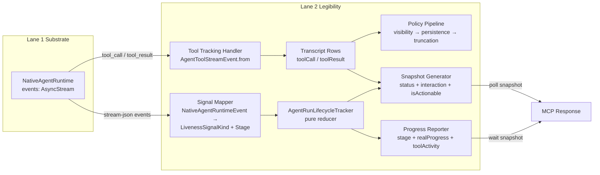

# feat: Headless Legibility & Interaction Layer (Lifecycle Stages, Transcripts, Steer/Respond, Approvals, HITL, Session Restore)

## Summary

Port the app's interactive-harness legibility and interaction layer onto the Lane 1 runtime substrate: run-lifecycle stages with explicit completion, tool-call tracking, structured transcripts replacing synthetic stdout/stderr, steer/respond ops, approvals (propose/apply gate), ask_user HITL, share_thoughts/set_status/wait_for_next_user_instruction, and session restore with checkpoint shape across server restarts.

---

## Problem Frame

Headless progress is a stopwatch — during a `wait`, the only message is `"Elapsed Ns; poll or wait again"` (`HeadlessContextBuilderService.swift:460-467`). A stalled run and a productive run look identical. Transcripts are synthetic XML of `prompt + raw stdout + raw stderr` (`HeadlessAgentSessionManager.swift:530-541`) — there is no structured tool-call list, so a consumer cannot answer "what tool did the agent call?" The run-state machine has no `waitingFor*` states (`HeadlessAgentRunStatus` = `running | cancelling | completed | failed | cancelled | expired`), so `steer`/`respond` and approvals cannot exist by construction. Sessions are ephemeral temp dirs removed on cleanup — a restarted server loses all run history.

The design doc's central insight (§2, §3) is that these are not four independent missing features; they are projections of one interactive-harness architecture whose keystone is a live, stateful runtime with waiting-states. Legibility is the observable surface of a runtime substrate, not a feature bolted on after the fact. Lane 2 builds that surface on top of Lane 1's substrate (the persistent, event-streaming native runtime). The lane is planned against the Lane 1 substrate contract before Lane 1 lands — contract boundaries are called out explicitly throughout.

---

## Requirements

- R1. Run-lifecycle substrate: typed signal kinds (`stageTransition | providerEvent | toolActivity | interaction | heartbeat`), stage vocabulary (`starting | preparingRuntime | running | waitingForInteraction | retrying | cancelling`), and an `isRealProgress` predicate that distinguishes real forward motion from liveness-only heartbeats.
- R2. Structured `ToolCall`/`ToolResult` transcripts replacing synthetic stdout/stderr, with visibility suppression, persistence sanitization (bounded summaries, `ask_user` preserved raw), and historical truncation policies.
- R3. Run-state machine with `waitingFor*` states (`waitingForUser | waitingForQuestion | waitingForApproval`) as the hinge — `running` is the state in which `steer` injects; `waitingFor*` are the states `respond` targets; terminal states are explicit.
- R4. `steer` (inject into `running` or start a new epoch if inactive) and `respond` (answer a `waitingFor*` state by interaction ID, transitioning back to `running`).
- R5. Approvals: `AgentApprovalRequest`/`AgentApprovalDecision` models, `waitingForApproval` gate, `respondToPermissionRequest` runtime hook — the propose/apply gate between an agent's proposed action and its application.
- R6. `ask_user` HITL question tool + `share_thoughts`/`set_status`/`wait_for_next_user_instruction` agent↔operator interaction loop.
- R7. Session restore across restarts: persisted sessions with metadata index reconciliation/quarantine, cold-restore normalization (active states → `idle`, in-flight tools cancelled), checkpoint shape.
- R8. Explicit completion signals only — no heuristic detection (no consecutive-iterations-without-tool-calls, no process-exit-code heuristics, no stdout pattern matching). Stage transitions, tool calls, waiting states, and completion are all explicit signals from the substrate or state machine.

---

## Scope Boundaries

### Deferred to Follow-Up Work

- **Worktree merge workflow** (`AgentSessionWorktreeMergeOperation` state machine) — Lane 3. Independent of the substrate but depends on the approval gate (Lane 2 U13).
- **Workflow resolution** (`AgentWorkflowStore`, `workflow_id`/`workflow_name`) — Lane 4.
- **Model catalog across providers** — Lane 1 substrate concern.
- **`app_settings`** registry split — Lane 4.
- **Write surface** (`apply_edits`, `file_actions`, `git`) — Lane 3.
- **Codex/ACP provider adapter support on Linux** — unknown whether non-Claude native runtimes work on Linux; Lane 2's Claude-first port may be the only provider for now.
- **ACP elicitation protocol** (`AgentMCPElicitationRequest`/`Response`) — depends on which providers are ported.
- **`AgentRequestUserInputRequest`** (Codex-specific structured input) — separate from `ask_user`; needs investigation if Codex is ported.
- **Transcript compaction** (`AgentTranscriptCompactor` tier compaction) — open question whether headless needs it; the app compacts for UI token budget.
- **Session retention sweeping** — a retention policy becomes necessary with persistent sessions; the policy is unspecified.
- **Full `AgentRunEpochTransitionKind` tracking** (`.initial`/`.relatedFollowUp`/`.steering`/`.unrelated`) — whether headless needs full epoch tracking or a simplified version is unknown.
- **Socket-mode tool exposure** — new `steer`/`respond`/`ask_user` tools would be stdio-only (socket mode is discovery-restricted); need to confirm acceptability.

---

## Context & Research

### Relevant Code and Patterns

**App reference (authoritative — to port from):**
- `Sources/RepoPrompt/Features/AgentMode/Runtime/AgentRunLifecycleContracts.swift` — `AgentRunLifecycleTracker` (pure value-type reducer), `AgentRunLivenessSignalKind`, `AgentRunLifecycleStage`, `AgentRunLivenessSnapshot`, `AgentRunOwnership`, acceptance/rejection protocol.
- `Sources/RepoPrompt/Features/AgentMode/Runtime/ToolTracking/AgentToolTrackingContracts.swift` — `AgentToolStreamEvent` (`ToolCall`/`ToolResult`/`LegacyEvent`), `AgentToolStreamEvent.from(_:)` parser.
- `Sources/RepoPrompt/Features/AgentMode/Runtime/ToolTracking/ClaudeAgentToolTrackingHandler.swift` — dual-source correlation (provider stream + MCP tracker), ACK-wait for steering safety, turn-scoped correlation state.
- `Sources/RepoPrompt/Features/AgentMode/Runtime/Transcript/AgentTranscriptToolVisibilityPolicy.swift` — placeholder suppression, path-like canonicalization, canonical aliases.
- `Sources/RepoPrompt/Features/AgentMode/Runtime/Transcript/AgentToolResultPersistencePolicy.swift` — bounded summaries (2048-byte cap), `ask_user` preserved raw, git/bash specialized summaries.
- `Sources/RepoPrompt/Features/AgentMode/Runtime/Transcript/AgentTranscriptHistoricalTruncationPolicy.swift` — middle-truncation of old turns, recent-turn exemption (3), structured JSON untouched.
- `Sources/RepoPrompt/Features/AgentMode/Runtime/Transcript/AgentTranscriptPolicyPipeline.swift` — `runtimeTranscript()`/`persistedTranscript()`/`handoffTranscript()`.
- `Sources/RepoPrompt/Infrastructure/MCP/Agent/AgentRunMCPToolService.swift` — ops `start`/`poll`/`wait`/`cancel`/`steer`/`respond`, `waitForInterestingState`, epoch transitions, steering wake note.
- `Sources/RepoPrompt/Features/AgentMode/Models/AgentChatModels.swift` — `AgentSessionRunState` (`idle | running | waitingForUser | waitingForQuestion | waitingForApproval | completed | cancelled | failed`), `isActive`, `AgentChatItemKind` (`toolCall`/`toolResult` transcript rows).
- `Sources/RepoPrompt/Features/AgentMode/Models/UserInteractionModels.swift` — `AgentApprovalRequest`, `AgentApprovalDecision` (`accept | acceptForSession | acceptWithExecpolicyAmendment | decline | cancel`), `AgentApprovalRequestID`, `AgentApprovalKind`, `AgentAskUserInteraction`/`Validation`.
- `Sources/RepoPrompt/Features/AgentMode/Runtime/Native/NativeAgentRuntimeContracts.swift` — `NativeAgentRuntimeControlling` actor protocol, `respondToPermissionRequest(id:decision:)` hook, `events: AsyncStream`.
- `Sources/RepoPrompt/Infrastructure/MCP/WindowTools/MCPAskUserToolProvider.swift` — `ask_user` tool (structured Q&A, `waitingForQuestion`).
- `Sources/RepoPrompt/Infrastructure/MCP/WindowTools/MCPAgentSessionControlToolProvider.swift` — `share_thoughts`/`set_status`/`wait_for_next_user_instruction`.
- `Sources/RepoPrompt/Features/AgentMode/Runtime/AgentSessionDataService.swift` — file-based session persistence, coalescing disk writer, `AgentSessionMeta`.
- `Sources/RepoPrompt/Features/AgentMode/Runtime/AgentSessionMetadataIndex.swift` — reconciliation against filesystem, quarantine of corrupt files, `AgentSessionMetadataRecord`.
- `Sources/RepoPrompt/Features/AgentMode/Runtime/AgentSessionRestoreModels.swift` — hydration request/payload.
- `Sources/RepoPrompt/Features/AgentMode/Runtime/AgentSessionRestoreSupport.swift` — `normalizeColdRestoredRunState` (active → `idle`), `sanitizeColdRestoredTranscript` (in-flight tools → `.cancelled`).

**Headless current state (to replace/extend):**
- `Sources/RepoPromptHeadlessServer/HeadlessContextBuilderService.swift` — `HeadlessProgressReporter` stopwatch (`"Elapsed Ns; poll or wait again"`), `snapshot(for:)` with elapsed-time only.
- `Sources/RepoPromptHeadlessServer/HeadlessAgentSessionManager.swift` — `transcriptXML` synthetic stdout/stderr, `HeadlessAgentRunStatus` (no `waitingFor*`), `rejectUnsupportedStartArguments` (rejects `steer`/`respond`/`session_id`/`interaction_id`/`answers`), ephemeral `NSTemporaryDirectory()` sessions.
- `Sources/RepoPromptHeadlessServer/HeadlessAgentTypes.swift` — `HeadlessAgentRunStatus` enum.
- `Sources/RepoPromptHeadlessServer/HeadlessToolSchemas.swift` — no `ask_user`/`share_thoughts`/`set_status`/`wait_for_next_user_instruction` tools.
- `Sources/RepoPromptHeadlessServer/AgentLauncher.swift` — `--permission-mode bypassPermissions` hard-coded.

### Institutional Learnings

- The design doc (§2, §3) establishes that legibility is the observable surface of a runtime substrate. The app's progress is rich because `AgentRunLifecycleTracker` is a substrate — typed signals with stages, activity kinds, and a real-progress predicate. Headless's progress is poor because there is no substrate beneath the stopwatch. Closing this gap requires introducing the lifecycle substrate itself, not adding status strings.
- The `waitingFor*` states are the hinge of the entire harness: `steer` targets `running`; `respond` targets `waitingFor*`; `wait` blocks until an "interesting" state (terminal or `waitingFor*`). Remove the state machine and the ops lose their referent (design doc §2).

### External References

- None — the app is the authoritative reference; no external research needed for this lane.

---

## Key Technical Decisions

- **CONTRACT-ONLY vs NEEDS-SUBSTRATE split:** Units U1–U8 are pure value types (signal kinds, stage vocabulary, run-state enum, tool-tracking contracts, transcript policies, snapshot/interaction model, approval models, ask_user models, session persistence models) that can be scaffolded against the Lane 1 contract now, before Lane 1 lands. Units U9–U17 require the Lane 1 runtime to be functional (event stream wiring, steer/respond, waiting-state transitions, approvals flow, HITL tools, session restore, progress reporter). This split lets Phase 1 land immediately and de-risks the NEEDS-SUBSTRATE units by stabilizing the contract first.
- **Explicit completion signals only (R8):** No heuristic detection. Stage transitions are explicit `stageTransition` signals; tool calls are explicit `toolActivity` signals from stream-json parsing; waiting states are explicit run-state transitions; completion is an explicit terminal-state publication. This is the core lesson from the design doc — legibility is the observable surface of a substrate, not a feature bolted on after the fact.
- **Cold-restore normalization to `idle`:** The app's `AgentSessionRestoreSupport` normalizes active states (`running`/`waitingFor*`) to `idle` on cold restore and cancels in-flight tool executions (`.cancelled` with `toolIsError: true` and `"restored_without_live_run"` reason). A restored session cannot resume mid-run without a live process; it can be re-hydrated and a new run started via `steer` (which calls `startOrResume`). Headless replicates this checkpoint shape.
- **File-based session persistence (not UserDefaults):** Replace the app's `@MainActor UserDefaults` singleton with a file-based JSON store at a headless-native path. The coalescing disk-writer pattern (batch per-URL, sequential drain, atomic writes) is portable. The metadata index reconciliation/quarantine logic is portable as-is.
- **MCP snapshot collapses three `waitingFor*` into `waitingForInput`:** The app's `AgentRunMCPSnapshot.Status` uses `waitingForInput` (not three separate states); the `interaction.kind` field disambiguates which `waitingFor*` state the run is in. Headless replicates this — the MCP-facing surface is simpler than the internal state machine.
- **The `isRealProgress` predicate is the critical distinction:** It separates "the agent just called a tool / moved stages" from "the tracker is still alive but nothing has moved." This is what makes a stalled run distinguishable from a productive one — the exact pain the design doc (§3) documents.

---

## High-Level Technical Design

> *This illustrates the intended approach and is directional guidance for review, not implementation specification. The implementing agent should treat it as context, not code to reproduce.*

### Run-state machine

Op overlays: `steer` targets `running` (or starts a new epoch from `idle`/terminal). `respond` targets a `waitingFor*` state by interaction ID. `wait` blocks until the machine reaches an "interesting" state (terminal or `waitingFor*`). `poll` reads the current snapshot without state change.

### Data flow: substrate events → legibility surface

The key invariant: the tracker is a pure value-type reducer that never mutates transcript, persistence, or provider state. It is the typed signal stream beneath progress. The tool-tracking handler feeds structured rows into the transcript, which passes through the policy pipeline (visibility → persistence sanitization → historical truncation) before being surfaced via `get_log`.

---

## Implementation Units

### U1. Lifecycle signal & stage types [CONTRACT-ONLY]

**Goal:** Port the provider-neutral, non-rendering liveness substrate types and the pure reducer tracker.

**Requirements:** R1, R8

**Dependencies:** None (pure value types).

**Files:**
- Create: `Sources/RepoPromptHeadlessServer/HeadlessAgentRunLifecycle.swift`
- Test: `Tests/RepoPromptHeadlessServerTests/HeadlessAgentRunLifecycleTests.swift`

**Approach:**
- Port `AgentRunLivenessSignalKind` (`stageTransition | providerEvent | toolActivity | interaction | heartbeat`), `AgentRunLifecycleStage` (`starting | preparingRuntime | running | waitingForInteraction | retrying | cancelling`), `AgentRunLivenessSnapshot` (stage, retryIntent, lastAcceptedSequence, lastSignalUptimeNanoseconds, lastRealProgressUptimeNanoseconds, lastHeartbeatUptimeNanoseconds), `AgentRunOwnership` (attemptID + binding identity + turn epoch), `AgentRunProgressAcceptance`/`Rejection` (`noActiveOwnership | staleOwnership | duplicateSequence | outOfOrderSequence | nonMonotonicTimestamp`), and `AgentRunLifecycleTracker` (pure value-type reducer).
- The tracker's `accept()` method enforces monotone, ownership-scoped signal acceptance. `isRealProgress` is `true` for all non-heartbeat signals.

**Patterns to follow:**
- `Sources/RepoPrompt/Features/AgentMode/Runtime/AgentRunLifecycleContracts.swift` (the authoritative reference; these types have no AppKit/`@MainActor` dependencies).

**Test scenarios:**
- Happy path: `tracker.begin(...)` → `liveness.stage == .starting`, `activeOwnership != nil`.
- Happy path: `record(kind:.stageTransition, stage:.preparingRuntime)` → `.accepted`, `liveness.stage == .preparingRuntime`.
- Edge case: heartbeat with prior real progress → `lastHeartbeatUptimeNanoseconds` updated, `lastRealProgressUptimeNanoseconds` unchanged.
- Error path: record with different ownership → `.rejected(.staleOwnership)`.
- Error path: same signal twice → second is `.rejected(.duplicateSequence)`.
- Error path: timestamp going backwards → `.rejected(.nonMonotonicTimestamp)`.
- Happy path: `end()` → `activeOwnership == nil`, `liveness == nil`.

**Verification:**
- The tracker correctly accepts/rejects signals per ownership/sequence/timestamp rules; `isRealProgress` distinguishes heartbeats; stage transitions update `lastRealProgressUptimeNanoseconds`.

---

### U2. Run-state machine [CONTRACT-ONLY]

**Goal:** Port the run-state enum with `waitingFor*` states and the `isActive` predicate.

**Requirements:** R3, R8

**Dependencies:** None (pure enum).

**Files:**
- Create: `Sources/RepoPromptHeadlessServer/HeadlessRunState.swift`
- Test: `Tests/RepoPromptHeadlessServerTests/HeadlessRunStateTests.swift`

**Approach:**
- Port `AgentSessionRunState` (`idle | running | waitingForUser | waitingForQuestion | waitingForApproval | completed | cancelled | failed`) with `isActive` (`running`/`waitingFor*` → true; `idle`/terminal → false).
- Extend the headless `HeadlessAgentRunStatus` to include the `waitingFor*` states, or replace it with this richer enum.

**Patterns to follow:**
- `Sources/RepoPrompt/Features/AgentMode/Models/AgentChatModels.swift` (`AgentSessionRunState`).

**Test scenarios:**
- Happy path: `waitingForUser`/`waitingForQuestion`/`waitingForApproval` → `isActive == true`; `idle`/`completed`/`cancelled`/`failed` → `isActive == false`.
- Error path: direct transition from `idle` to `waitingForApproval` is rejected (must go through `running` first).

**Verification:**
- All legal state transitions succeed; illegal transitions are rejected; `isActive` predicate is correct.

---

### U3. Tool tracking contracts [CONTRACT-ONLY]

**Goal:** Port the `ToolCall`/`ToolResult`/`LegacyEvent` shapes and the `AgentToolStreamEvent.from(_:)` parser.

**Requirements:** R2

**Dependencies:** None (pure value types).

**Files:**
- Create: `Sources/RepoPromptHeadlessServer/HeadlessToolTracking.swift`
- Test: `Tests/RepoPromptHeadlessServerTests/HeadlessToolTrackingTests.swift`

**Approach:**
- Port `AgentToolStreamEvent` (`ToolCall` with `toolName`/`invocationID`/`argsJSON`; `ToolResult` with `toolName`/`invocationID`/`argsJSON`/`resultJSON`/`isError`; `LegacyEvent` with `toolName`).
- Port the `from(_:)` parser: `"tool_call"` → `.toolCall`; `"tool_result"` → `.toolResult`; `"event"` with `"Using tool: "` prefix → `.legacyEvent`; non-tool events → `nil`.
- Port `AgentToolTrackingHooks` with headless-appropriate no-op hooks.

**Patterns to follow:**
- `Sources/RepoPrompt/Features/AgentMode/Runtime/ToolTracking/AgentToolTrackingContracts.swift`.

**Test scenarios:**
- Happy path: `AIStreamResult(type:"tool_call", toolName:"read_file", ...)` → `.toolCall` with correct fields.
- Happy path: `AIStreamResult(type:"tool_result", ...)` → `.toolResult` with `resultJSON` and `isError`.
- Happy path: `AIStreamResult(type:"event", text:"Using tool: bash")` → `.legacyEvent(toolName:"bash")`.
- Edge case: `AIStreamResult(type:"assistant", ...)` → `nil` (non-tool event).

**Verification:**
- The parser correctly maps all tool-event types; non-tool events return nil.

---

### U4. Transcript visibility/persistence/truncation policies [CONTRACT-ONLY]

**Goal:** Port the pure value-transform policies that make a transcript legible and storage-safe.

**Requirements:** R2

**Dependencies:** U3 (ToolCall/ToolResult shapes).

**Files:**
- Create: `Sources/RepoPromptHeadlessServer/HeadlessTranscriptPolicies.swift`
- Test: `Tests/RepoPromptHeadlessServerTests/HeadlessTranscriptPoliciesTests.swift`

**Approach:**
- Port `AgentTranscriptToolVisibilityPolicy.shouldSuppressRow(_:)` (placeholder suppression unless error/args/payload; path-like canonicalization to `read_file`; canonical aliases).
- Port `AgentToolResultPersistencePolicy` (2048-byte cap; `ask_user` preserved raw; `agent_run`/`agent_explore` status-word summary; `bash` extracts `processId`/`exitCode`; `git` specialized summaries; `prompt` export file metadata capped at 12; everything else `minimalResultJSON(statusWord:)`).
- Port `AgentTranscriptHistoricalTruncationPolicy` (10000-token per-field cap; 3-turn recent exemption; `"\n\n[content truncated]\n\n"` marker; never touches user messages or structured JSON).
- Port `AgentTranscriptPolicyPipeline` (`runtimeTranscript()`/`persistedTranscript()`/`handoffTranscript()`).
- Port the `AgentChatItem`/`AgentChatItemPersist` and `AgentTranscript` types these policies depend on.

**Patterns to follow:**
- `Sources/RepoPrompt/Features/AgentMode/Runtime/Transcript/AgentTranscriptToolVisibilityPolicy.swift`, `AgentToolResultPersistencePolicy.swift`, `AgentTranscriptHistoricalTruncationPolicy.swift`, `AgentTranscriptPolicyPipeline.swift`.

**Test scenarios:**
- Edge case: placeholder tool name `"tool"` with nil args → suppressed; with error → not suppressed.
- Edge case: path-like name `"src/foo.swift"` → canonicalized to `"read_file"`.
- Happy path: 10KB bash result → summary ≤ 2048 bytes, contains `processId`/`exitCode`.
- Happy path: `ask_user` result → `preservesRawPayload == true`, `summaryOnly == false`.
- Edge case: 2-turn transcript with large text → no truncation markers.
- Edge case: 10-turn transcript with large text in turn 0 → turn 0 truncated, turns 7–9 intact.
- Edge case: old turn with `argsJSON` → `argsJSON` untouched by truncation.

**Verification:**
- Sanitization enforces byte caps and preserves raw payloads for HITL; visibility suppresses noise; truncation protects recent turns and structured JSON.

---

### U5. Snapshot & interaction model [CONTRACT-ONLY]

**Goal:** Port the MCP-facing snapshot that collapses `waitingFor*` into `waitingForInput` with interaction kind disambiguation.

**Requirements:** R3, R4

**Dependencies:** U2 (run states).

**Files:**
- Create: `Sources/RepoPromptHeadlessServer/HeadlessRunSnapshot.swift`
- Test: `Tests/RepoPromptHeadlessServerTests/HeadlessRunSnapshotTests.swift`

**Approach:**
- Port `AgentRunMCPSnapshot` with `Status` (`running | waitingForInput | completed | failed | cancelled | expired`), `Interaction` (Kind, ResponseType, Field, Option, Detail), `isActionableForMCPWait` (`interaction != nil || status == .waitingForInput || status.isTerminal`), `FailureReason`.
- The interaction `kind` disambiguates which `waitingFor*` state the run is in (approval/question/instruction).

**Patterns to follow:**
- `Sources/RepoPrompt/Infrastructure/MCP/Agent/AgentRunMCPSnapshot.swift`.

**Test scenarios:**
- Happy path: snapshot with `interaction != nil` → `isActionableForMCPWait == true`.
- Happy path: snapshot with `status == .completed` → `isActionableForMCPWait == true`.
- Edge case: snapshot with `status == .running`, no interaction → `isActionableForMCPWait == false`.
- Edge case: `status == .failed`, `statusText == "timed out"` → `FailureReason.timeout`.

**Verification:**
- The wait-completion predicate (`isActionableForMCPWait`) correctly identifies actionable states.

---

### U6. Approval models [CONTRACT-ONLY]

**Goal:** Port the approval request/decision models as pure value types.

**Requirements:** R5

**Dependencies:** None (pure value types).

**Files:**
- Create: `Sources/RepoPromptHeadlessServer/HeadlessApprovals.swift`
- Test: `Tests/RepoPromptHeadlessServerTests/HeadlessApprovalsTests.swift`

**Approach:**
- Port `AgentApprovalRequest` (`id` derived from `requestID + method + kind + thread/turn/item`; `requestID: AgentApprovalRequestID` provider-typed union; `method`; `kind: AgentApprovalKind` — `.commandExecution | .fileChange`; `reason`, `command`, `cwd`, `grantRoot`, `details`).
- Port `AgentApprovalDecision` (`accept | acceptForSession | acceptWithExecpolicyAmendment(String) | decline | cancel`).
- Port `AgentApprovalRequestID` (`.codex | .claudeControl | .acp`).

**Patterns to follow:**
- `Sources/RepoPrompt/Features/AgentMode/Models/UserInteractionModels.swift`.

**Test scenarios:**
- Happy path: same requestID/method/kind/thread/turn/item → same UUID (stable ID derivation).
- Happy path: `.commandExecution` → title "Command Approval"; `.fileChange` → "File Change Approval".

**Verification:**
- Approval models construct correctly; stable ID derivation is deterministic.

---

### U7. ask_user interaction models [CONTRACT-ONLY]

**Goal:** Port the structured Q&A interaction models with validation.

**Requirements:** R6

**Dependencies:** None (pure value types).

**Files:**
- Create: `Sources/RepoPromptHeadlessServer/HeadlessAskUser.swift`
- Test: `Tests/RepoPromptHeadlessServerTests/HeadlessAskUserTests.swift`

**Approach:**
- Port `AgentAskUserInteraction` (`questions: [{id, header?, question, context?, options?: [{label, description?}], allows_multiple?, allows_custom?}]`), `AgentAskUserQuestion`, `AgentAskUserOption`, `AgentAskUserDraft`, `AgentAskUserAnswer`, `AgentAskUserResponse` (answers keyed by question ID, `timed_out`, `skipped`, `elapsed_seconds`), `AgentAskUserValidationError`.
- Port `validate()` (non-empty questions, unique IDs, non-blank text, no impossible questions, no duplicate option labels).

**Patterns to follow:**
- `Sources/RepoPrompt/Features/AgentMode/Models/UserInteractionModels.swift`, `Sources/RepoPrompt/Infrastructure/MCP/WindowTools/MCPAskUserToolProvider.swift`.

**Test scenarios:**
- Error path: `questions: []` → throws `.emptyQuestions`.
- Error path: duplicate question IDs → throws `.duplicateQuestionID`.
- Error path: no options + `allowsCustom: false` → throws `.impossibleQuestion`.
- Error path: `allowsMultiple: false` with 2 answers → throws `.invalidSingleSelectAnswer`.
- Error path: `skipped: true` with answers → throws `.skippedQuestionHasAnswer`.
- Happy path: incomplete drafts → `buildTimedOutResponse` → valid response with `timedOut: true`.

**Verification:**
- All validation error cases are caught; draft→answer conversion works; timeout/skip responses build correctly.

---

### U8. Session persistence & restore models [CONTRACT-ONLY]

**Goal:** Port file-based session persistence, metadata index reconciliation/quarantine, and cold-restore normalization.

**Requirements:** R7

**Dependencies:** U4 (transcript sanitization for persisted transcripts).

**Files:**
- Create: `Sources/RepoPromptHeadlessServer/HeadlessSessionPersistence.swift`
- Test: `Tests/RepoPromptHeadlessServerTests/HeadlessSessionPersistenceTests.swift`

**Approach:**
- Port `AgentSessionDataService` as a file-based actor (not `@MainActor`/UserDefaults). Sessions persisted as JSON files under a durable headless data directory (not `NSTemporaryDirectory()`). Use the coalescing disk-writer pattern (batch per-URL, sequential drain, atomic writes).
- Port `AgentSessionMetadataIndex` with reconciliation against the filesystem (new files indexed, stale records removed, corrupt files quarantined with reason rather than silently dropped).
- Port `AgentSessionRestoreSupport`: `normalizeColdRestoredRunState` (active states → `idle`), `sanitizeColdRestoredTranscript` (in-flight tools → `.cancelled` with `toolIsError: true` and `"restored_without_live_run"` reason).

**Patterns to follow:**
- `Sources/RepoPrompt/Features/AgentMode/Runtime/AgentSessionDataService.swift`, `AgentSessionMetadataIndex.swift`, `AgentSessionRestoreSupport.swift`.

**Test scenarios:**
- Happy path: session with 5 items → save → load → matches original (modulo sanitization).
- Happy path: new file on disk → reconcile → new `AgentSessionMetadataRecord` added.
- Edge case: index with record for deleted file → reconcile → record removed.
- Edge case: undecodable JSON file → reconcile → quarantined.
- Happy path: `lastRunStateRaw: "running"` → `normalizeColdRestoredRunState` → `.idle`.
- Happy path: turn with `pending` tool execution → `sanitizeColdRestoredTranscript` → `.cancelled`, `toolIsError: true`.

**Verification:**
- Sessions round-trip through file persistence; reconciliation handles new/stale/corrupt files; cold-restore normalizes active states and cancels in-flight tools.

---

### U9. Lifecycle tracker integration with runtime [NEEDS-SUBSTRATE]

**Goal:** Wire the `AgentRunLifecycleTracker` to the Lane 1 runtime's event stream.

**Requirements:** R1, R8

**Dependencies:** U1; Lane 1 runtime emitting `NativeAgentRuntimeEvent` values (contract: the runtime emits `providerEvent`/`toolActivity`/`stageTransition` signals from stream-json parsing).

**Files:**
- Modify: `Sources/RepoPromptHeadlessServer/HeadlessAgentSessionManager.swift`
- Test: `Tests/RepoPromptHeadlessServerTests/HeadlessLifecycleIntegrationTests.swift`

**Approach:**
- Map `NativeAgentRuntimeEvent` values from the Lane 1 runtime to `AgentRunLivenessSignalKind` + `AgentRunLifecycleStage` and feed them to the tracker. The runtime's `.stream` events map to `providerEvent`/`toolActivity`; `.runtimeInit` maps to `stageTransition(.preparingRuntime)`; `.turnCompleted` maps to terminal stage; `.approvalRequest` maps to `interaction`.

**Execution note:** The substrate must emit explicit signals — stage transitions are explicit `stageTransition` signals, not inferred from elapsed time or stdout patterns.

**Patterns to follow:**
- The app's runtime → tracker wiring (all four runners emit the `preparingRuntime → running → waitingForInteraction` spine).

**Test scenarios:**
- Integration: start agent run → observe tracker → `starting → preparingRuntime → running` signals emitted.
- Integration: agent calls a tool → `toolActivity` signal, `lastRealProgressUptimeNanoseconds` updated.
- Integration: run stalled, heartbeats only → `lastRealProgressUptimeNanoseconds` unchanged over time.

**Verification:**
- A real run produces correct stage transitions and tool-activity signals; heartbeats don't fake progress.

---

### U10. Tool tracking handler integration [NEEDS-SUBSTRATE]

**Goal:** Wire tool-event parsing to the runtime's event stream and build structured transcript rows.

**Requirements:** R2

**Dependencies:** U3, U4; Lane 1 runtime with stream-json parsing producing `AIStreamResult` tool events.

**Files:**
- Modify: `Sources/RepoPromptHeadlessServer/HeadlessAgentSessionManager.swift`
- Test: `Tests/RepoPromptHeadlessServerTests/HeadlessToolTrackingIntegrationTests.swift`

**Approach:**
- Implement a headless-appropriate `AgentToolTrackingHandler` (simplified from `ClaudeAgentToolTrackingHandler` — headless may use single-source correlation from the provider stream rather than dual-source if the MCP tracker callbacks are not available). Wire `AgentToolStreamEvent.from()` parsing to the runtime's event stream. Build structured `toolCall`/`toolResult` transcript rows. Replace `transcriptXML`'s synthetic stdout/stderr with the structured transcript in `get_log`.

**Execution note:** Tool calls are explicit `toolActivity` signals from stream-json parsing, not regex-matched from stdout.

**Patterns to follow:**
- `Sources/RepoPrompt/Features/AgentMode/Runtime/ToolTracking/ClaudeAgentToolTrackingHandler.swift` (the dual-source correlation; headless may simplify).

**Test scenarios:**
- Integration: agent calls `read_file` → `toolCall` row with `toolName`, `invocationID`, `argsJSON`.
- Integration: tool result arrives → paired `toolResult` row with `resultJSON`.
- Integration: run with 3 tool calls → `agent_manage get_log` → structured tool-call list, not raw stdout/stderr.

**Verification:**
- Tool calls produce structured transcript rows; `get_log` returns a structured tool-call list, not synthetic XML.

---

### U11. steer/respond op implementation [NEEDS-SUBSTRATE]

**Goal:** Add `steer` and `respond` ops to the headless `agent_run` tool.

**Requirements:** R3, R4

**Dependencies:** U2, U5; Lane 1 runtime with `startOrResume`, `interruptTurn`, instruction dispatch, and `respondToPermissionRequest`.

**Files:**
- Modify: `Sources/RepoPromptHeadlessServer/HeadlessAgentSessionManager.swift`
- Modify: `Sources/RepoPromptHeadlessServer/HeadlessToolSchemas.swift`
- Test: `Tests/RepoPromptHeadlessServerTests/HeadlessSteerRespondTests.swift`

**Approach:**
- Remove `steer` and `respond` from `rejectUnsupportedStartArguments`. Add them to the op switch.
- `executeSteer`: if session is active (`running`), dispatch the instruction into the live process. If inactive (`idle`/terminal), start a new epoch without replacing activation. If `wait=true`, block until an interesting state.
- `executeRespond`: resolve the pending interaction by `interaction_id` (validate against current pending interaction — reject stale/wrong IDs), deliver the payload (text for instruction, answers for questions, decision for approvals), transition back to `running`.
- Steering interrupting a `wait`: emit a `steeringRequested` wake reason; the wait returns `interrupted_by_steering` with the wake note.

**Execution note:** Waiting states are explicit run-state transitions, not inferred from process inactivity. Completion is an explicit terminal-state publication.

**Patterns to follow:**
- `Sources/RepoPrompt/Infrastructure/MCP/Agent/AgentRunMCPToolService.swift` (`executeSteer`, `executeRespond`, `waitForInterestingState`).

**Test scenarios:**
- Happy path: active `running` session → `steer` with message → instruction dispatched, run continues, snapshot shows `running`.
- Happy path: `idle` session → `steer` with message → new epoch started, run transitions to `running`.
- Integration: active `wait` on running session → `steer` → wait returns `interrupted_by_steering`, wake note included.
- Happy path: session in `waitingForApproval` → `respond` with `accept` → run transitions to `running`.
- Happy path: session in `waitingForQuestion` → `respond` with answers → run transitions to `running`.
- Error path: `respond` with wrong `interaction_id` → error.
- Error path: `respond` on a `running` session (no pending interaction) → error.

**Verification:**
- `steer` injects into running or starts a new epoch; `respond` resolves pending interactions by ID; steering interrupts waits with the correct wake note.

---

### U12. waitingFor* state transitions [NEEDS-SUBSTRATE]

**Goal:** Wire runtime interaction events to run-state transitions.

**Requirements:** R3, R8

**Dependencies:** U2, U5; Lane 1 runtime emitting interaction events (permission requests, ask_user questions, turn completion).

**Files:**
- Modify: `Sources/RepoPromptHeadlessServer/HeadlessAgentSessionManager.swift`
- Test: `Tests/RepoPromptHeadlessServerTests/HeadlessWaitingStateTests.swift`

**Approach:**
- When the runtime emits a permission request → transition to `waitingForApproval`. When the agent calls `ask_user` → `waitingForQuestion`. When the agent calls `wait_for_next_user_instruction` → `waitingForUser`. When a decision/answer/instruction arrives → `running`.
- Update `waitForSession` to resolve on `waitingFor*` (not just terminal). Update `poll` to report the correct `waitingFor*` state via the snapshot's `interaction.kind`.

**Execution note:** Waiting states are explicit run-state transitions from the substrate, not heuristic detection.

**Patterns to follow:**
- The app's op → state mapping (`AgentRunMCPToolService.swift`).

**Test scenarios:**
- Integration: runtime emits permission request → `waitingForApproval`.
- Integration: agent calls `ask_user` → `waitingForQuestion`.
- Integration: agent calls `wait_for_next_user_instruction` → `waitingForUser`.
- Integration: run enters `waitingForApproval` during `wait` → wait resolves `.snapshotReady`.
- Integration: run in `waitingForQuestion` → `poll` → snapshot with `status: waiting_for_input`, `interaction.kind: question`.

**Verification:**
- Each interaction type triggers the correct state transition; `wait` resolves on `waitingFor*`; `poll` reports the correct state.

---

### U13. Approvals flow [NEEDS-SUBSTRATE]

**Goal:** Implement the full approval lifecycle: request → park → respond → resume.

**Requirements:** R5, R8

**Dependencies:** U6, U12; Lane 1 `respondToPermissionRequest(id:decision:)` hook.

**Files:**
- Modify: `Sources/RepoPromptHeadlessServer/HeadlessAgentSessionManager.swift`
- Test: `Tests/RepoPromptHeadlessServerTests/HeadlessApprovalsFlowTests.swift`

**Approach:**
- When the runtime emits a permission request, construct an `AgentApprovalRequest`, park the run in `waitingForApproval`, surface the interaction in the snapshot. When `respond` arrives with a decision, call `respondToPermissionRequest(id:decision:)` on the runtime, transition to `running`.
- Replace `bypassPermissions` with a configurable permission profile (Lane 1 provides the profile → mode resolution; Lane 2 wires the `waitingForApproval` gate).

**Execution note:** Approvals are explicit `interaction` signals, not inferred from process inactivity. The propose/apply gate is: agent proposes (emits request) → run parks → operator decides → action applies.

**Patterns to follow:**
- `Sources/RepoPrompt/Features/AgentMode/Models/UserInteractionModels.swift` (approval models), `Sources/RepoPrompt/Features/AgentMode/Runtime/Native/NativeAgentRuntimeContracts.swift` (`respondToPermissionRequest`).

**Test scenarios:**
- Integration: run requests command execution → `respond` accept → `waitingForApproval` → `running`, command executes.
- Error path: `respond` decline → run transitions to `running` (command denied) or `cancelled`.
- Error path: `respond` cancel → run cancelled.
- Happy path: `respond` acceptForSession → subsequent same-kind approvals auto-approved for session.

**Verification:**
- The full approval lifecycle works (request → park → respond → resume); decline/cancel/acceptForSession paths are correct.

---

### U14. ask_user tool [NEEDS-SUBSTRATE]

**Goal:** Add the `ask_user` HITL question tool to the headless tool surface.

**Requirements:** R6

**Dependencies:** U7, U12; Lane 1 runtime (the agent's tool call must reach the headless MCP server via the runtime's tool dispatch).

**Files:**
- Create: `Sources/RepoPromptHeadlessServer/HeadlessAskUserTool.swift`
- Modify: `Sources/RepoPromptHeadlessServer/HeadlessToolSchemas.swift`
- Modify: `Sources/RepoPromptHeadlessServer/HeadlessMCPServer.swift`
- Test: `Tests/RepoPromptHeadlessServerTests/HeadlessAskUserToolTests.swift`

**Approach:**
- Add `ask_user` to headless tool schemas. Implement the tool handler: parse questions, construct `AgentAskUserInteraction`, validate, park the run in `waitingForQuestion`, surface the interaction in the snapshot. When `respond` arrives with answers, resume the run with the structured response.

**Execution note:** The `waitingForQuestion` state is an explicit run-state transition, not inferred from process inactivity.

**Patterns to follow:**
- `Sources/RepoPrompt/Infrastructure/MCP/WindowTools/MCPAskUserToolProvider.swift`.

**Test scenarios:**
- Happy path: agent calls `ask_user` with 1 question → `respond` with answer → run resumes with answer in context.
- Edge case: no response → wait past timeout → `timed_out: true`, run resumes.
- Happy path: `respond` with skip → `skipped: true`, run resumes.
- Happy path: 3 questions in one interaction → `respond` with answers for all → all answers delivered, run resumes.

**Verification:**
- `ask_user` parks in `waitingForQuestion`; `respond` with answers resumes the run; timeout/skip paths work.

---

### U15. share_thoughts / set_status / wait_for_next_user_instruction [NEEDS-SUBSTRATE]

**Goal:** Add the three agent↔operator interaction-loop tools.

**Requirements:** R6

**Dependencies:** U12; Lane 1 runtime (agent tool calls must reach the headless server).

**Files:**
- Create: `Sources/RepoPromptHeadlessServer/HeadlessAgentSessionControlTools.swift`
- Modify: `Sources/RepoPromptHeadlessServer/HeadlessToolSchemas.swift`
- Modify: `Sources/RepoPromptHeadlessServer/HeadlessMCPServer.swift`
- Test: `Tests/RepoPromptHeadlessServerTests/HeadlessAgentSessionControlTests.swift`

**Approach:**
- `share_thoughts`: append a thinking-segment to the transcript; return `{ok, context_id}`.
- `set_status`: update session name; return `{ok, context_id, session_name_applied, session_name?}`.
- `wait_for_next_user_instruction`: park the run in `waitingForUser`; the `prompt` IS the agent's response to the user. Returns the user's next instruction (via `steer` or `respond`) or `timed_out: true`.

**Execution note:** `waitingForUser` is an explicit run-state transition.

**Patterns to follow:**
- `Sources/RepoPrompt/Infrastructure/MCP/WindowTools/MCPAgentSessionControlToolProvider.swift`.

**Test scenarios:**
- Happy path: `share_thoughts` → thinking-segment appended to transcript.
- Happy path: `set_status` with name → `session_name` updated.
- Integration: `wait_for_next_user_instruction` → `waitingForUser` → `steer` with next message → run resumes with message as next turn.
- Edge case: no user input → wait past timeout → `timed_out: true`.

**Verification:**
- `share_thoughts` appends to transcript; `set_status` renames session; `wait_for_next_user_instruction` parks in `waitingForUser` and resumes on steer.

---

### U16. Session restore across restarts [NEEDS-SUBSTRATE for resume; CONTRACT-ONLY for checkpoint]

**Goal:** Persist sessions to a durable directory and restore them across server restarts.

**Requirements:** R7

**Dependencies:** U8 (persistence models); Lane 1 `startOrResume(existingSessionID:)` for actual resume.

**Files:**
- Modify: `Sources/RepoPromptHeadlessServer/HeadlessAgentSessionManager.swift`
- Test: `Tests/RepoPromptHeadlessServerTests/HeadlessSessionRestoreTests.swift`

**Approach:**
- Persist sessions to a durable directory (not `NSTemporaryDirectory()`). On server startup, reconcile the metadata index against the filesystem, quarantine corrupt files, normalize active states to `idle`, sanitize in-flight tool executions. Expose restored sessions via `agent_manage list_sessions`. Allow `agent_run steer` to resume a restored session (which calls `startOrResume`).

**Execution note:** Cold-restore normalization is an explicit state transition (active → `idle`), not a heuristic. In-flight tool cancellation is an explicit signal (`.cancelled` with `toolIsError: true`).

**Patterns to follow:**
- `Sources/RepoPrompt/Features/AgentMode/Runtime/AgentSessionRestoreSupport.swift` (cold-restore normalization).

**Test scenarios:**
- Integration: running session → kill server → restart → `list_sessions` → session present with `status: idle`.
- Integration: restored idle session → `steer` with message → `startOrResume(existingSessionID:)` called, run resumes.
- Edge case: corrupt session file on disk → startup reconciliation → quarantined.
- Edge case: session with pending tool → restart → restore → tool execution status → `.cancelled`.

**Verification:**
- Sessions survive restarts; active states are normalized to `idle`; corrupt files are quarantined; `steer` resumes a restored session.

---

### U17. Progress reporter upgrade [NEEDS-SUBSTRATE]

**Goal:** Replace the stopwatch with lifecycle-substrate-rendered progress.

**Requirements:** R1, R8

**Dependencies:** U9 (tracker integration).

**Files:**
- Modify: `Sources/RepoPromptHeadlessServer/HeadlessContextBuilderService.swift`
- Test: `Tests/RepoPromptHeadlessServerTests/HeadlessProgressReporterTests.swift`

**Approach:**
- Replace `HeadlessProgressReporter`'s `"Elapsed Ns; poll or wait again"` message with lifecycle-substrate-rendered progress. The `wait` snapshot should include `stage`, `lastRealProgressUptimeNanoseconds`, recent `toolActivity` signals, and a meaningful status string derived from the stage.

**Execution note:** Progress is the substrate rendered — explicit stage transitions and tool-activity signals, not elapsed time.

**Patterns to follow:**
- The app's `AgentRunLifecycleTracker` → progress rendering path.

**Test scenarios:**
- Happy path: run in `preparingRuntime` → `wait` → snapshot includes `stage: preparingRuntime`.
- Edge case: heartbeat-only run → `wait` → `lastRealProgressUptimeNanoseconds` stale, `lastHeartbeatUptimeNanoseconds` recent.
- Happy path: agent calls tool → `wait` → snapshot includes tool-activity signal, not just elapsed time.

**Verification:**
- The `wait` snapshot includes stage + real-progress timestamp; a stalled run is distinguishable from a productive run.

---

## System-Wide Impact

- **Interaction graph:** Lane 1 runtime events → (Lane 2) signal mapper → `AgentRunLifecycleTracker` → progress reporter → MCP `wait` response. Tool events → `AgentToolStreamEvent.from()` → transcript rows → policy pipeline → `get_log`. Waiting-states → `steer`/`respond`/`wait` ops → snapshot `interaction` field.
- **Error propagation:** Stale interaction ID → `respond` rejects (not silently applied). Approval swallow race → ACK-wait mechanism ensures steering doesn't race ahead of tool completions. Provider internal timeout → `respond` rejected if run already transitioned out of waiting state.
- **State lifecycle risks:** Partial-write session files (process died mid-save) → atomic writes mitigate; quarantine handles truncated files. In-flight tool cancellation on restore → explicit `.cancelled` with `toolIsError: true`. Cache/duplicate concerns → ownership/sequence discipline rejects stale/duplicate signals.
- **API surface parity:** `agent_run` gains `steer`/`respond` ops. `HeadlessAgentRunStatus` gains `waitingFor*` states. New tools: `ask_user`, `share_thoughts`, `set_status`, `wait_for_next_user_instruction`. `get_log` returns structured transcript, not synthetic XML. `wait` snapshot includes `stage`/`interaction`/`lastRealProgressUptimeNanoseconds`.
- **Integration coverage:** State-machine → op → transcript (steer produces transcript row; approval appears in snapshot; respond updates transcript; tool call during run appears in `get_log`). These cross-layer scenarios unit tests alone will not prove.
- **Unchanged invariants:** The read-only context tools (`get_file_tree`, `file_search`, `get_code_structure`, `read_file`, `workspace_context`, `prompt` basic, `manage_selection` get/add/remove/set/clear) are not modified by this lane. `context_builder`'s core context-selection logic is not modified — only its progress reporting surface (U17). The `oracle_send` tool is not modified.

---

## Risk Analysis & Mitigation

| Risk | Likelihood | Impact | Mitigation |
|------|-----------|--------|------------|
| State-machine correctness: run enters `waitingFor*` but runtime doesn't emit interaction signal → run hangs forever | Medium | High | Replicate `mcpResolvePendingInteraction` validation exactly; reject `respond` on stale/wrong interaction IDs; add timeout fallbacks for all `waitingFor*` states |
| Approval swallow races: steer races ahead of in-flight tool completions → lost tool results | Medium | High | Implement ACK-wait mechanism (park continuation until N explicit `tool_result` acknowledgements); maintain dedup set per tracked run |
| Transcript fidelity vs stream-json coverage: parser misses tool events or misparses on Linux | Medium | Medium | Verify stream-json event schema against actual Linux CLI output; build tests against recorded real transcripts; keep a raw-event JSONL log for diffing |
| Restore across Linux process restarts: partial writes, truncated transcripts → silent data loss | Medium | Medium | Atomic writes (write-to-temp + rename); quarantine logic handles truncated/mid-write files; verify atomic writes on ext4/tmpfs |
| Lane 1 contract drift: runtime event shape differs from assumed mapping | Medium | High | CONTRACT-ONLY units (U1–U8) are safe (pure value types); keep contract boundary explicit (substrate emits `AgentRunLivenessSignalKind` + `AgentRunLifecycleStage` + `AgentToolStreamEvent`; everything downstream consumes those types); only U9–U17 are at risk |
| Permission profile on Linux CLI: `--permission-mode` behaves differently | Low | Medium | Validate against actual Linux CLI permission surface; Lane 1 provides the profile → mode resolution; Lane 2 wires the gate |

---

## Phased Delivery

### Phase 1 — CONTRACT-ONLY pure value types (U1–U8)
Can land immediately, before Lane 1. Establishes the contract boundary (signal kinds, stages, run-state enum, tool-tracking contracts, transcript policies, snapshot/interaction model, approval models, ask_user models, session persistence models). De-risks Phase 2 by stabilizing the types the substrate must emit.

### Phase 2 — Substrate integration (U9–U12)
Requires Lane 1 runtime. Wires the lifecycle tracker to the event stream (U9), tool tracking to stream-json events (U10), steer/respond ops (U11), and `waitingFor*` state transitions (U12). At the end of Phase 2, headless runs are legible and steerable.

### Phase 3 — Approvals + HITL tools (U13–U15)
Requires Phase 2. Implements the full approval lifecycle (U13), `ask_user` tool (U14), and the agent↔operator interaction loop (U15). At the end of Phase 3, headless runs can pause for human input.

### Phase 4 — Session restore + progress reporter (U16–U17)
Requires Phase 2. Persists sessions across restarts with cold-restore normalization (U16) and replaces the stopwatch with substrate-rendered progress (U17). At the end of Phase 4, headless runs are durable and their progress is rich.

---

## Open Questions

### Resolved During Planning
- **Explicit completion signals only:** No heuristic detection — stage transitions, tool calls, waiting states, and completion are all explicit signals from the substrate or state machine (R8).
- **CONTRACT-ONLY vs NEEDS-SUBSTRATE split:** U1–U8 are pure value types that don't depend on the runtime shape; U9–U17 require the runtime. This is the de-risking strategy.
- **Cold-restore normalization:** Active states → `idle`; in-flight tools → `.cancelled` with `toolIsError: true` and `"restored_without_live_run"` reason. A restored session is re-hydrated, not resumed mid-run.

### Deferred to Implementation
- **Headless tool tracking: single-source vs dual-source correlation:** The app's `ClaudeAgentToolTrackingHandler` correlates tool events from two sources (provider stream + MCP tracker callbacks). Headless may simplify to single-source if MCP tracker callbacks are not available — needs investigation during U10.
- **Transcript compaction:** Whether headless needs `AgentTranscriptCompactor` tier compaction (`full → compacted → summary`) for long-running sessions — the app compacts for UI token budget; headless may have different constraints.
- **Session retention policy:** With persistent sessions (U16), a retention/sweeping policy becomes necessary. The policy is unspecified.
- **Full epoch transition tracking:** The app distinguishes `.initial`/`.relatedFollowUp`/`.steering`/`.unrelated` epoch transitions. Whether headless needs the full set or a simplified version is unknown.
- **Socket-mode tool exposure:** New `steer`/`respond`/`ask_user` tools would be stdio-only (socket mode is discovery-restricted). Need to confirm this is acceptable.

---

## Documentation / Operational Notes

- Update `Sources/RepoPromptHeadlessServer/README.md` to document: structured transcripts (replacing synthetic stdout/stderr), `steer`/`respond` ops, approvals (`waitingForApproval` gate), HITL tools (`ask_user`/`share_thoughts`/`set_status`/`wait_for_next_user_instruction`), session persistence/restore, and the upgraded progress reporter (stage + real-progress, not stopwatch).
- Parity map rows owned by Lane 2 (see Lane 0 plan) flip from `deferred` to `ported` as units land.
- `headless_capabilities` should report the new ops and tools in its tool list and capability guides once they ship.

---

## Sources & References

- **Origin document:** [docs/investigations/feature-parity/app-vs-headless-parity-design.md](docs/investigations/feature-parity/app-vs-headless-parity-design.md) (§2 Interactive Harness, §3 Context Builder and Run Legibility, §6 Consolidated gap matrix 🔴 rows)
- **Lane index:** [2026-06-18-001-feat-app-headless-parity-lane-index-plan.md](2026-06-18-001-feat-app-headless-parity-lane-index-plan.md)
- **Lane 1 plan (contract dependency):** [2026-06-18-003-feat-headless-runtime-substrate-plan.md](2026-06-18-003-feat-headless-runtime-substrate-plan.md) (the runtime substrate that emits the events this lane consumes)
- App reference: `Sources/RepoPrompt/Features/AgentMode/Runtime/AgentRunLifecycleContracts.swift`, `AgentToolTrackingContracts.swift`, `ClaudeAgentToolTrackingHandler.swift`, `Transcript/AgentTranscriptToolVisibilityPolicy.swift`, `AgentToolResultPersistencePolicy.swift`, `AgentTranscriptHistoricalTruncationPolicy.swift`, `AgentTranscriptPolicyPipeline.swift`; `Sources/RepoPrompt/Infrastructure/MCP/Agent/AgentRunMCPToolService.swift`; `Sources/RepoPrompt/Features/AgentMode/Models/AgentChatModels.swift`, `UserInteractionModels.swift`; `Sources/RepoPrompt/Features/AgentMode/Runtime/Native/NativeAgentRuntimeContracts.swift`; `Sources/RepoPrompt/Infrastructure/MCP/WindowTools/MCPAskUserToolProvider.swift`, `MCPAgentSessionControlToolProvider.swift`; `Sources/RepoPrompt/Features/AgentMode/Runtime/AgentSessionDataService.swift`, `AgentSessionMetadataIndex.swift`, `AgentSessionRestoreModels.swift`, `AgentSessionRestoreSupport.swift`
- Headless current state: `Sources/RepoPromptHeadlessServer/HeadlessContextBuilderService.swift`, `HeadlessAgentSessionManager.swift`, `HeadlessAgentTypes.swift`, `HeadlessToolSchemas.swift`, `AgentLauncher.swift`
