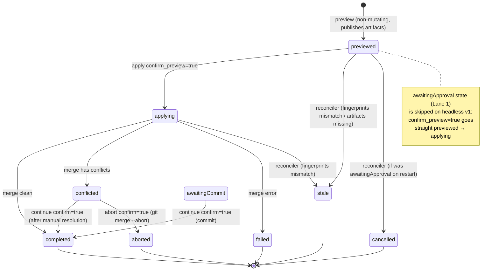
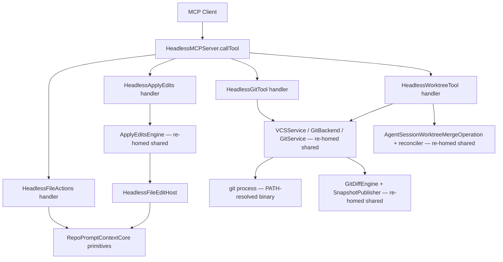

# feat: Headless Mutation & Isolation Surface (apply_edits, file_actions, git, manage_worktree + Merge Workflow)

## Summary

Port the app's write/isolation surface so `rpce-headless` gains CRUD-completeness for files and git (currently read-only) plus worktree isolation and the propose/apply merge workflow. This lane is independent of the Lane 1 runtime substrate — the capability leaves can proceed in parallel — but it is not independent of isolation safety: without worktree-first as the default, any agent write mutates the live checkout with no preview/approval gate.

---

## Problem Frame

`rpce-headless` is a read-only context server today. Every mutation tool the macOS app exposes — `apply_edits`, `file_actions`, `git` (read ops + diff-artifact publishing), `manage_worktree` (create/list/merge) — is absent from the headless tool set. The shared read engine (`RepoPromptContextCore`) already ships low-level file mutation primitives (`FileSystemService.createFile/moveFile/deleteFile/editFile`, `WorkspaceFileMutationService`, `WorkspaceFileContextStore`, `CreatePathPreflight`, `mutationTarget` path-escape guards), and headless already links them — but the *service layer* that turns those primitives into MCP tools (`ApplyEditsEngine`, `VCSService`, `GitService`, `GitDiffEngine`, `GitRepoTargetResolver`, `AgentSessionWorktreeMergeOperation`) lives exclusively under `Sources/RepoPrompt/**` and was never ported. In CRUD terms: headless has Read for files/git but no Create/Update/Delete. The design doc calls the absence of worktree isolation "direct and severe" (§4): a headless agent run that writes files does so against the same checkout the user is operating in, with no worktree endpoint to branch into and no preview/approval gate between an agent's edits and the user's working tree.

---

## Requirements

- R1. `apply_edits` — three mutually exclusive modes (rewrite, single search/replace, batch sequential edits), `on_missing=create` for rewrite, literal-only matching with escape-decoding retry, preview/apply split as the non-mutating/mutating boundary.
- R2. `file_actions` — `create`/`move`/`delete` with `if_exists` handling, in-workspace-root safety, auto-created parent directories, catalog materialization on create.
- R3. `git` tool — read ops (`status`/`diff`/`log`/`show`/`blame`) plus the worktree tree-specifier system (`@wt`, `@main`, `@main:<branch>`, `@branch:<name>`, `@id:<id>`, `@current`) and diff-artifact publishing (MAP.txt, files.tsv, all.patch with auto-selection).
- R4. `manage_worktree` management — `list`/`show`/`create`/`unbind` with worktree selectors and a headless worktree path planner (`bind`/`select` deferred to Lane 1).
- R5. `manage_worktree` merge workflow — the `previewed | awaitingApproval | applying | conflicted | awaitingCommit | stale | completed | failed | cancelled | aborted` state machine with propose/apply gate (`confirm_preview`/`confirm` flags for headless v1), explicit `source` worktree selector (no session binding), and reconciler-on-load for process-restart resilience.
- R6. Worktree-first as the **default** for any mutating agent workflow; live-checkout writes require explicit opt-in.
- R7. Cross-platform git — resolve the git binary via `PATH` (configurable via `RPCE_GIT_BINARY`), not hard-coded `/usr/bin/git`; keep `GIT_DIR`/`GIT_WORK_TREE` injection for gitfile worktrees.
- R8. Linux-safe delete — address the `moveItemToTrash` `#else` regression (hard delete on Linux, not recoverable); must not ship silently as "Trash."

---

## Scope Boundaries

- No `waitingForApproval` merge gate continuation — headless v1 uses `confirm_preview=true`/`confirm=true` flags (the approval *store* and `waitingForApproval` state machine are Lane 1).
- No `apply_edits` auto-approval store — headless v1 uses the preview/apply split (non-mutating preview, mutating apply with a `confirm` flag).
- No `bind`/`select` worktree-to-session binding — requires persistent session state (Lane 1); headless v1 merge takes an explicit `source` worktree selector.
- No git staging/committing/branching via the `git` tool — the app's `git` tool is read-only (`status`/`diff`/`log`/`show`/`blame`); broader git write is net-new and out of scope.
- No selection slices/preview/promote/demote (Lane 5); no `prompt` presets/export (Lane 5).
- No multi-root git aggregation — headless is single-workspace by design; multi-root code paths simplify to single-repo.
- No visual identity persistence (`label`/`color`/`icon_name`) — UI-only metadata, dropped for headless v1.

### Deferred to Follow-Up Work

- `bind`/`select` worktree-to-session + `WorktreeMergeSourceBindingResolver` → Lane 1 (requires persistent session state).
- `waitingForApproval` merge gate continuation (`requestWorktreeMergeReviewAndApply`) → Lane 1.
- `apply_edits` auto-approval (`applyEditsApprovalStore.requestReview`) → Lane 1.
- `AgentSessionWorktreeBinding` session-bound merge source resolution → Lane 1.
- Headless dependency-injection shape replacing `MCPWindowToolDependencies` → implementation-time design decision.
- Linux trash-can implementation details (trash dir vs documented permanent delete) → U1 implementation decision.

---

## Context & Research

### Relevant Code and Patterns

**Headline finding:** The headless target links only `RepoPromptContextCore` + `RepoPromptShared` (`Package.swift:100-113`), NOT the `RepoPrompt` app target. The entire write service layer is app-only. However, `RepoPromptContextCore` already ships reusable low-level mutation primitives.

**Already in `RepoPromptContextCore` (linked by headless — REUSABLE):**
- `FileSystemService.createFile/moveFile/deleteFile/editFile`, `FileSystemService.mutationTarget` (path-escape/symlink guards — cross-platform `#if os(macOS)...#else import Glibc`), `FileSystemService.writeFileRobust/writeFilePOSIX`
- `WorkspaceFileMutationService` (catalog-aware create/move/delete), `WorkspaceFileContextStore.createFile/moveFile/deleteFile/moveItemToTrash`
- `CreatePathPreflight.validate`, `WorkspaceSelectionMutationService`, `StoredSelection`, `AgentSessionWorktreeBinding` (model)
- `FileSystemService.moveItemToTrash` — **Linux `#else` falls back to `removeItem` (hard delete, NOT recoverable)** — R8 risk.

**Already in `RepoPromptShared` (linked by headless — REUSABLE):**
- `MCPControlMessages`, `MCPTimeoutPolicy`

**App-only (`Sources/RepoPrompt/**` — NOT linked — NET-NEW for the port):**
- `MCPApplyEditsToolProvider`, `ApplyEditsEngine`, `ApplyEditsService`, `ApplyEditsRequestBuilder`, `ApplyEditsResult`, `ApplyEditsModels`, `WorkspaceFileEditHost`, `FileEditHost`
- `MCPFileToolProvider.fileActionsTool` + `MCPServerViewModel.performFileAction`
- `MCPGitToolProvider`, `VCSService`, `GitBackend`, `GitService` (process runner — hard-codes `/usr/bin/git`), `GitDiffEngine`, `GitDiffSnapshotStore`, `GitDiffSnapshotPublisher`, `GitDiffMapBuilder`, `GitDiffPatchParsing`
- `MCPWorktreeToolProvider`, `MCPWorktreeToolProvider+Merge`, `GitWorktreeModels`, `GitWorktreeMergeModels`, `GitWorktreeMergePreviewPublisher`
- `GitRepoTargetResolver`, `GitRepositoryLayoutResolver`, `GitRepoDescriptor`, `GitWorktreeDefaultPathPlanner`
- `AgentSessionWorktreeMergeOperation` + `AgentSessionWorktreeMergeReconciler` + `AgentWorktreeMergeCoordinator` (pure, no `@MainActor`)
- `AgentModeViewModel+WorktreeMerge` (`@MainActor` — app-actor glue, NOT portable)

**Headless current-state gaps:**
- `HeadlessToolSchemas.tools` registers 13 tools — no `apply_edits`, `file_actions`, `git`, or `manage_worktree`. `HeadlessMCPServer.callTool` has no `case` for any of them (falls through to `methodNotFound`).
- `HeadlessAgentSessionManager.rejectUnsupportedStartArguments` explicitly rejects `worktree`, `worktree_id`, `worktree_create`, `worktree_repo_root`, `worktree_branch`.
- Headless links `RepoPromptContextCore` but has **no native git service** (`VCSService`/`GitBackend`/`GitService` are app-only).
- The `FileEditHost` protocol is trivial; the `ApplyEditsService` cleanly separates `preview` (non-mutating) from `run` (mutating) — the headless port can expose preview/apply as two steps.

### Institutional Learnings

- The design doc's "silent drift" diagnosis applies here: the write surface was never ported because headless was conceived as a read-only context server. The CRUD framing makes the gap concrete (Read present, Create/Update/Delete absent).
- The app's `ApplyEditsService.preview`/`run` split and the merge `preview`/`apply confirm_preview=true` split are the existing propose/apply patterns — the headless v1 gate reuses this shape rather than inventing a new one.

### External References

- None — the app is the authoritative reference implementation (per `AGENTS.md`), and the write/git patterns are well-established locally.

---

## Key Technical Decisions

- **Re-home pure engine/model pieces into a shared target:** `ApplyEditsEngine`, `ApplyEditsService`, `FileEditHost` protocol, `GitWorktreeMergeModels`, `AgentSessionWorktreeMergeOperation` + `AgentSessionWorktreeMergeReconciler` + `AgentWorktreeMergeCoordinator`, `GitRepoTargetResolver`, `GitDiffEngine`, `GitDiffSnapshotPublisher` are largely free of `@MainActor`/UI coupling. Re-home them into `RepoPromptContextCore` or a new `RepoPromptMutationCore` target so both the app and headless link them. The app also benefits (no drift).
- **Reimplement tool providers as headless-native handlers, NOT transplant app `@MainActor` providers:** Mirror the existing read-tool handlers in `HeadlessMCPServer.callTool`/`HeadlessWorkspaceHost`. Headless handlers call `RepoPromptContextCore`/the VCS layer directly — do NOT re-create `MCPWindowToolDependencies`.
- **Preview/apply split as the headless v1 approval gate:** `ApplyEditsService.preview` is non-mutating; `.run` writes — expose both. The merge `confirm_preview`/`confirm` flags are the intent-confirmation gate (not a human-review gate — that's Lane 1).
- **Worktree-first as default:** `apply_edits`/`file_actions` accept an optional worktree specifier or are called inside a worktree-scoped session; live-checkout writes require explicit opt-in (`@main` targeting or `allow_live_checkout=true`). This is the cheapest safety win and the design doc's strongest recommendation.
- **Resolve git via PATH (`RPCE_GIT_BINARY`):** Replace the hard-coded `/usr/bin/git` with a configurable, PATH-resolved binary. Keep `GIT_DIR`/`GIT_WORK_TREE` injection for gitfile worktrees.
- **Address Linux delete (R8):** Either a Linux trash-can (`.trash/` dir with timestamped names) or documented permanent delete with `confirm=true`. Must not ship silently as "Trash" when it is `removeItem`.

---

## Open Questions

### Resolved During Planning

- Worktree-first as default for mutating workflows — confirmed (design doc §4).
- Re-home pure engines to shared target — confirmed (avoids drift, app benefits).
- Confirm-flag gate for v1 (not `waitingForApproval`) — confirmed (Lane 1 delivers the approval state machine).

### Deferred to Implementation

- Exact shared-target name (`RepoPromptMutationCore` vs extend `RepoPromptContextCore`) — a packaging decision once the engine boundaries are clear.
- Linux trash implementation (trash dir vs documented permanent delete) — a U1 design decision.
- Headless worktree default path planner (the app uses an app-managed container; headless needs its own path policy, defaulting to `.git/worktrees`-adjacent or a headless-managed dir).
- Headless dependency-injection shape replacing `MCPWindowToolDependencies` — headless handlers call shared core/VCS directly; exact structure TBD.
- Multi-root git simplification (headless single-workspace → drop/simplify the app's multi-root aggregation code paths).

---

## High-Level Technical Design

> *This illustrates the intended approach and is directional guidance for review, not implementation specification. The implementing agent should treat it as context, not code to reproduce.*

### Merge workflow state machine

### Component flow

---

## Implementation Units

### U1. file_actions (headless)

**Goal:** Add the `file_actions` MCP tool (`create`/`move`/`delete`) dispatched in `HeadlessMCPServer.callTool`, backed by the already-linked `WorkspaceFileMutationService`/`WorkspaceFileContextStore`.

**Requirements:** R2, R6, R8

**Dependencies:** None (file-only, no git dependency)

**Files:**
- Create: `Sources/RepoPromptHeadlessServer/HeadlessFileActionsTool.swift`
- Modify: `Sources/RepoPromptHeadlessServer/HeadlessMCPServer.swift` (add `callTool` case)
- Modify: `Sources/RepoPromptHeadlessServer/HeadlessToolSchemas.swift` (register tool)
- Modify: `Sources/RepoPromptHeadlessServer/HeadlessWorkspaceHost.swift` (add `performFileAction` method)
- Test: `Tests/RepoPromptHeadlessServerTests/HeadlessFileActionsTests.swift`

**Approach:**
- Delegate to `WorkspaceFileMutationService.createFile/createFileWithPostcondition`, `WorkspaceFileContextStore.moveFile/deleteFile/moveItemToTrash`, `CreatePathPreflight`, `FileSystemService.mutationTarget` (all shared core).
- Headless has a single workspace root — no multi-root disambiguation needed; path translation is simpler than the app's `MCPWindowToolDependencies`/`lookupContext`.
- **Worktree-first default (R6):** accept an optional worktree specifier or worktree-scoped root; refuse paths outside the loaded root (the shared `mutationTarget` guard already does this). Live-checkout writes require explicit opt-in.
- **Linux delete (R8):** either implement a `.trash/` dir with timestamped names, or change delete to require `confirm=true` and document that delete is permanent. The `#else` `removeItem` regression must not ship silently as "Trash."
- `create`: `if_exists="error"` (default) or `"overwrite"`; auto-create parent dirs; materialize into catalog.
- `move`: validate both paths in-root; fail if destination exists; selection state transfers.
- `delete`: address the Linux regression per R8.

**Patterns to follow:**
- The existing read-tool handlers in `HeadlessMCPServer.callTool` / `HeadlessWorkspaceHost` (same dispatch pattern, same host-based delegation).

**Test scenarios:**
- Happy path: `create` new file with content inside root → file written, catalog materialized, reply `status:"ok"`, file exists on disk with exact content.
- Edge case: `create` existing path, default `if_exists` → error (file already exists).
- Happy path: `create` existing path, `if_exists="overwrite"` → file replaced with new content.
- Happy path: `create` path with non-existent nested dirs → parent dirs created, file created.
- Happy path: `move` existing file to non-existing `new_path` → file moved, destination exists, source gone.
- Error path: `move` to existing `new_path` → error (destination exists).
- Error path: `move` to path outside loaded root → error (invalid relative path / out-of-root).
- Happy path: `delete` existing file → (macOS: Trash; Linux: hard-delete or trash-dir per R8 decision — verify the `#else` branch behavior).
- Error path: `delete` non-existent path → error (file not found).
- Error path: `create`/`move` with `../` or absolute outside root → error (invalid path).

**Verification:**
- `file_actions` tool is registered in `HeadlessToolSchemas`, dispatched in `HeadlessMCPServer.callTool`, and create/move/delete all work against a sample workspace inside Docker `swift:6.2.4-noble`.

---

### U2. apply_edits (headless)

**Goal:** Add the `apply_edits` MCP tool (rewrite/single-replace/batch search-replace) backed by a headless re-homing of `ApplyEditsEngine` + `ApplyEditsService` + a headless `FileEditHost`.

**Requirements:** R1, R6

**Dependencies:** None (file-only; uses re-homed engine)

**Files:**
- Create: `Sources/RepoPromptHeadlessServer/HeadlessApplyEditsTool.swift`
- Create: `Sources/RepoPromptHeadlessServer/HeadlessFileEditHost.swift` (wraps `WorkspaceFileMutationService`)
- Re-home (move to shared target): `ApplyEditsEngine`, `ApplyEditsService`, `ApplyEditsRequestBuilder`, `ApplyEditsResult`, `ApplyEditsModels`, `FileEditHost` protocol (from `Sources/RepoPrompt/Infrastructure/MCP/ApplyEdits/`)
- Modify: `Sources/RepoPromptHeadlessServer/HeadlessMCPServer.swift`, `HeadlessToolSchemas.swift`
- Test: `Tests/RepoPromptHeadlessServerTests/HeadlessApplyEditsTests.swift`
- Test: `Tests/RepoPromptContextCoreTests/ApplyEditsEngineTests.swift` (re-homed engine)

**Approach:**
- Re-home `ApplyEdits/*` (minus the `@MainActor` tool provider) into a shared target; the engine is pure (depends only on `RepoPromptContextCore` for perf + diff utils). The `FileEditHost` protocol is trivial.
- `HeadlessFileEditHost` wraps `WorkspaceFileMutationService` like `WorkspaceFileEditHost` but without the `@MainActor` selection coordinator (or with a no-op coordinator).
- **Preview/apply split as the v1 gate:** `ApplyEditsService.preview` is non-mutating; `.run` writes — expose both (or require a `confirm` flag). The approval store is dropped for v1.
- Three mutually exclusive modes: `rewrite` (with `on_missing=create`), `search`+`replace` (with `all` flag), `edits` batch (sequential).
- Literal matching with escape-decoding retry for malformed JSON newlines.
- **Worktree-first default (R6):** same as U1 — optional worktree specifier, live-checkout opt-in.

**Patterns to follow:**
- `ApplyEditsService.run`/`preview` flow (preview → read original → engine.apply → writeText → result).
- `WorkspaceFileEditHost.writeText` (overwrite vs create-with-postcondition).

**Test scenarios:**
- Happy path: single `search`/`replace`, `all=false` → first match replaced, `editsApplied=1`, unified diff present if `verbose`.
- Happy path: single `search`/`replace`, `all=true` → all occurrences replaced.
- Happy path: batch `edits:[{...},{...}]` → each applied to prior result, outcomes per edit.
- Happy path: `rewrite` on existing file → entire content replaced.
- Happy path: `rewrite` on missing file, `on_missing="create"` → file created with content, `fileCreated=true`.
- Error path: `rewrite` on missing file, default `on_missing` → error (file does not exist).
- Edge case: `search` string absent in file → `editsApplied=0`, result reports 0 matches (not thrown).
- Edge case: `search` with literal `\n` instead of real newline → retry with escape decoding, or report 0 matches with note.
- Error path: `rewrite` + `search` + `edits` together → error (modes mutually exclusive).
- Happy path: call `preview` path on existing file → original text unchanged on disk, result has updated text + diff (non-mutating).

**Verification:**
- `apply_edits` tool registered, dispatched, and all three modes work against a sample workspace; preview is non-mutating; re-homed engine tests pass in `RepoPromptContextCoreTests`.

---

### U3. VCS / git engine (shared or headless)

**Goal:** Port `VCSService` + `GitBackend` + `GitService` + `GitDiffEngine` + `GitDiffSnapshotStore`/`Publisher` + `GitRepoTargetResolver` + `GitRepositoryLayoutResolver` + `GitRepoDescriptor`/`GitWorktreeModels` into a shared target. This is the largest unit and the prerequisite for U4/U5/U6.

**Requirements:** R7

**Dependencies:** None (foundational for U4/U5/U6)

**Files:**
- Re-home (move to shared target): `Sources/RepoPrompt/Infrastructure/VCS/` (`VCSService.swift`, `GitBackend.swift`, `GitService.swift`, `GitDiff/GitDiffEngine.swift`, `GitDiff/GitDiffSnapshotStore.swift`, `GitDiff/GitDiffSnapshotPublisher.swift`, `GitDiff/GitDiffMapBuilder.swift`, `GitDiff/GitDiffPatchParsing.swift`, `GitRepoTargetResolver.swift`, `GitRepositoryLayoutResolver.swift`, `GitRepoDescriptor.swift`, `GitWorktreeModels.swift`, `GitWorktreeMergeModels.swift`, `GitWorktreeMergePreviewPublisher.swift`)
- Re-home: `Sources/RepoPrompt/Features/AgentMode/Runtime/AgentSessionWorktreeMergeOperation.swift` (+ `AgentSessionWorktreeMergeReconciler`, `AgentWorktreeMergeCoordinator` — pure, no `@MainActor`)
- Modify: `Package.swift` (shared target deps)
- Test: `Tests/RepoPromptContextCoreTests/VCSEngineTests.swift` (re-homed engine — git binary, worktree layout, fingerprints, merge-tree prediction)

**Approach:**
- Almost all of `Infrastructure/VCS/` is process-based git (no macOS-only APIs except `/usr/bin/git` hard-coding). The diff/patch/map builders are pure Swift.
- **Git binary resolution (R7):** replace hard-coded `/usr/bin/git` with `which git`/PATH lookup; provide configurable `gitBinaryPath` via `RPCE_GIT_BINARY` env. Keep `GIT_DIR`/`GIT_WORK_TREE` injection for gitfile worktrees. Keep `GIT_TERMINAL_PROMPT=0` and `--no-ext-diff --no-textconv --color=never` flags (already cross-platform).
- Drop `FSEvents` (not needed for the write lane). `GitService.runGit` uses `Process` (Foundation) — cross-platform.
- Verify `git merge-tree` conflict prediction and `git merge --no-commit`/`--abort` behave identically on Linux git (they do — portable git commands).
- Install git in the Docker lane (`apt-get install git` in `swift:6.2.4-noble`, mirroring the `apt-get install python3` pattern).

**Patterns to follow:**
- `GitService.runGit` process execution + `GIT_DIR`/`GIT_WORK_TREE` env injection.

**Test scenarios:**
- Happy path: run any op on a Linux host where git is not `/usr/bin/git` → op succeeds using PATH-resolved git.
- Happy path: preview a merge with conflicting changes → `conflictPrediction.status=.conflicts` with file list (`git merge-tree`).
- Happy path: run op inside a linked worktree with `.git` file → `GIT_DIR`/`GIT_WORK_TREE` injected, op targets the worktree not main.
- Happy path: compute fingerprint for clean vs dirty tree → different fingerprints (used by staleness detection).

**Verification:**
- The VCS engine builds and runs on Linux via Docker; git binary is resolved via PATH; worktree layout injection works; merge-tree conflict prediction works.

---

### U4. git tool (headless)

**Goal:** Add the headless `git` MCP tool (`status`/`diff`/`log`/`show`/`blame`) + worktree specifiers + diff-artifact publishing, dispatched in `HeadlessMCPServer.callTool`.

**Requirements:** R3

**Dependencies:** U3 (VCS engine)

**Files:**
- Create: `Sources/RepoPromptHeadlessServer/HeadlessGitTool.swift`
- Modify: `Sources/RepoPromptHeadlessServer/HeadlessMCPServer.swift`, `HeadlessToolSchemas.swift`
- Test: `Tests/RepoPromptHeadlessServerTests/HeadlessGitToolTests.swift`

**Approach:**
- Re-use `MCPGitToolProvider.executeGitTool` logic (compare-spec resolution, worktree DTO, artifact DTO, hunk parsing/truncation) — re-home or mirror. `GitDiffSnapshotPublisher`, `GitDiffMapBuilder`, `GitDiffPatchParsing` are pure Swift (re-homed in U3).
- Headless is single-workspace → multi-root aggregation simplifies to single-repo.
- Artifact root: `~/.local/share/rpce-headless/snapshots/` (not `NSTemporaryDirectory`).
- Auto-selection of artifacts into context: headless has a `manage_selection` add path already — wire it.
- Compare specs: `uncommitted` (default) | `staged` | `unstaged` | `back:N` | `mergebase:X` | `main`/`trunk` (auto-detected) | `uncommitted:main` | `staged:main` | `last` | `<snapshot_id>` | `<revspec>`.
- Worktree specifiers: `@wt`, `@main`, `@main:<branch>`, `@branch:<name>`, `@id:<id>`, `@current`.
- `patches` detail truncated ~300 lines; `full` untruncated.

**Patterns to follow:**
- `MCPGitToolProvider.executeGitTool` (compare-spec resolution, `worktreeWarning`, `buildWorktreeDTO`, `artifactsDTO`).

**Test scenarios:**
- Happy path: `op:"status"` → branch, upstream, ahead/behind, staged/modified/untracked.
- Happy path: `op:"diff","compare":"main"` → diff vs auto-detected main branch merge-base.
- Happy path: `op:"diff","artifacts":true` → snapshot dir created with MAP.txt, files.tsv, all.patch; auto-selected.
- Happy path: `op:"status","repo_root":"@main"` → status of main checkout (not current worktree).
- Happy path: `op:"status","repo_root":"@main:feature-x"` → status of worktree on branch `feature-x`.
- Edge case: `op:"diff","detail":"patches"` on large diff → truncated at ~300 lines, `truncated=true` + note.
- Happy path: `op:"blame","path":"...","lines":"45-60"` → blame lines 45-60 only.
- Error path: `compare:"main"` with no main branch → error with suggestion to use `origin/main`.

**Verification:**
- `git` tool registered, dispatched, all 5 read ops work; worktree specifiers resolve; artifact publishing creates the expected snapshot files and auto-selects them.

---

### U5. manage_worktree management ops (headless)

**Goal:** Add headless `manage_worktree` with `list`/`show`/`create`/`unbind` (and optionally `remove`).

**Requirements:** R4

**Dependencies:** U3 (VCS engine)

**Files:**
- Create: `Sources/RepoPromptHeadlessServer/HeadlessWorktreeTool.swift`
- Modify: `Sources/RepoPromptHeadlessServer/HeadlessMCPServer.swift`, `HeadlessToolSchemas.swift`
- Test: `Tests/RepoPromptHeadlessServerTests/HeadlessWorktreeToolTests.swift`

**Approach:**
- Re-use `VCSService.listGitWorktrees/createGitWorktreeWithResult`, `GitRepoTargetResolver`, `GitWorktreeDefaultPathPlanner`, `GitWorktreeModels` (re-homed in U3).
- **Headless worktree path planner:** the app uses an app-managed container; headless should use a configurable worktree root (defaulting to `.git/worktrees`-adjacent or a headless-managed dir).
- Visual identity persistence (`GlobalSettingsStore` is app-only/macOS `UserDefaults`) → **drop for v1** (UI-only metadata).
- **`bind`/`select` require session state (Lane 1) — defer or stub.** Worktree creation on disk is NOT Lane 1 dependent; binding to a session is.
- Add `remove` (via `git worktree remove`) — not in the app's ops but a natural headless addition (the app relies on the UI for cleanup).

**Patterns to follow:**
- `MCPWorktreeToolProvider` (list/show/create/unbind ops); `GitWorktreeDefaultPathPlanner.plan`.

**Test scenarios:**
- Happy path: `op:"list"` → all worktrees with IDs, branches, HEADs, isMain.
- Happy path: `op:"create","branch":"feat-x"` → worktree created on `feat-x`, descriptor returned.
- Happy path: `op:"create","branch":"y","path":"/abs/path","allow_external_path":true` → created at explicit path.
- Error path: `op:"create","path":"/abs/path"` (no `allow_external_path`) → error (external path requires flag).
- Happy path: `op:"unbind","all":true` → all bindings removed.

**Verification:**
- `manage_worktree` management ops registered, dispatched; create/list/show/unbind work; worktree path planner produces sensible defaults.

---

### U6. manage_worktree merge workflow (headless)

**Goal:** Add headless merge ops `preview`/`apply`/`status`/`continue`/`abort` + the `AgentSessionWorktreeMergeOperation` state machine + reconciler.

**Requirements:** R5

**Dependencies:** U3 (VCS engine), U5 (worktree management)

**Files:**
- Create: `Sources/RepoPromptHeadlessServer/HeadlessWorktreeMergeTool.swift`
- Create: `Sources/RepoPromptHeadlessServer/HeadlessMergeOperationStore.swift` (persistent JSON-file store keyed by operation ID, with reconciler-on-load)
- Modify: `Sources/RepoPromptHeadlessServer/HeadlessMCPServer.swift`, `HeadlessToolSchemas.swift`
- Test: `Tests/RepoPromptHeadlessServerTests/HeadlessWorktreeMergeTests.swift`
- Test: `Tests/RepoPromptContextCoreTests/AgentSessionWorktreeMergeOperationTests.swift` (re-homed state machine + reconciler)

**Approach:**
- Re-use `GitWorktreeMergeModels` (pure `Codable`/`Sendable`), `AgentSessionWorktreeMergeOperation` + `AgentSessionWorktreeMergeReconciler` + `AgentWorktreeMergeCoordinator` (pure, no `@MainActor` — re-homed in U3), `VCSService.previewGitWorktreeMerge/applyGitWorktreeMerge/continueGitWorktreeMerge/abortGitWorktreeMerge`, `GitWorktreeMergePreviewPublisher`.
- **Headless merge-operation store:** the app stores ops in `TabSession.worktreeMergeOperations` (app-actor memory + persistence); headless needs a persistent JSON-file store keyed by operation ID, with reconciler-on-load.
- **Approval gate = `confirm_preview=true`/`confirm=true` flags only** (no `waitingForApproval` continuation — that's Lane 1). `confirm_preview=true` goes straight `previewed → applying`.
- **Explicit `source` worktree selector** (no session binding — `WorktreeMergeSourceBindingResolver` requires Lane 1). Headless v1 merge `preview`/`apply` take an explicit `source` selector instead of resolving from a session binding.
- **Reconciler-on-load:** re-validate non-terminal operations on server start (`awaitingApproval` → `.cancelled`; `previewed` → `.stale` if artifacts missing/fingerprints mismatch; `applying`/`conflicted`/`awaitingCommit` → inspect target merge state). This is process-restart resilience, NOT Lane 1 dependent — it uses `VCSService` git inspection.

**Technical design:** The merge state machine is documented in the High-Level Technical Design section above.

**Patterns to follow:**
- `AgentWorktreeMergeCoordinator` (pure state transitions); `AgentSessionWorktreeMergeReconciler.reconcile` (restart resilience); `MCPWorktreeToolProvider+Merge` (preview/apply/status/continue/abort op shapes).

**Test scenarios:**
- Happy path: `preview` with non-conflicting source/target → `status:"preview"`, operationID, no blockers, artifacts published.
- Happy path: preview with dirty target worktree → `status:"blocked"`, `target_dirty` blocker.
- Error path: `apply` with `operation_id` but no `confirm_preview` → error (confirm_preview=true required).
- Happy path: `apply` with `confirm_preview=true` on clean merge → `status:"completed"`, mergeCommit set, target HEAD advanced.
- Happy path: apply a merge with conflicts → `status:"conflicted"`, conflictFiles listed.
- Happy path: `continue` with `confirm=true` after resolving conflicts → `status:"completed"`, commit created.
- Happy path: `abort` with `confirm=true` → `status:"aborted"`, target HEAD unchanged, `git merge --abort` ran.
- Edge case: source HEAD moved after preview; apply → `status:"stale"`, no mutation.
- Integration: restart server with an `.applying` operation; call `status` → reconciler inspects target merge state → `.awaitingCommit`/`.conflicted`/`.completed`/`.failed`.
- Integration: restart with `.awaitingApproval` → `.cancelled` (approvals don't survive relaunch).
- Edge case: source HEAD is already ancestor of target → `status:"completed"` (no-op), target HEAD unchanged.
- Integration: `manage_worktree create` → agent edits in worktree → `preview` → `apply confirm_preview=true` → `status` → worktree created, edits land in worktree, preview shows diff, apply merges to target, status completed.
- Integration: create worktree → edit conflicting → preview → apply (conflicted) → resolve in target cwd → `continue` → status completed.
- Integration: preview → apply (conflicted) → `abort` → target worktree restored to pre-merge HEAD.

**Verification:**
- Merge workflow registered, dispatched; full state machine works (preview → apply → completed/conflicted → continue/abort); reconciler-on-load handles restart resilience; explicit `source` selector works without session binding.

---

## System-Wide Impact

- **Interaction graph:** file writes → `WorkspaceFileContextStore` catalog materialization; git ops → VCS layer → git process (PATH-resolved); merge → `VCSService.applyGitWorktreeMerge` → `git merge --no-commit`/`commit`/`--abort`; artifact publishing → snapshot dir → auto-selection via `manage_selection` add.
- **Error propagation:** path-escape (shared `mutationTarget` guard), failed search match (reported in result, not thrown), merge conflicts (state → `conflicted` + conflictFiles), stale fingerprints (state → `stale`, no mutation), git binary not found (clear error).
- **State lifecycle risks:** partial merge state across restart (reconciler handles via `inspectMergeState`); in-flight tool cancellation (process tree kill); snapshot artifact cleanup (headless artifact root under `~/.local/share/rpce-headless/snapshots/`).
- **API surface parity:** new tools `apply_edits`/`file_actions`/`git`/`manage_worktree` registered in `HeadlessToolSchemas` and dispatched in `HeadlessMCPServer.callTool`; `HeadlessAgentSessionManager.rejectUnsupportedStartArguments` updated to stop rejecting worktree args where the merge workflow handles them.
- **Integration coverage:** worktree → git → merge full flow (I.1); conflict resolution flow (I.2); abort flow (I.3) — cross-layer scenarios that unit tests alone will not prove.
- **Unchanged invariants:** the read surface (`read_file`/`get_file_tree`/`file_search`/`get_code_structure`/`workspace_context`/`prompt`) is unchanged; the shared `RepoPromptContextCore` primitives are reused as-is (not forked); the app's `@MainActor` tool providers are NOT transplanted.

---

## Alternative Approaches Considered

- **Re-home engines to shared target vs reimplement in headless:** Re-home wins — avoids drift between app and headless engine logic, and the app also benefits from the shared target. Reimplementing risks subtle divergence in the diff/merge/patch logic.
- **Transplant app `@MainActor` providers vs headless-native handlers:** Headless-native wins — the app providers (`MCPApplyEditsToolProvider`, `MCPGitToolProvider`, `MCPWorktreeToolProvider`, `MCPWindowToolDependencies`) are `@MainActor`-bound and cannot be linked by headless. Headless handlers mirror the existing read-tool dispatch pattern.
- **Confirm-flag gate vs defer entire lane to Lane 1:** Confirm-flag wins — the CRUD leaves are independent of the runtime substrate and deliver value immediately. The `confirm_preview`/`confirm` flags are the existing pattern (the app's plain-MCP path already uses them); deferring would block all mutation/isolation work behind the keystone substrate.

---

## Risk Analysis & Mitigation

| Risk | Likelihood | Impact | Mitigation |
|------|-----------|--------|------------|
| R1: Mutating the live checkout without worktree isolation (design doc §4 — "direct and severe") | High | High | Worktree-first as default; explicit opt-in for live-checkout writes (`@main` targeting or `allow_live_checkout=true`). Gate `apply_edits`/`file_actions` behind a worktree binding or explicit root flag. |
| R2: Approval-gate correctness (confirm flag is intent-confirmation, not human-review) | Medium | Medium | Document that the flag is confirmation-of-intent, not a human-review gate. For human review, require out-of-band inspection of preview artifacts before apply. Consider a "dry-run-only" mode for unattended servers. |
| R3: Cross-platform git path on Linux (`/usr/bin/git` hard-coded) | High | Medium | Resolve via `which git`/PATH; configurable `RPCE_GIT_BINARY`. Install git in Docker lane (`apt-get install git` in `swift:6.2.4-noble`). |
| R4: `file_actions` delete non-recoverable on Linux (`moveItemToTrash` `#else` = `removeItem`) | High | High | Implement a Linux trash-can (`.trash/` dir with timestamped names) OR change delete to require `confirm=true` and document permanent delete. Must not ship silently as "Trash." |
| R5: `@MainActor` coupling in app write layers | High | Medium | Re-home pure engine/model pieces (no `@MainActor`); reimplement tool handlers headless-native. Do not transplant app providers. |
| R6: `GlobalSettingsStore` visual identity is macOS `UserDefaults` | Medium | Low | Drop visual identity for headless v1 (UI-only metadata, non-functional for a server). |
| R7: Session binding requires Lane 1 (`bind`/`select` + `WorktreeMergeSourceBindingResolver`) | High | Medium | Headless v1 merge takes an explicit `source` worktree selector; `bind`/`select` deferred to Lane 1. |
| R8: Workspace directory for snapshot artifacts (`NSTemporaryDirectory` macOS-flavored) | Medium | Low | Define a headless artifact root (`~/.local/share/rpce-headless/snapshots/` or server-managed dir next to loaded root). |

---

## Phased Delivery

### Phase 1 — File writes (U1 + U2)
- `file_actions` and `apply_edits` land first — no git dependency, immediate CRUD value for files. Worktree-first default lands here.

### Phase 2 — VCS/git engine (U3)
- The VCS engine is the largest unit and the prerequisite for U4/U5/U6. Re-home the full `Infrastructure/VCS/` + merge state machine into the shared target; resolve git via PATH.

### Phase 3 — Git tool + worktree management (U4 + U5)
- `git` read tool and `manage_worktree` management ops build on U3. Can be parallelized.

### Phase 4 — Merge workflow (U6)
- The merge workflow needs U3 (VCS engine) + U5 (worktree management). The state machine + reconciler + explicit `source` selector deliver the propose/apply isolation gate.

---

## Documentation / Operational Notes

- Update `Sources/RepoPromptHeadlessServer/README.md` — the write surface is now available; document worktree-first default, the confirm-flag gate semantics, and the merge workflow.
- Document the Linux delete semantics explicitly (permanent vs trash-dir) — the app's "Recoverable from Finder Trash" description is false on Linux.
- Parity map rows owned by Lane 3 (see Lane 0 parity contract) flip from `deferred`/`absent` to `ported` as each unit lands: `apply_edits` (U2), `file_actions` (U1), `git` (U4), `manage_worktree` management (U5), `manage_worktree` merge (U6).
- Docker lane: `apt-get install git` is required in `swift:6.2.4-noble` for U3+ (mirroring the `apt-get install python3` pattern).

---

## Sources & References

- **Origin document:** [docs/investigations/feature-parity/app-vs-headless-parity-design.md](docs/investigations/feature-parity/app-vs-headless-parity-design.md) (§4 worktree isolation, §6 consolidated gap matrix)
- **Lane index:** [2026-06-18-001-feat-app-headless-parity-lane-index-plan.md](2026-06-18-001-feat-app-headless-parity-lane-index-plan.md)
- App reference (apply_edits): `Sources/RepoPrompt/Infrastructure/MCP/ApplyEdits/` (`ApplyEditsEngine.swift`, `ApplyEditsService.swift`, `ApplyEditsModels.swift`, `WorkspaceFileEditHost.swift`, `FileEditHost.swift`), `Sources/RepoPrompt/Infrastructure/MCP/WindowTools/MCPApplyEditsToolProvider.swift`
- App reference (file_actions): `Sources/RepoPrompt/Infrastructure/MCP/WindowTools/MCPFileToolProvider.swift`
- App reference (git): `Sources/RepoPrompt/Infrastructure/MCP/WindowTools/MCPGitToolProvider.swift`, `Sources/RepoPrompt/Infrastructure/VCS/` (`VCSService.swift`, `GitBackend.swift`, `GitService.swift`, `GitDiff/`, `GitRepoTargetResolver.swift`, `GitRepositoryLayoutResolver.swift`)
- App reference (worktree + merge): `Sources/RepoPrompt/Infrastructure/MCP/WindowTools/MCPWorktreeToolProvider.swift`, `MCPWorktreeToolProvider+Merge.swift`, `Sources/RepoPrompt/Features/AgentMode/Runtime/AgentSessionWorktreeMergeOperation.swift`
- Headless current-state: `Sources/RepoPromptHeadlessServer/HeadlessToolSchemas.swift` (empty write surface), `HeadlessAgentSessionManager.swift` (explicit rejections), `HeadlessMCPServer.swift` (no write-tool dispatch)
- Package manifest: `Package.swift:100-113` (headless deps = ContextCore + Shared, NOT the app target)
