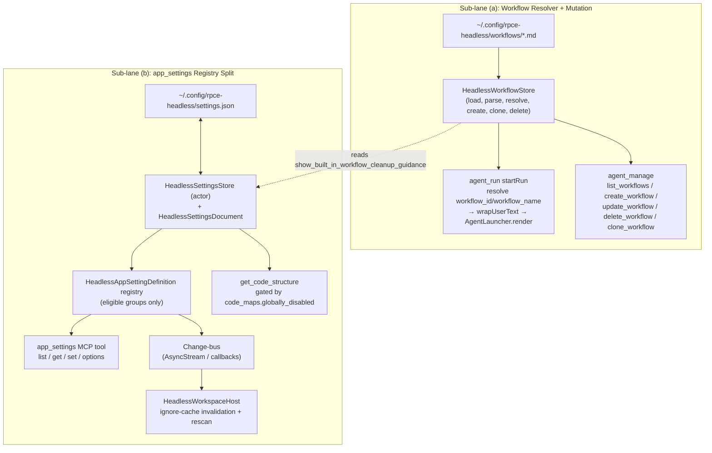

# feat: Headless Workflow Resolution & Settings (Workflow Resolver, app_settings Registry Split)

## Summary

Move headless from `metadata_only` workflows to runnable workflows — a headless workflow store that loads, parses, resolves, and mutates custom (and built-in) workflows, wired into `agent_run` prompt wrapping and `agent_manage` listing/CRUD. Alongside, split the app's `app_settings` registry into a headless-native actor-isolated JSON-file store with per-setting `afterWrite` decisions: port the file-system rescan hook, drop macOS chrome/OSLog, and rewrite model-catalog `options` against headless bindings (or mark unavailable). This lane is independent of Lane 1.

---

## Problem Frame

Headless workflow support is `metadata_only` today: `HeadlessCapabilities` reports `currentHeadlessSupport: "metadata_only"`, `agent_run` rejects `workflow_name`/`workflow_id` outright, and `startRun` passes the message verbatim to `AgentLauncher.render` with no wrap step. There is no `AgentWorkflowStore` equivalent in `Sources/RepoPromptHeadlessServer/`. The `app_settings` tool is entirely absent — no tool, no store, no registry. The app's `GlobalSettingsStore` is a `@MainActor` `UserDefaults` singleton that also writes a JSON document to `~/Library/Application Support`; `AgentWorkflowStore` is `@MainActor` + `NSWorkspace` + Application Support. None of this is portable. The design doc's §5 conclusion — "a registry split, not a copy" — is source-confirmed: the store backend, the main-actor assumption, and the macOS-only hooks all require replacement, not transplant.

---

## Requirements

- R1. A headless workflow store that loads, parses, and resolves custom (and built-in) workflows from `$XDG_CONFIG_HOME/rpce-headless/workflows/`, with frontmatter stripping, `$ARGUMENTS` substitution, visibility/featured metadata, and create/clone/delete operations.
- R2. Workflow resolution wired into `agent_run` (`workflow_id`/`workflow_name` → `wrapUserText` before `AgentLauncher.render`) and `list_workflows` wired into `agent_manage`, matching the app's resolution and listing shapes.
- R3. A workflow create/update/delete surface (extend `agent_manage`) with validation, atomic writes, and no partial writes.
- R4. A headless settings store: actor-isolated JSON file at `$XDG_CONFIG_HOME/rpce-headless/settings.json`, versioned schema, atomic write + corrupt-backup, no `UserDefaults`/`@MainActor`.
- R5. A headless `AppSettingDefinition` registry with non-isolated closures over the headless store, carrying only eligible groups (`prompt_packaging`, `models`, `context_builder`, `code_maps`, `file_system`, `agent_mode` durable subset); drop `ui`, `mcp`, and DEBUG settings.
- R6. An `app_settings` MCP tool implementing the `list`/`get`/`set`/`options` contract matching the app's response envelope shapes.
- R7. Per-setting `afterWrite` split: port `file_system.*` rescan hook (→ headless ignore-cache invalidation), port `models` mirror/sync logic, drop `AppearanceController`/`FontScaleManager`/`OSLog`/`.recommendationsDidApply`, rewrite model-catalog `options` against headless bindings or mark `options_available:false`.
- R8. Wire `file_system` settings into the shared ignore engine (replace hardcoded `respectGitignore: true` in `WorkspaceRootBindingProjection`), with a change-bus subscription that triggers rescan.

---

## Scope Boundaries

- The `ui` group (4 settings) is dropped entirely — pure macOS chrome (`AppearanceController`, `FontScaleManager`, `NSApplication.appearance`).
- The `mcp.show_model_presets` setting is dropped — it controls a UI recommendation concept with no headless behavioral effect.
- All `agent_mode` DEBUG settings (4, `#if DEBUG`-gated, OSLog/raw-`UserDefaults`) are dropped.
- `UserDefaults` is not used anywhere in the headless port. Ignore defaults seed from `IgnoreSettingsDefaults.canonicalGlobalIgnoreDefaults` (the static string in ContextCore), not `UserDefaults.standard`.
- The app's per-workspace `copySettings`/`chatSettings` and `ModelOverrideSettingsData` are not ported (app-only, multi-workspace).
- Backwards compatibility is not a concern (early dev, no users, no tech debt per `AGENTS.md`).

### Deferred to Follow-Up Work

- **`agent_mode.codex_goal_support_enabled` afterWrite:** port the storage (so the value is configurable), defer the effect until `AgentLauncher` templates support Codex goal flags. Today headless hardcodes `--permission-mode bypassPermissions` and a fixed argv; the setting has no behavioral hook.
- **Headless model catalog for `options`:** the first cut marks model-typed settings `options_available:false` (or returns a clear "catalog not available" error) rather than fabricating candidates. A real headless catalog (from `agents.json` + per-agent model discovery) is a Lane 1 follow-up; Lane 4 must leave a clean extension point.
- **`context_builder.agent`/`context_builder.model` write-path auto-default resolution:** first cut stores raw values without auto-resolving a default; the caller sets `context_builder.model` explicitly. Defer the auto-default logic (depends on a headless model catalog).
- **Optional Linux inotify watcher for the workflows directory:** not a parity requirement (source confirms the app uses on-demand + post-mutation refresh, not live watching). A future nicety.
- **Built-in workflow template port to shared module:** if U1 chooses the custom-workflows-only first cut, the built-in template port (`RepoPromptWorkflowPrompts` → shared module) is deferred to a later phase.

---

## Context & Research

### Relevant Code and Patterns

**App reference — workflow engine:**
- `Sources/RepoPrompt/Features/AgentMode/Runtime/AgentWorkflowStore.swift` — `@MainActor` store; `refresh()`, `parseWorkflowFile`, `resolveWorkflowReference`, `createWorkflow`, `cloneBuiltIn`, `deleteWorkflow`, `writeWorkflowFile`, `sanitizedFilename`, `uniqueWorkflowFileURL`, `generateMarkdown`, `deterministicUUID`. **Important correction:** the design doc claims the store "watches that directory for changes" — source evidence contradicts this. `AgentWorkflowStore` has no FSEvents/DispatchSource/directory observer. `refresh()` is called in `init`, at the end of each mutation, and from SwiftUI view lifecycle. On-demand + post-mutation refresh is the real contract.
- `Sources/RepoPrompt/Features/AgentMode/Models/AgentWorkflow.swift` — `AgentWorkflowDefinition` (`Sendable`, `Identifiable`); `stripYAMLFrontmatter`, `wrap`, `wrapUserText` static logic (pure functions); `import SwiftUI` for `Color(hex:)` (coupling risk). `includeSessionCleanupGuidance` coupling to `GlobalSettingsStore.shared.showBuiltInWorkflowCleanupGuidance()`.
- `Sources/RepoPrompt/Infrastructure/MCP/Agent/AgentRunMCPToolService.swift` — `resolveWorkflow(args:)` (reject both provided; resolve by id then name case-insensitive; throw if not found).
- `Sources/RepoPrompt/Infrastructure/MCP/Agent/AgentManageMCPToolService.swift` — `executeListWorkflows()` (canonical listing shape: `{workflows:[{id,name,source,icon,description,tooltip}]}`).

**App reference — settings registry:**
- `Sources/RepoPrompt/Infrastructure/MCP/AppSettingsMCPService.swift` — `AppSettingsMCPService` + `AppSettingsMCPRegistry` (8 groups, full setting inventory, `list`/`get`/`set`/`options` contract, validators).
- `Sources/RepoPrompt/Features/Settings/Models/GlobalSettingsManager.swift` — `GlobalSettingsStore` (`@MainActor` `UserDefaults` singleton + `GlobalSettingsFileStore` JSON doc).
- `Sources/RepoPrompt/Features/Settings/Models/GlobalSettingsDocument.swift` — `GlobalSettingsDocument` (versioned, `scalarPreferences: GlobalScalarPreferences` with portable group structs).
- `Sources/RepoPrompt/Features/Settings/Models/GlobalSettingsFileStore.swift` — versioned document, atomic write, corrupt-backup, future-schema guard (the design *pattern* to mirror).

**Confirmed app-only (not portable as-is):**
- `RepoPromptWorkflowPrompts` + all `WorkflowPrompt+*.swift` template files (`Sources/RepoPrompt/Infrastructure/AI/Prompts/Workflows/`) + `MCPPromptRegistry.swift` — all in the app-only `RepoPrompt` module. Headless cannot render built-in workflow templates without porting to a shared module.
- `AgentProviderKind` (`Sources/RepoPrompt/Features/AgentMode/Runtime/Providers/AgentRuntimeProviderService.swift`) — app-only. `context_builder.agent` allowedValues must be headless agent names from `AgentLauncher.definitions` (`agents.json`), not the app enum.

**Confirmed shared (portable):**
- `PromptSection` (`Sources/RepoPromptContextCore/PromptServices/PromptPackagingService.swift`) — shared via ContextCore. The `prompt_packaging.prompt_sections_order` validator is portable as-is.
- `IgnoreSettingsDefaults.canonicalGlobalIgnoreDefaults` (ContextCore) — static string for seeding ignore defaults.
- The ignore engine (`IgnoreRulesManager`, `FileSystemService`, `WorkspaceFileContextStore`) — already linked by headless.

**Headless current state:**
- `Sources/RepoPromptHeadlessServer/HeadlessCapabilities.swift` — `currentHeadlessSupport: "metadata_only"`; `futureHeadlessContract` explicitly defers workflow listing/resolution/mutation.
- `Sources/RepoPromptHeadlessServer/HeadlessAgentSessionManager.swift` — `rejectUnsupportedStartArguments` rejects `workflow_name`/`workflow_id`; `startRun` passes message verbatim to `AgentLauncher.render` (no wrap step).
- No `app_settings` case in `HeadlessToolSchemas.tools` or `HeadlessMCPServer`'s switch.
- `Sources/RepoPromptHeadlessServer/WorkspaceRootBindingProjection.swift` — hardcodes `respectGitignore: true, respectRepoIgnore: true` (no settings wiring).
- `Sources/RepoPromptHeadlessServer/AgentLauncher.swift` — `definitions` from `agents.json` at `~/.config/rpce-headless/agents.json` (the existing headless config location to mirror).

### Institutional Learnings

- The design doc's "watches that directory" claim about `AgentWorkflowStore` is inaccurate — source reading confirmed on-demand refresh. This de-risks the Linux port: no FSEvents→inotify bridge needed for correctness.
- The `postModelRawDidWrite` mirror in the app uses direct store setters that bypass the registry to avoid re-entry. The headless port must preserve this invariant — the sibling write must go through the store's typed setter, not the MCP `set` path.

---

## Key Technical Decisions

- **Headless config layout (XDG-conformant):** workflow markdown at `$XDG_CONFIG_HOME/rpce-headless/workflows/*.md`; settings JSON at `$XDG_CONFIG_HOME/rpce-headless/settings.json`. Mirrors the existing `agents.json` location so all headless config is in one directory. No `~/Library/Application Support`, no `UserDefaults`.
- **Actor-isolated settings store, not `@MainActor`:** MCP tool handlers `await` results, so an `actor` fits Swift concurrency on a server with no main run loop.
- **No directory watcher needed:** on-demand `refresh()` + post-mutation refresh is the source-confirmed contract. An optional inotify watcher is a future nicety, not a parity requirement.
- **`AgentWorkflowDefinition` SwiftUI coupling:** extract a SwiftUI-free core (or define a headless mirror) and share the `stripYAMLFrontmatter`/`wrap` pure-function logic even if the type itself is mirrored. Do not `import SwiftUI` in headless.
- **Built-in template availability (biggest scope decision — see U1 Approach):** `RepoPromptWorkflowPrompts` + built-in templates are confirmed app-only. U1 must decide: (a) port `RepoPromptWorkflowPrompts` to a shared module (no-tech-debt path but touches app module boundaries), or (b) ship custom-workflows-only first cut with a clear error for built-ins. The plan recommends (a) for the no-tech-debt principle but records (b) as a viable phased fallback.
- **`context_builder.agent` allowedValues = headless agent names** from `AgentLauncher.definitions` (`agents.json`), not the app `AgentProviderKind` enum. The `op=options` `agent` filter parser is rewritten against headless agent names.
- **First-cut model `options` = `options_available:false`:** honest about the gap, no fabricated candidates. Leaves a clean extension point for a future headless model catalog (Lane 1 follow-up).
- **`afterWrite` change-bus replaces `NotificationCenter`:** the store exposes an `AsyncStream<SettingsChange>` or callback list that `HeadlessWorkspaceHost` subscribes to for ignore-cache invalidation. No `NotificationCenter`, no `.recommendationsDidApply`.

---

## Open Questions

### Resolved During Planning

- Config paths: `$XDG_CONFIG_HOME/rpce-headless/` (mirrors existing `agents.json`).
- Directory watching: not needed (source-confirmed on-demand + post-mutation refresh).
- Store concurrency: `actor`-isolated, not `@MainActor`.
- Group eligibility: drop `ui`, `mcp`, DEBUG; port `prompt_packaging`, `models`, `context_builder`, `code_maps`, `file_system`, `agent_mode` (durable subset).
- First-cut model `options`: `options_available:false` (no fabricated candidates).

### Deferred to Implementation

- **Built-in template port decision (biggest open question):** port `RepoPromptWorkflowPrompts` to a shared module vs custom-workflows-only first cut. U1 must decide based on the invasiveness of the shared-module move against app module boundaries (per `AGENTS.md` source-placement rules). If deferred, U1 ships custom-only with a clear error for built-ins.
- **Shared-target name** for re-homed workflow prompts (if the port-to-shared path is chosen): `RepoPromptShared` vs `RepoPromptContextCore` vs a new target.
- **Exact change-bus mechanism:** `AsyncStream<SettingsChange>` vs callback list — a U4 design decision.
- **Headless model catalog extension point** for future `options` support — the registry must leave a clean seam but the catalog itself is out of scope.

---

## High-Level Technical Design

> *This illustrates the intended approach and is directional guidance for review, not implementation specification. The implementing agent should treat it as context, not code to reproduce.*

The two sub-lanes are independent of each other except for one coupling: the workflow resolver (U2) reads `agent_mode.show_built_in_workflow_cleanup_guidance` from the settings store (U4) when wrapping built-in templates. If sub-lane (a) lands before (b), U2 can stub that flag to `true` until U4 is available.

---

## Implementation Units

### U1. Headless Workflow Store + Definition

**Goal:** Port `AgentWorkflowStore` / `AgentWorkflowDefinition` into a headless-native workflow store that loads, parses, resolves, and mutates custom (and built-in) workflows from a Linux-native directory.

**Requirements:** R1

**Dependencies:** None (U4 is optional for the `show_built_in_workflow_cleanup_guidance` consumer; stub to `true` until U4 lands)

**Files:**
- Create: `Sources/RepoPromptHeadlessServer/HeadlessWorkflowStore.swift`
- Create: `Sources/RepoPromptHeadlessServer/HeadlessWorkflowDefinition.swift`
- Create (if built-in port chosen): re-home `Sources/RepoPrompt/Infrastructure/AI/Prompts/Workflows/` + `RepoPromptWorkflowPrompts` into a shared module
- Test: `Tests/RepoPromptHeadlessServerTests/HeadlessWorkflowStoreTests.swift`

**Approach:**
- Do not import SwiftUI/AppKit. Replace `Color(hex:)` with plain hex-string storage (the resolved `Color` is UI-only). Either extract a SwiftUI-free `AgentWorkflowDefinition` core into a shared module or define a headless-native `HeadlessWorkflowDefinition` mirroring the fields (`id`, `displayName`, `iconName`, `accentColorHex`, `tooltipText`, `descriptionText`, `template`, `source`). Share the `stripYAMLFrontmatter`/`wrap` pure-function logic regardless.
- Directory: `$XDG_CONFIG_HOME/rpce-headless/workflows/` (default `~/.config/rpce-headless/workflows/`). Port `ensureWorkflowsDirectoryExists`, `refresh`, `parseWorkflowFile` (frontmatter parser + ID resolution + `deterministicUUID`), `createWorkflow`, `cloneBuiltIn`, `deleteWorkflow`, `writeWorkflowFile`, `sanitizedFilename`, `uniqueWorkflowFileURL`, `generateMarkdown`.
- Visibility/featured: port `hiddenBuiltInIDs`, `featuredWorkflowIDs`, versioned defaults reset, `maxFeaturedWorkflowCount`. Persist these in the headless settings JSON (U4) rather than `UserDefaults`. `resolveWorkflowReference` (exact id then case-insensitive name).
- No directory watcher (source-confirmed): on-demand `refresh()` + post-mutation refresh only.
- **Built-in template availability decision:** `RepoPromptWorkflowPrompts` + built-in template files are confirmed app-only. Choose: (a) port to a shared module (no-tech-debt, but touches app module boundaries per `AGENTS.md` source-placement rules), or (b) ship custom-workflows-only first cut with a clear "built-in templates not available on headless yet" error for built-in resolution. The plan recommends (a) for the no-tech-debt principle; (b) is a viable phased fallback. This is the single biggest open question for U1 — the implementer must decide based on the invasiveness of the shared-module move.

**Patterns to follow:**
- `Sources/RepoPrompt/Features/AgentMode/Runtime/AgentWorkflowStore.swift` (the authoritative store logic — port, do not transplant the `@MainActor`/`NSWorkspace`/`UserDefaults` coupling).
- `AgentWorkflowDefinition.stripYAMLFrontmatter` / `wrap` / `wrapUserText` (pure functions — share or port).

**Test scenarios:**
- Happy path: WF-RESOLVE-BY-ID — a custom `foo.md` with frontmatter `id: <uuid>`, `name: "Foo"`; `agent_run` `op:start` with `workflow_id:"custom-<uuid>"`, `message:"do X"` → resolves, wraps (strips frontmatter, replaces `$ARGUMENTS`), passes wrapped prompt to `AgentLauncher.render`; snapshot echoes `workflow_id`/`workflow_name:"Foo"`.
- Happy path: WF-RESOLVE-BY-NAME-CASEINSENSITIVE — built-in `deepPlan`; `workflow_name:"deep plan"` → resolves to `builtin-deepPlan`; built-in template rendered with `show_built_in_workflow_cleanup_guidance` from the headless settings store (or stub `true`).
- Edge case: WF-RESOLVE-MISSING — `workflow_id:"custom-00000000-…-000000"` → `invalidParams` "Workflow '...' was not found."
- Error path: WF-RESOLVE-BOTH-PROVIDED — both `workflow_id` and `workflow_name` set → `invalidParams` "Specify either workflow_id or workflow_name, not both."
- Happy path: WF-LIST — `agent_manage` `op:"list_workflows"` → `{workflows:[{id,name,source,icon,description,tooltip}]}` containing visible built-ins + custom, matching `allWorkflows` order.
- Edge case: WF-MISSING-FILE — workflows dir empty/missing; `refresh()` then list → `customWorkflows == []`, built-ins still listed (if ported) or empty (if custom-only first cut), featured pruned to defaults.
- Edge case: WF-INVALID-YAML-NO-CLOSING — `foo.md` starting `---` with no closing `\n---` → frontmatter not stripped at parse (treated as body); `parseWorkflowFile` returns a definition with `template = full content`, derived name from filename.
- Edge case: WF-NO-ARGUMENTS-PLACEHOLDER — custom template body with no `$ARGUMENTS`; resolve + wrap with `message:"do X"` → body used verbatim, user message dropped.
- Happy path: WF-CLONE-BUILTIN — `agent_manage` `op:"clone_workflow"` `source:"builtin-review"`, `name:"My Review"` → new `.md` written with stripped built-in template + new UUID + built-in icon/tooltip/description; `refresh()` surfaces it; `list_workflows` shows it as `source:"custom"`.
- Edge case: WF-CREATE-UNIQUE-SLUG — create two workflows named "Foo Bar" → files `foo-bar.md` and `foo-bar-2.md`.
- Edge case: WF-FRONTMATTER-ID-FROM-FILENAME — `workflow-<uuid>.md` with no `id:` frontmatter → ID parsed from filename stem.
- Edge case: WF-FRONTMATTER-DETERMINISTIC-ID — `weird name.md` with no id → deterministic djb2-hashed UUID stable across runs.

**Verification:**
- The headless workflow store loads, parses, resolves, and mutates custom workflows from `$XDG_CONFIG_HOME/rpce-headless/workflows/`; `resolveWorkflowReference` matches by exact id then case-insensitive name; frontmatter stripping and `$ARGUMENTS` substitution match the app's behavior.

---

### U2. Wire Workflow Resolution into agent_run + list_workflows into agent_manage

**Goal:** Connect the workflow store to the MCP tool surface: `agent_run` accepts `workflow_id`/`workflow_name`, resolves, and wraps the prompt; `agent_manage` lists workflows.

**Requirements:** R2

**Dependencies:** U1 (workflow store)

**Files:**
- Modify: `Sources/RepoPromptHeadlessServer/HeadlessAgentSessionManager.swift` (startRun, rejectUnsupportedStartArguments)
- Modify: `Sources/RepoPromptHeadlessServer/HeadlessToolSchemas.swift` (agent_run + agent_manage schemas)
- Test: `Tests/RepoPromptHeadlessServerTests/HeadlessWorkflowResolutionTests.swift`

**Approach:**
- In `HeadlessAgentSessionManager.startRun`: accept `workflow_id`/`workflow_name` (remove them from `rejectUnsupportedStartArguments`, or split the rejection so only worktree/steer/respond remain rejected). Resolve via the headless store's `resolveWorkflowReference`; reject if both provided; reject "Workflow '...' was not found." if unresolved. Wrap `message` via `wrapUserText(includeBuiltInSessionCleanupGuidance:)` before passing to `AgentLauncher.render`. For built-ins, consult the headless settings store (U4) for `show_built_in_workflow_cleanup_guidance` — stub to `true` until U4 lands.
- Echo `workflow_id`/`workflow_name` in the run snapshot (mirror the app's `decoratedRunValue`).
- `agent_manage`: add `op:"list_workflows"` to `executeAgentManage`'s switch, returning the `{workflows:[{id,name,source,icon,description,tooltip}]}` shape. Update the `agent_manage` tool schema in `HeadlessToolSchemas.swift` (add `list_workflows` to the op enum and description).
- Add `workflow_id`/`workflow_name` to the `agent_run` tool schema.

**Patterns to follow:**
- `Sources/RepoPrompt/Infrastructure/MCP/Agent/AgentRunMCPToolService.swift` `resolveWorkflow(args:)` (the resolution contract).
- `Sources/RepoPrompt/Infrastructure/MCP/Agent/AgentManageMCPToolService.swift` `executeListWorkflows()` (the listing shape).

**Test scenarios:**
- Integration: WF-RESOLVE-BY-ID (from U1) exercised end-to-end through `agent_run` startRun → `AgentLauncher.render` receives the wrapped prompt.
- Integration: WF-LIST (from U1) exercised end-to-end through `agent_manage` `list_workflows`.
- Error path: WF-RESOLVE-MISSING through `agent_run` → `invalidParams`.
- Error path: WF-RESOLVE-BOTH-PROVIDED through `agent_run` → `invalidParams`.
- Integration: `agent_run` with no workflow args → message passed verbatim (no wrap), backward-compatible.

**Verification:**
- `agent_run` with a valid `workflow_id`/`workflow_name` produces a wrapped prompt; `agent_manage list_workflows` returns the workflow list; `agent_run` without workflow args is backward-compatible.

---

### U3. Workflow Create/Update/Delete Surface

**Goal:** Expose workflow CRUD through `agent_manage` with validation, atomic writes, and no partial writes.

**Requirements:** R3

**Dependencies:** U1, U2

**Files:**
- Modify: `Sources/RepoPromptHeadlessServer/HeadlessAgentSessionManager.swift` (executeAgentManage — add create/update/delete/clone ops)
- Modify: `Sources/RepoPromptHeadlessServer/HeadlessToolSchemas.swift` (agent_manage schema — add workflow CRUD ops)
- Test: `Tests/RepoPromptHeadlessServerTests/HeadlessWorkflowCRUDTests.swift`

**Approach:**
- Extend `agent_manage` (it already owns `list_workflows` from U2) with `create_workflow`/`update_workflow`/`delete_workflow`/`clone_workflow` ops. This keeps the tool count flat and matches the app's `agent_manage` `list_workflows` precedent. (A dedicated `workflows` tool is a defensible alternative — see Alternative Approaches Considered.)
- Each mutation: validate → atomic write → `refresh()` → return the stored definition. No partial writes. `create_workflow` and `clone_workflow` use `writeWorkflowFile` (sanitized filename, unique URL, atomic write). `update_workflow` overwrites an existing file. `delete_workflow` removes the file and refreshes.
- `clone_workflow` strips YAML frontmatter from the source (built-in or custom) and writes a new file with a new UUID.

**Patterns to follow:**
- `AgentWorkflowStore.createWorkflow`/`cloneBuiltIn`/`deleteWorkflow`/`writeWorkflowFile` (the mutation + atomic-write + refresh contract).

**Test scenarios:**
- Happy path: WF-CLONE-BUILTIN (from U1) through `agent_manage`.
- Happy path: create a workflow named "My Workflow" → file `my-workflow.md` written; `list_workflows` shows it as `source:"custom"`.
- Edge case: WF-CREATE-UNIQUE-SLUG (from U1) — two workflows named "Foo Bar" → `foo-bar.md` and `foo-bar-2.md`.
- Happy path: update an existing custom workflow's body → file overwritten; `refresh()` surfaces the new template; `list_workflows` reflects the change.
- Error path: delete a non-existent workflow → `invalidParams`.
- Happy path: delete an existing custom workflow → file removed; `list_workflows` no longer shows it.
- Error path: `clone_workflow` with an unknown `source` → `invalidParams`.

**Verification:**
- Workflow CRUD through `agent_manage` creates, updates, deletes, and clones workflows with atomic writes; the store refreshes after each mutation; no partial writes.

---

### U4. Headless Settings Store (Registry Split Substrate)

**Goal:** Build the actor-isolated JSON-file settings store that replaces `GlobalSettingsStore` for headless.

**Requirements:** R4

**Dependencies:** None

**Files:**
- Create: `Sources/RepoPromptHeadlessServer/HeadlessSettingsStore.swift`
- Create: `Sources/RepoPromptHeadlessServer/HeadlessSettingsDocument.swift`
- Test: `Tests/RepoPromptHeadlessServerTests/HeadlessSettingsStoreTests.swift`

**Approach:**
- New `HeadlessSettingsStore` (actor) + `HeadlessSettingsDocument` (Codable, with only the portable `scalarPreferences` groups). Path: `$XDG_CONFIG_HOME/rpce-headless/settings.json`. Atomic write + corrupt-backup + versioned schema (mirror `GlobalSettingsFileStore`'s design pattern). No `UserDefaults`, no `@MainActor`.
- Reuse the app's portable group structs (`PromptPackagingSettings`, `ModelSelectionSettings`, `FileSystemSettings`, `AgentModeSettings`) — they are plain `Codable` structs in `GlobalSettingsDocument.swift` (which imports `RepoPromptContextCore`, no AppKit), likely portable as-is to a shared module or headless copy. Drop `UISettings`, `ModelOverrideSettingsData`, `WorktreeVisualIdentity` (app-only).
- Typed accessors mirroring the app's (`respectGitignore()` → `scalarPreferences.fileSystem?.respectGitignore ?? true`, etc.) with the same defaults. Seed `globalIgnoreDefaults` with `IgnoreSettingsDefaults.canonicalGlobalIgnoreDefaults` (ContextCore static string) — NOT `UserDefaults.standard`.
- Expose a change signal: an `AsyncStream<SettingsChange>` or callback list the workspace host subscribes to. The change-bus replaces `NotificationCenter`.
- Also persist workflow visibility/featured metadata (`hiddenBuiltInIDs`, `featuredWorkflowIDs`, `featuredDefaultsVersion`) here, so U1 does not use `UserDefaults`.

**Patterns to follow:**
- `Sources/RepoPrompt/Features/Settings/Models/GlobalSettingsFileStore.swift` (versioned document, atomic write, corrupt-backup, future-schema guard — the design pattern to mirror, not the macOS path).
- `Sources/RepoPrompt/Features/Settings/Models/GlobalSettingsDocument.swift` (the `scalarPreferences` group struct shapes).

**Test scenarios:**
- Happy path: store a boolean setting → reload from disk → value persists in `settings.json`.
- Edge case: no settings file exists on first boot → store loads with defaults; file created on first write.
- Edge case: corrupt settings file → backup created; store loads defaults; diagnostic recorded.
- Edge case: future-schema file → guard rejects; backup created; defaults loaded.
- Happy path: change-bus emits a `SettingsChange` event when a setting is written.
- Integration: workflow visibility/featured metadata round-trips through the store.

**Verification:**
- The settings store persists to `$XDG_CONFIG_HOME/rpce-headless/settings.json` with atomic writes, versioned schema, and corrupt-backup; reads return typed defaults when unset; the change-bus emits on write.

---

### U5. Headless AppSettingDefinition + Registry (the Split)

**Goal:** Define the headless setting-definition type and registry with eligible definitions only, applying the per-setting `afterWrite` split decisions.

**Requirements:** R5, R7

**Dependencies:** U4 (settings store)

**Files:**
- Create: `Sources/RepoPromptHeadlessServer/HeadlessAppSettingsRegistry.swift`
- Create: `Sources/RepoPromptHeadlessServer/HeadlessAppSettingDefinition.swift`
- Test: `Tests/RepoPromptHeadlessServerTests/HeadlessAppSettingsRegistryTests.swift`

**Approach:**
- New `HeadlessAppSettingDefinition` with non-isolated (or `actor`-isolated) `read`/`write`/`validate`/`afterWrite?`/`candidateProvider?` closures over `HeadlessSettingsStore`. No `@MainActor`, no `NotificationCenter` param. `afterWrite` takes `(store, value, changeBus)`.
- Port the **eligible** definitions only: `prompt_packaging.*` (5), `models.*` (6), `context_builder.*` (2), `code_maps.globally_disabled` (1), `file_system.*` (7), `agent_mode.show_built_in_workflow_cleanup_guidance` (1), optionally `agent_mode.codex_goal_support_enabled` (port storage, defer effect). Drop `ui.*`, `mcp.show_model_presets`, all DEBUG settings.
- Port the validators (`validateBool`, `validateEnumString`, `validateTrimmedString`, `validateRawString`, `validateOptionalTrimmedString`, `validateDouble`, `validatePromptSectionsOrder`) — pure functions, portable as-is. `PromptSection` is shared via ContextCore.
- **afterWrite split decisions:**
  - `file_system.*` (7 settings) → publish `fileSystemPreferencesDidChange(key:)` on the change-bus; the `HeadlessWorkspaceHost` subscriber invalidates its ignore cache and rescans.
  - `models.preferred_compose_model` / `models.planning_model` → port `postModelRawDidWrite` mirror logic (pure store-internal; no notification). The sibling write must go through the store's typed setter, not the MCP `set` path, to avoid re-entry.
  - `models.sync_chat_model_with_oracle` → port snap-on-enable; no notification.
  - `context_builder.agent` write-path model resolution → **REWRITE-against-headless-bindings**: store raw value without auto-resolving a default (defer auto-default until a headless catalog exists).
  - `code_maps.globally_disabled` → no afterWrite; the gate is read at request time (U6).
  - Everything else → no afterWrite (notifications dropped).
- `context_builder.agent` allowedValues = headless agent names from `AgentLauncher.definitions` (`agents.json`), not the app `AgentProviderKind` enum.
- Model-typed settings (`models.*`, `context_builder.model`) `candidateProvider` → `nil` (mark `options_available:false`) until a headless model catalog exists.

**Patterns to follow:**
- `Sources/RepoPrompt/Infrastructure/MCP/AppSettingsMCPService.swift` `AppSettingsMCPRegistry` (the definition shape and group inventory — port eligible definitions, do not copy the `@MainActor` closures).

**Test scenarios:**
- Happy path: `op:"list"` returns groups `[prompt_packaging, models, context_builder, code_maps, file_system, agent_mode]` (no `ui`, no `mcp`); each setting has `key/group/type/description/writable/value`.
- Happy path: `op:"list","group":"file_system"` → only the 7 `file_system.*` settings.
- Error path: `op:"list","group":"ui"` → `invalidParams` (ui dropped) or clear "group not available on headless" message.
- Happy path: `op:"get","key":"file_system.respect_gitignore"` → `{values:{"file_system.respect_gitignore":true},count:1}` (default).
- Happy path: `op:"get","group":"models"` → all 6 model settings with current values (nulls for unset model raws).
- Error path: `op:"get"` with both `key` and `group` → `invalidParams` "exactly one selector".
- Happy path: `op:"set","key":"code_maps.globally_disabled","value":true` → `{old_value:false,new_value:true,changed:true,applied:true}`; reload store from disk → persists.
- Edge case: set `respect_gitignore` to its current value → `changed:false,applied:false`, no disk write.
- Error path: `op:"set","key":"prompt_packaging.file_path_display_option","value":"Banana"` → `invalidParams`, no partial apply, value unchanged.
- Error path: `op:"set","key":"models.temperature","value":5.0` → `invalidParams` "must be between 0.0 and 2.0".
- Error path: `op:"set","key":"ui.appearance_mode","value":"Dark"` → `invalidParams` "Unknown or unavailable app setting key" (ui dropped).
- Happy path: `op:"set","key":"models.planning_model","value":null` → clears the model.
- Integration: with `models.sync_chat_model_with_oracle=true`, set `models.planning_model:"foo"` → `models.preferred_compose_model` also becomes `"foo"` via the mirror (no re-entry); one disk write for the sibling.

**Verification:**
- The registry exposes only eligible groups/settings; validators reject invalid values before any write; the `afterWrite` split is applied per-setting (file-system rescan, model mirror, dropped notifications).

---

### U6. app_settings MCP Tool + Wiring

**Goal:** Add the `app_settings` MCP tool implementing the `list`/`get`/`set`/`options` contract over the headless registry.

**Requirements:** R6, R7 (options handling)

**Dependencies:** U4, U5

**Files:**
- Create: `Sources/RepoPromptHeadlessServer/HeadlessAppSettingsTool.swift`
- Modify: `Sources/RepoPromptHeadlessServer/HeadlessToolSchemas.swift` (add `app_settings` tool)
- Modify: `Sources/RepoPromptHeadlessServer/HeadlessMCPServer.swift` (add `app_settings` case to switch)
- Test: `Tests/RepoPromptHeadlessServerTests/HeadlessAppSettingsToolTests.swift`

**Approach:**
- Add an `app_settings` case to `HeadlessToolSchemas.tools` and to `HeadlessMCPServer`'s `switch name`. Implement `list`/`get`/`set`/`options` over `HeadlessAppSettingDefinition`. Keep the exact request/response envelope shapes (`op,status,key,old_value,new_value,changed,applied` for `set`; the `options` envelope with `source/exhaustive/truncated/notes`) so MCP clients see a familiar contract.
- `options` for model-typed settings: mark `options_available:false` and return a clear "headless model catalog not yet available" error from `op=options` (no fabricated candidates). Leave a clean extension point.
- `context_builder.agent` allowedValues = headless agent names from `AgentLauncher.definitions`.
- Gate `get_code_structure` exposure on `code_maps.globally_disabled` in `HeadlessMCPServer` (read the setting at request time).

**Patterns to follow:**
- `Sources/RepoPrompt/Infrastructure/MCP/AppSettingsMCPService.swift` (the `list`/`get`/`set`/`options` contract and envelope shapes).

**Test scenarios:**
- Error path: `op:"options","key":"file_system.respect_gitignore"` → `invalidParams` "does not advertise candidate options".
- Error path: `op:"options","key":"models.planning_model"` → clear error "headless model catalog not yet available" (or `options_available:false` in `list`).
- Edge case: `op:"options","key":<with-provider>,"limit":0` → `invalidParams` "limit >= 1". `limit:201` → "limit <= 200".
- Integration: set `code_maps.globally_disabled:true` → `get_code_structure` MCP calls rejected/unavailable; set `false` → available.

**Verification:**
- The `app_settings` tool implements `list`/`get`/`set`/`options` with the app's envelope shapes; model `options` is honestly unavailable; `get_code_structure` is gated by `code_maps.globally_disabled`.

---

### U7. Wire File-System Settings into the Shared Ignore Engine

**Goal:** Replace the hardcoded ignore settings in `WorkspaceRootBindingProjection` with reads from the headless settings store, and subscribe to the change-bus for rescan.

**Requirements:** R8

**Dependencies:** U4 (settings store + change-bus), U5 (file_system definitions)

**Files:**
- Modify: `Sources/RepoPromptHeadlessServer/WorkspaceRootBindingProjection.swift` (replace hardcoded `respectGitignore: true, respectRepoIgnore: true`)
- Modify: `Sources/RepoPromptHeadlessServer/HeadlessWorkspaceHost.swift` (subscribe to change-bus, invalidate ignore cache)
- Test: `Tests/RepoPromptHeadlessServerTests/HeadlessFileSystemSettingsIntegrationTests.swift`

**Approach:**
- Replace hardcoded `respectGitignore: true, respectRepoIgnore: true` with reads from `HeadlessSettingsStore` (a `fileSystemSettingsSnapshot()`-equivalent). Apply all 7 `file_system.*` settings: `respect_gitignore`, `respect_repo_ignore`, `respect_cursorignore`, `global_ignore_defaults`, `enable_hierarchical_ignores`, `skip_symlinks`, `show_empty_folders`.
- Subscribe to the change-bus → invalidate the workspace's `IgnoreRules` / `FileSystemService` ignore cache and trigger a rescan. This is the headless analog of `.appSettingsFileSystemPreferencesDidChange`.
- The rescan should be a fire-and-forget `Task` off the settings actor to avoid reentrancy/deadlock with the workspace host actor.

**Patterns to follow:**
- The app's `.appSettingsFileSystemPreferencesDidChange` notification → `FileSystemService`/`WorkspaceFileContextStore` ignore-cache invalidation (the intent, not the `NotificationCenter` mechanism).

**Test scenarios:**
- Integration: SET-FS-RESCAN — `op:"set","key":"file_system.respect_gitignore","value":false` → persisted; change-bus emits `fileSystemPreferencesDidChange`; `HeadlessWorkspaceHost` ignore cache invalidated; a subsequent `get_file_tree`/`workspace_context` reflects `.gitignore` no longer honored.
- Integration: SET-FS-GLOBAL-IGNORE-DEFAULTS — set `file_system.global_ignore_defaults` to `"**/build/\n"` → rescan; build dirs excluded.
- Integration: SET-CODE-MAPS-GATE (from U6) — `code_maps.globally_disabled:true` → `get_code_structure` unavailable; `false` → available.
- Integration: SET-MODEL-SYNC-MIRROR (from U5) — with `sync_chat_model_with_oracle=true`, set `models.planning_model:"foo"` → `models.preferred_compose_model` also becomes `"foo"`.

**Verification:**
- `file_system.*` settings are read from the store (not hardcoded); a setting change triggers ignore-cache invalidation and rescan; `get_file_tree`/`workspace_context` reflect the new ignore rules.

---

## System-Wide Impact

- **Interaction graph:** workflow resolve → `AgentLauncher.render` prompt wrapping (the prompt the agent receives is now workflow-shaped); settings `set` → change-bus → workspace ignore-cache invalidation → rescan; `code_maps.globally_disabled` gates `get_code_structure` exposure at request time; `models` mirror silently updates the sibling setting on write.
- **Error propagation:** invalid YAML frontmatter (treated as body, not an error); unknown setting key → `invalidParams` "Unknown or unavailable app setting key"; invalid enum value → `invalidParams`, no partial apply; out-of-range number → `invalidParams`; corrupt settings file → backup created, defaults loaded, diagnostic recorded.
- **State lifecycle risks:** partial writes — atomic write mitigates (write to temp, move); reentrant `afterWrite` mirror — the sibling write must go through the store's typed setter, not the MCP `set` path, or be guarded against re-entry; workflow file collisions — `uniqueWorkflowFileURL` appends `-2`, `-3`, etc.
- **API surface parity:** `agent_run` now accepts `workflow_id`/`workflow_name`; `agent_manage` gains `list_workflows`/`create_workflow`/`update_workflow`/`delete_workflow`/`clone_workflow`; new `app_settings` tool (`list`/`get`/`set`/`options`); `get_code_structure` gated by `code_maps.globally_disabled`.
- **Integration coverage:** setting change triggers rescan (cross-layer: settings actor → change-bus → workspace host actor → ignore engine → file tree); workflow wrap shapes the prompt (cross-layer: workflow store → agent_run → AgentLauncher); model sync mirror (cross-setting: planning_model → preferred_compose_model).
- **Unchanged invariants:** `agent_run` without workflow args remains backward-compatible (message passed verbatim); the existing headless `agents.json` config location is unchanged; the shared `RepoPromptContextCore` ignore engine is not modified (only wired with settings instead of hardcoded values).

---

## Risk Analysis & Mitigation

| Risk | Likelihood | Impact | Mitigation |
|------|-----------|--------|------------|
| Directory watching on Linux (FSEvents vs inotify) | Low | Low | **De-risked:** source shows `AgentWorkflowStore` does not continuously watch. On-demand `refresh()` + post-mutation refresh is the real contract. No inotify bridge needed. |
| `AgentWorkflowDefinition` SwiftUI coupling (`import SwiftUI` for `Color`) | Med | Med | Extract a SwiftUI-free core or define a headless mirror. Share `stripYAMLFrontmatter`/`wrap` pure-function logic even if the type is mirrored. Do not `import SwiftUI` in headless. |
| Hook-split correctness (`postModelRawDidWrite` mirror re-entry) | Med | High | The sibling write must go through the store's typed setter, not the MCP `set` path, or be guarded against re-entry (matching the app's direct-setter-bypass invariant). |
| Hook-split correctness (file-system rescan no-op) | Med | High | The rescan must actually invalidate the shared `FileSystemService` ignore cache, not just post an event. The `HeadlessWorkspaceHost` subscription is the load-bearing piece — test it explicitly. |
| Workflow markdown parsing edge cases (line-based, not real YAML) | Med | Med | Replicate the exact parser or share it. Quoted values, colons in values, missing closing `---`, `$ARGUMENTS` absence all have specific behaviors. Test WF-INVALID-YAML-NO-CLOSING and WF-NO-ARGUMENTS-PLACEHOLDER. |
| Built-in template availability (CONFIRMED app-only) | High | High | `RepoPromptWorkflowPrompts` + templates are app-only. U1 must decide: port to shared module (no-tech-debt) vs custom-only first cut. This is the single biggest scope risk. |
| `context_builder.agent` allowedValues (CONFIRMED app-only dependency) | High | Med | `AgentProviderKind` is app-only. Rewrite allowedValues as headless agent names from `AgentLauncher.definitions`. The `op=options` `agent` filter parser must also be rewritten. |
| `UserDefaults` on Linux (ignore defaults seeding) | Low | Med | Do NOT rely on `UserDefaults.standard`. Seed from `IgnoreSettingsDefaults.canonicalGlobalIgnoreDefaults` (static string in ContextCore) directly into the headless JSON store. |
| Concurrency (actor store + workspace host actor reentrancy) | Med | Med | The file-system rescan should be a fire-and-forget `Task` off the settings actor to avoid reentrancy/deadlock with the workspace host actor. |
| Backward compatibility | Low | Low | NOT a concern per `AGENTS.md` (early dev, no users, no tech debt). Clean new schema; no migration from app `globalSettings.json` needed. |

---

## Alternative Approaches Considered

- **Port `RepoPromptWorkflowPrompts` to shared module vs custom-workflows-only first cut:** The shared-module port is the no-tech-debt path (per `AGENTS.md`) but touches app module boundaries and bridging-header-sensitive code. The custom-only first cut is smaller and lower-risk but delivers incomplete parity (built-ins return a clear error). The plan recommends the shared-module port for the no-tech-debt principle but records the custom-only first cut as a viable phased fallback. The implementer must decide in U1 based on the invasiveness of the move. These differ on *sequencing and module boundaries*, not on the resolver architecture.

- **Extend `agent_manage` for workflow CRUD vs dedicated `workflows` tool:** Extending `agent_manage` keeps the tool count flat and matches the app's `agent_manage` `list_workflows` precedent. A dedicated `workflows` tool is defensible (the app's `futureHeadlessContract` mentions "an explicit settings/workflow tool") but adds a tool. The plan chooses `agent_manage` extension; the alternative is recorded for review.

- **Actor store vs non-isolated struct for settings:** An `actor` serializes reads/writes and fits the MCP handler's `await` pattern. A non-isolated struct with external locking would work but is less idiomatic for a server-side mutable store. The plan chooses `actor`.

- **Mark model `options` unavailable vs fabricate candidates:** Marking `options_available:false` is honest about the gap and leaves a clean extension point. Fabricating candidates from `agents.json` without a real catalog would create tech debt. The plan chooses unavailable (no-tech-debt principle).

---

## Phased Delivery

### Phase 1
- U4 (settings store substrate) and U1 (workflow store, custom-workflows-only if built-in port is deferred). These are the foundations with no cross-dependency. U1 stubs `show_built_in_workflow_cleanup_guidance` to `true` until U4 lands.

### Phase 2
- U2 + U3 (workflow resolution into `agent_run` + `list_workflows` into `agent_manage` + workflow CRUD) and U5 + U6 (registry + `app_settings` tool). These build on the Phase 1 substrates.

### Phase 3
- U7 (file-system settings wired into the ignore engine) and the built-in template port (if deferred from Phase 1). U7 is the integration capstone that makes `file_system.*` settings actually affect the workspace.

---

## Documentation / Operational Notes

- Update `Sources/RepoPromptHeadlessServer/README.md`: workflows are now runnable (not `metadata_only`); `app_settings` is available; `file_system.*` settings are wired into the ignore engine.
- Document the headless config directory layout (`~/.config/rpce-headless/`: `agents.json`, `workflows/*.md`, `settings.json`) in the README and in `headless_capabilities` architecture-onboarding.
- Parity map rows owned by Lane 4 (workflow resolution, `app_settings`, `file_system.*` settings, `code_maps.globally_disabled`, `agent_mode.show_built_in_workflow_cleanup_guidance`) flip to `ported` as units land — update `docs/parity/app-headless-capability-map.md` (Lane 0).
- Update `HeadlessCapabilities` to reflect that workflows are no longer `metadata_only` and `app_settings` is available.

---

## Sources & References

- **Origin document:** [docs/investigations/feature-parity/app-vs-headless-parity-design.md](docs/investigations/feature-parity/app-vs-headless-parity-design.md) (§4 Workflows, §5 Settings)
- **Lane index:** [2026-06-18-001-feat-app-headless-parity-lane-index-plan.md](2026-06-18-001-feat-app-headless-parity-lane-index-plan.md)
- **App reference — workflow engine:** `Sources/RepoPrompt/Features/AgentMode/Runtime/AgentWorkflowStore.swift`; `Sources/RepoPrompt/Features/AgentMode/Models/AgentWorkflow.swift`; `Sources/RepoPrompt/Infrastructure/MCP/Agent/AgentRunMCPToolService.swift` (`resolveWorkflow`); `Sources/RepoPrompt/Infrastructure/MCP/Agent/AgentManageMCPToolService.swift` (`executeListWorkflows`); `Sources/RepoPrompt/Infrastructure/AI/Prompts/Workflows/` (`RepoPromptWorkflowPrompts` + `WorkflowPrompt+*`)
- **App reference — settings registry:** `Sources/RepoPrompt/Infrastructure/MCP/AppSettingsMCPService.swift` (`AppSettingsMCPService` + `AppSettingsMCPRegistry`); `Sources/RepoPrompt/Features/Settings/Models/GlobalSettingsManager.swift` (`GlobalSettingsStore`); `Sources/RepoPrompt/Features/Settings/Models/GlobalSettingsDocument.swift`; `Sources/RepoPrompt/Features/Settings/Models/GlobalSettingsFileStore.swift`
- **Headless current state:** `Sources/RepoPromptHeadlessServer/HeadlessCapabilities.swift` (`metadata_only`); `Sources/RepoPromptHeadlessServer/HeadlessAgentSessionManager.swift` (rejections, `startRun`); `Sources/RepoPromptHeadlessServer/WorkspaceRootBindingProjection.swift` (hardcoded ignore settings); `Sources/RepoPromptHeadlessServer/AgentLauncher.swift` (`definitions` from `agents.json`)
- **Shared module:** `Sources/RepoPromptContextCore/` (`PromptSection`, `IgnoreSettingsDefaults`, ignore engine); `Package.swift` (target dependencies)
